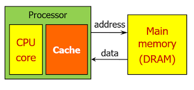

# [CS Study] 2주차

### : 캐시 메모리(Cache Memory) 및 성능 최적화

## 0. 목차

1. **캐시 메모리(Cache Memory) 개요**
    - 1.1 메모리 벽(Memory Wall) 현상
    - 1.2 캐시의 목적 및 필요성
    - 1.3 캐시 메모리의 물리적 위치와 계층 (L1, L2, L3)
2. **캐시 작동의 근거: 지역성의 원리 (Locality)**
    - 2.1 캐시 적중(Hit)과 미스(Miss)의 정의
    - 2.2 시간 지역성 (Temporal Locality)
    - 2.3 공간 지역성 (Spatial Locality)
    - 2.4 실제 코드 예시 분석
3. **캐시 매핑 방식 (Cache Mapping)**
    - 3.1 직접 매핑 (Direct Mapping)
    - 3.2 연관 매핑 (Fully Associative Mapping)
    - 3.3 세트 연관 매핑 (Set Associative Mapping)
    - 3.4 태그(Tag)와 인덱스(Index)를 통한 주소 변환 매커니즘
4. **데이터 업데이트: 쓰기 정책 (Write Policy)**
    - 4.1 즉시 쓰기 (Write-Through)
    - 4.2 나중 쓰기 (Write-Back)
    - 4.3 실생활 예시
5. **자원 재할당: 교체 정책 (Replacement Policy)**
    - 5.1 LRU (Least Recently Used)
    - 5.2 LFU (Least Frequently Used) 및 FIFO
    - 5.3 하드웨어 제약과 Pseudo-LRU
6. **멀티코어 환경: 캐시 일관성 (Cache Coherence)**
    - 6.1 Snooping 프로토콜
    - 6.2 MESI 프로토콜
7. **성능 최적화: Cache-Friendly Code**

## 1. 캐시 메모리(Cache Memory) 개요

캐시 메모리는 CPU의 연산 속도와 메인 메모리(RAM)의 접근 속도 차이를 줄이기 위해 그 사이에 배치하는 고속 정적 램(SRAM)이다.

### 1.1 메모리 벽(Memory Wall) 현상

CPU의 발전 속도에 비해 DRAM(메인 메모리)의 속도 발전이 더디게 진행되면서 발생하는 성능 격차를 의미한다. 1주차에서 다룬 **MBR의 데이터 대기 시간**이 길어지는 근본적인 원인이다.

### 1.2 캐시 메모리의 목적

- **데이터 인출 속도 향상**: CPU가 자주 사용하는 데이터를 레지스터보다 조금 더 큰 공간에 미리 가져다 두어 RAM 접근 횟수를 줄인다.
- **시스템 효율성**: 비싼 SRAM을 소량 사용하고 저렴한 DRAM을 대량 사용하여 비용 대비 고성능을 구현한다.



### 1.3 캐시 메모리의 물리적 위치와 계층

- **Core** : 독립적인 연산 장치
- **L1 Cache:** CPU 코어 내부에 위치, 속도가 가장 빠름. 보통 명령어(I$)와 데이터(D$) 캐시로 분리됨.
- **L2 Cache:** 코어마다 독립적으로 존재하거나 공유됨. L1보다 크고 조금 더 느림.
- **L3 Cache:** 여러 코어가 공유하는 구조(LLC, Last Level Cache). 칩 내부에 위치한 마지막 보루이다.
    
    
    

---

## 2. 캐시 작동의 근거: 지역성의 원리 (Locality)

캐시는 데이터 접근의 '지역성(Locality)' 이라는 특성을 전략적으로 이용한 장치이다. CPU 연산 속도에 비해 메모리 접근 속도가 현저히 느린 'Memory Wall' 문제를 해결하기 위해, 다음에 필요할 데이터를 미리 **추측**하여 캐시에 적재하는 것이 성능의 핵심이다.

### 2.1 캐시 적중(Hit)과 미스(Miss)의 정의

캐시의 효율성을 측정하고 관리하기 위한 핵심 지표들이다.

- **캐시 적중 (Cache Hit)**: CPU가 참조하고자 하는 데이터가 캐시에 존재하여 즉시 데이터를 가져올 수 있는 상태이다.
- **캐시 미스 (Cache Miss)**: 참조하려는 데이터가 캐시에 없어 메인 메모리(DRAM)까지 접근해야 하는 상태이다.
- **미스 패널티 (Miss Penalty)**: 캐시 미스가 발생했을 때 메인 메모리에서 데이터를 찾아 캐시에 채워 넣고 CPU에 전달하기까지 걸리는 추가적인 비용(시간)을 의미한다.
- **히트 레이턴시 (Hit Latency)**: 캐시에서 적중했을 때 데이터를 CPU로 가져오는 데 소요되는 비용이다.
- 캐시의 성능을 높이기 위해서는 캐시의 크기를 줄여 히트 레이턴시를 줄이던가, 캐시의 크기를 늘려 미스 비율을 줄이던가, 더 빠른 캐시를 이용해 레이턴시를 줄이는 방법이 있다.


### 2.2 시간 지역성 (Temporal Locality)

- **정의:** 최근에 참조된 데이터가 가까운 미래에 다시 참조될 가능성이 높다는 원리이다.
- **발생 원인:** 프로그램 내의 반복문(Loop), 스택(Stack), 공통 변수 등이 빈번하게 재사용되기 때문이다.
- **캐시의 대응:** 최근 사용 데이터를 캐시에 보관하여 다시 호출될 때 메모리 대기 시간 없이 즉시 반환한다. 이는 히트 레이턴시(Hit Latency)를 단축시킨다.

### 2.3 공간 지역성 (Spatial Locality)

- **정의:** 특정 데이터에 접근하면 그와 인접한 주소의 데이터도 곧 참조될 가능성이 높다는 원리이다.
- **발생 원인:** 명령어의 순차적 실행 및 배열(Array)과 같은 데이터 구조가 연속적인 메모리 공간에 배치되기 때문이다.
- **캐시의 대응:** 데이터를 가져올 때 단일 단위가 아닌, 인접 데이터를 포함한 **캐시 라인(Cache Line, 보통 64바이트)** 단위로 통째로 읽어와 캐시 미스를 예방한다.

### 2.4 실제 코드 예시 분석

반복문 예시를 통해 지역성의 발현을 확인할 수 있다.

C

```jsx
for(int i=0; i < N; i++){
    data[i] = data[i-1] + 1;
}
```

- **시간 지역성 활용:** `data[i-1]`은 이전 루프에서 값이 갱신된 후, 바로 다음 루프에서 피연산자로 다시 읽히며 재사용된다.
- **공간 지역성 활용:** 인덱스 `0`부터 `N-1`까지 순차적으로 접근한다. 캐시가 `data[0]`을 인출할 때 주변 데이터를 캐시 라인에 함께 담아두면 이후의 접근 적중률이 비약적으로 상승한다.

---

## 3. 캐시 매핑 방식 (Cache Mapping)

메인 메모리는 거대하고 캐시는 작기 때문에, 메모리 주소를 캐시의 특정 슬롯에 배치하는 효율적인 규칙이 필요하다. 따라서, 캐시에 데이터를 저장할 때 이를 쉽게 찾을 수 있도록 특정 자료 구조를 사용하여 묶음으로 저장하며, 이를 캐싱 라인(Caching Line)이라고 한다. 빈번하게 사용되는 데이터의 주소들이 흩어져 있기 때문에 캐시에 저장하는 데이터에는 데이터의 주소 등을 기록해둔 태그를 달아둘 필요가 있는데, 이러한 태그들의 묶음을 의미하는 것이다.

간단히 캐시 메모리에 주소를 저장하는 방식을 말하는 것으로 이해해도 무방하며, 일반적으로 세 가지 매핑 방식으로 구분할 수 있다.

### 3.1 직접 매핑 (Direct Mapping)

- **정의**: 메인 메모리의 특정 주소가 캐시의 특정 라인 하나에만 매핑될 수 있는 방식이다.
- **원리**: 메모리 주소를 캐시 라인 수로 나눈 나머지(Modulo)를 인덱스로 활용한다.
- **장점**: 구현이 매우 단순하고, 확인해야 할 위치가 하나뿐이므로 검색 속도가 가장 빠르다.
- **단점**: 인덱스가 같은 서로 다른 주소들이 빈번하게 호출될 경우, 캐시 적중률이 급격히 떨어지는 충돌 미스(Conflict Miss)가 발생한다.


### 3.2 연관 매핑 (Fully Associative Mapping)

- **정의**: 특정 주소가 캐시의 어느 라인에든 자유롭게 배치될 수 있는 방식이다.
- **원리**: 비어 있는 캐시 라인이 있다면 어디든 데이터를 저장한다.
- **장점**: 빈 공간을 최대한 활용하므로 충돌 미스가 없으며 적중률이 매우 높다.
- **단점**: 특정 데이터를 찾기 위해 캐시의 모든 라인을 병렬로 검색해야 하므로 하드웨어 설계가 복잡하고 전력 소모가 크며 속도가 느리다.

### 3.3 세트 연관 매핑 (Set Associative Mapping)

- **정의**: 캐시 라인을 여러 개의 세트(Set)로 나누고, 특정 주소는 지정된 세트 내의 아무 라인에나 들어갈 수 있는 방식이다.
- **N-way**: 하나의 세트가 N개의 라인을 가질 때 'N-way 세트 연관 매핑'이라 부른다.
- **장점**: 직접 매핑의 속도와 연관 매핑의 유연성을 결합한 현대 프로세서의 **표준 설계 방식**이다.


### 3.4 주소 변환 메커니즘 (Tag, Index, Offset)

CPU는 하드웨어 수준에서 주소값을 다음과 같은 세 영역으로 쪼개어 캐시를 탐색한다.

- **태그 (Tag)**: 해당 캐시 라인에 담긴 데이터가 내가 찾는 메모리 주소인지 확인하기 위한 식별표이다.
- **인덱스 (Index)**: 캐시 내에서 어떤 세트(또는 라인)를 뒤져야 하는지 결정하는 방 번호이다.
    - *Tip: 인덱스를 주소의 중간 비트에 두는 이유는 연속된 주소 접근 시 데이터를 여러 인덱스에 골고루 분산시켜 충돌을 줄이기 위함이다.*
- **오프셋 (Offset)**: 캐시 라인 내에서 실제 원하는 데이터가 위치한 상세 주소를 가리킨다.


---

## 4. 데이터 업데이트: 쓰기 정책 (Write Policy)

캐시 메모리는 메인 메모리의 복사본을 보관하므로, 캐시 내부의 데이터가 수정되었을 때 이를 원본(메인 메모리)에 어떻게 반영할 것인지 결정하는 전략이 필수적이다. 이는 데이터의 일관성(Consistency)과 시스템 성능 사이의 타협점(Trade-off)을 찾는 과정이다.

### 4.1 Write-Through (즉시 쓰기)

- **정의**: CPU가 캐시에 데이터를 쓸 때, 연결된 아래 계층의 캐시나 메인 메모리에도 즉시 동시에 업데이트를 수행하는 방식이다.
- **장점**: 캐시와 메모리의 내용이 항상 일치한다. 갑작스러운 전원 차단 시에도 메인 메모리에 최신 데이터가 보관되어 있어 데이터 유실 위험이 적다.
- **단점**: 쓰기 동작이 발생할 때마다 상대적으로 속도가 느린 메모리나 하위 캐시의 응답을 기다려야 하므로, 전체적인 쓰기 레이턴시(Latency)가 길어진다.

### 4.2 Write-Back (나중 쓰기)

- **정의**: 데이터 수정 시 일단 캐시에만 기록하고, 해당 캐시 라인이 새로운 데이터에 의해 밀려나갈 때 비로소 메인 메모리에 변경 사항을 반영하는 방식이다.
- **장점**: 동일한 주소에 여러 번의 쓰기 작업이 발생해도 메모리 접근은 마지막에 단 한 번만 이루어지므로, Write-Through에 비해 압도적인 성능 우위를 가진다. 현대 고성능 프로세서의 데이터 캐시는 대부분 이 방식을 채택한다.
- **단점**: 캐시 일관성이 유지되기 힘들어 종종 캐시와 메모리가 서로 값이 다른 경우가 발생한다.
- **예외**: 프로그램 코드가 담긴 L1 명령어 캐시(I-Cache)는 코드가 수정되는 일이 거의 없으므로, 관리가 단순한 Write-Through를 주로 사용한다.
    
    
    

### 4.3 실생활 예시: 저장 장치의 쓰기 캐시

- **하드 디스크/SSD**: 기본적으로 Write-Back 정책을 사용하여 작업 속도를 높인다. 데이터를 일단 캐시에 모았다가 한꺼번에 디스크로 내보낸다.
- **안전하게 제거(Flush)**: USB 메모리 등을 무단으로 뽑을 경우 데이터가 손상되는 이유는, 아직 캐시에만 머물러 있고 디스크로 반영되지 않은 데이터가 남아있기 때문이다. '하드웨어 안전하게 제거' 기능은 이 캐시를 강제로 비우고(Flush) 메모리에 기록하는 과정을 보장한다.

---

## 5. 자원 재할당: 교체 정책 (Replacement Policy)

캐시는 메인 메모리에 비해 공간이 매우 제한적이다. 캐시 세트가 가득 찼을 때 새로운 데이터를 수용하기 위해 기존 데이터 중 하나를 제거(Evict)하는 규칙이 필요하며, 이를 통해 적중률(Hit Rate)을 최적화한다.

### 5.1 LRU (Least Recently Used) 알고리즘과 자료구조

가장 오랫동안 참조되지 않은 데이터를 교체 대상으로 선정하는 방식이다. "최근에 쓰인 데이터가 미래에도 쓰일 확률이 높다"는 시간 지역성을 가장 잘 활용한다.

### [자료구조적 구현: Hash Table + Doubly Linked List]

가장 효율적인 LRU 구현을 위해 두 자료구조를 조합하여 탐색과 갱신을 모두 $O(1)$에 처리한다.

- **이중 연결 리스트 (Doubly Linked List)**: 데이터의 '순서'를 관리한다. 최근 사용된 데이터는 Head(MRU)로, 오래된 데이터는 Tail(LRU)로 배치한다.
- **해시 테이블 (Hash Table)**: 데이터의 '존재 여부'를 즉시 확인한다. 키(Key) 값으로 리스트 내 해당 노드의 주소를 저장하여 탐색 시간을 최소화한다.
- **동작 메커니즘**:
    1. **Hit 발생**: 해시 테이블에서 노드 위치를 찾고, 리스트 내 해당 노드를 끊어 Head로 옮긴다.
    2. **Miss 발생**: 리스트의 Tail 노드를 제거하고 해시 테이블에서도 해당 키를 삭제한다. 이후 새 데이터를 Head에 삽입한다.
    
    
    

### 5.2 기타 교체 알고리즘 비교

- **LFU (Least Frequently Used)**: 참조 횟수가 가장 적은 데이터를 교체한다. 장기적인 참조 빈도를 고려하나, 초기에만 집중 사용된 데이터가 캐시를 계속 점유하는 '메모리 오염'에 취약하다.


- **FIFO (First-In, First-Out)**: 캐시에 먼저 들어온 순서대로 내보낸다. 구현은 단순하지만 자주 사용되는 데이터(예: 루프 변수)가 오래되었다는 이유로 쫓겨날 수 있어 효율이 낮다.


- **Random**: 무작위로 교체한다. 부가 정보 기록이 필요 없어 하드웨어 구현이 가장 단순하지만, 성능 변동 폭이 크다.

### 5.3 하드웨어 제약과 Pseudo-LRU

- **설계의 타협**: CPU 캐시는 수조 번의 연산을 처리하므로 위와 같은 복잡한 리스트 조작을 수행하기 어렵다. 모든 라인에 정밀한 타임스탬프를 기록하는 것은 회로 면적과 전력 소모 측면에서 비효율적이다.
- **Pseudo-LRU (근사 LRU)**: 실제 CPU는 비트 단위의 단순한 이진 트리(Binary Tree) 구조를 활용한다. 데이터 접근 시마다 경로 비트를 뒤집어 "상대적으로 덜 최근에 사용된" 구역을 가리키게 함으로써, 적은 비용으로 LRU와 유사한 성능을 구현한다.

---

### 6. 멀티코어 환경: 캐시 일관성 (Cache Coherence)

현대 CPU는 여러 개의 코어가 각각 전용 캐시(L1, L2)를 가진다. 동일한 메모리 주소의 데이터를 여러 코어가 복사하여 들고 있을 때, 한 코어가 데이터를 수정하면 다른 코어는 '과거의 데이터'를 보게 되는 데이터 불일치 문제가 발생한다. 이를 해결하는 규칙이 캐시 일관성 프로토콜이다.


### 6.1 Snooping 프로토콜

- **원리**: 각 코어가 공유 버스(Shared Bus)를 통해 전송되는 데이터 신호를 마치 '도청(Snooping)'하듯 감시한다.
- **작동**: 특정 코어가 메모리에 데이터를 쓸 때 다른 코어들에게 알리고, 이를 감시하던 코어들은 자신의 캐시에 같은 주소의 데이터가 있다면 이를 무효화하거나 업데이트한다.

### 6.2 MESI 프로토콜

캐시 라인의 상태를 4가지로 정의하여 일관성을 관리하는 가장 대표적인 프로토콜이다.

1. **M (Modified)**: 데이터가 수정된 상태. 메인 메모리와 값이 다르며, 이 코어만 해당 데이터를 가지고 있다.
2. **E (Exclusive)**: 메인 메모리와 값이 같으며, 오직 이 코어만 데이터를 가지고 있다.
3. **S (Shared)**: 메인 메모리와 값이 같으며, 여러 코어가 동일한 데이터를 나누어 가진 상태이다.
4. **I (Invalid)**: 다른 코어에서 데이터를 수정하여, 현재 내 캐시에 있는 데이터는 무효가 된 상태이다.
    
    
    
    
    

---

## **7. 성능 최적화 (핵심 요약)**

- **핵심 원리:** 메모리 배치 순서와 코드의 접근 순서를 일치시켜 캐시 적중률을 높인다.
- **실천:** 2차원 배열은 가급적 행 단위(`matrix[i][j]`)로 순회한다. (열 단위 순회 시 캐시 미스 폭증)
- **주의:** 멀티코어 환경에서 서로 다른 변수가 같은 캐시 라인에 묶여 발생하는 '거짓 공유(False Sharing)' 성능 저하를 경계한다.