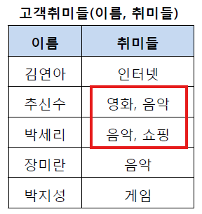
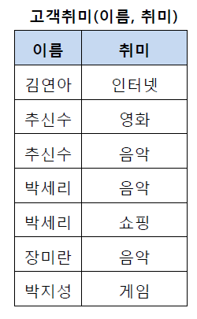
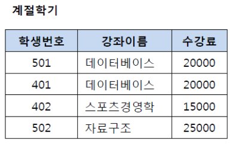
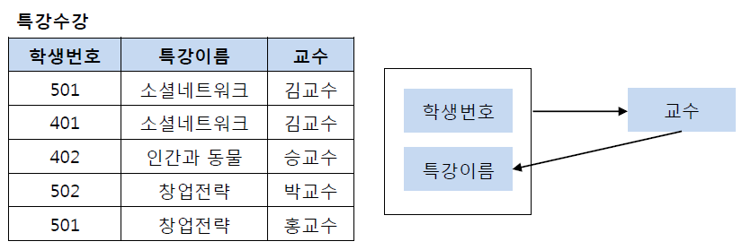
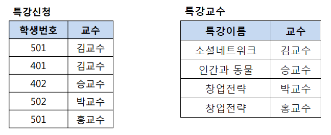

# **1. 이상(Anomaly) 현상이란?**

**테이블을 잘못 설계해서** 데이터를 **삽입/삭제/수정**할 때 논리적 오류(정합성 깨짐)가 발생하는 현상.

### 1) 삽입 이상

필요한 데이터만 넣고 싶은데 불필요한 데이터까지 강제로 넣게 됨

### 2) 갱신 이상

중복된 데이터 중 일부만 수정되어 불일치 발생

### 3) 삭제 이상

어떤 튜플 삭제가 의도치 않은 정보 손실로 이어짐

---

# **2. 정규화(Normalization)란?**

**불필요한 중복**과 잘못된 의존 관계(함수 종속)를 줄이기 위해, 하나의 테이블을 **의미가 분명한 여러 테이블로 분해**하는 과정.

## 목적

중복 때문에 생기는 **삽입/삭제/갱신 이상**을 줄여 정합성(무결성)을 지키기 쉽게 하기 위함.

---

# 3. 정규형별 정리

## 3.1 1NF (제1정규형)

모든 컬럼 값은 원자값(Atomic)이어야 한다.

→ 한 칸에 값이 여러 개 들어가면 안 됨(리스트/반복그룹 금지)

### 왜?

- 특정 값만 수정/삭제/검색이 어려움
- 인덱스/제약조건 적용이 애매해짐
- 데이터가 쉽게 꼬임

→ DB가 다루기 쉬운 형태로 만드는 기초

---

## 3.2 2NF (제2정규형)

제1정규형을 만족한 테이블에서 완전 함수 종속(Full FD)을 만족

→ 기본키의 부분집합이 결정자가 되면 안 됨 (특히 복합키에서 중요)

### 왜?

복합키 테이블에서 키 일부에만 의존하는 컬럼이 있으면 그 값이 행마다 반복 저장됨(중복)

→ 강의실 변경 시 여러 행 수정(갱신 이상), 마지막 행 삭제 시 정보 소실(삭제 이상)

- PK = (학생번호, 강좌이름)
- (학생번호, 강좌이름) → 성적
- 강좌이름 → 강의실 (부분키가 결정자)

→ 강의실을 분리해서 별도 테이블로 관리(2NF 만족)

---

## 3.3 3NF (제3정규형)

제2정규형을 만족한 테이블에서 이행적 종속(Transitive FD)을 제거

> 이행적 종속이란?
A → B, B → C가 성립할 때 A→C가 성립되는 것을 의미한다.
> 

### 왜?

키가 아닌 컬럼이 또 다른 컬럼을 결정하면

그 값이 여러 행에 반복 저장됨(중복)

→ 갱신 이상(한 번 바뀌면 여러 행 수정), 경우에 따라 삭제 이상도 발생

- 학생번호는 강좌 이름을 결정하고(학생번호 → 강좌이름)
- 강좌이름은 수강료를 결정한다.(강좌이름 → 수강료)
- 그렇다면 학생번호가 수강료를 결정한다고 볼 수 있다.(학생번호 → 수강료)

→ 만약 데이터베이스 수강료가 10,000이 된다면? 두 행을 바꿔야 한다. → `갱신 이상`

→ 501, 401 학생이 계절학기를 듣지 않는다면? 데이터베이스 정보가 사라진다. → `삭제 이상`

---

## 3.4  BCNF 정규형 (보이스-코드 정규형)

제3정규형에서도 남을 수 있는 문제 제

→ “모든 결정자가 후보키가 되도록” 분해 (결정자는 항상 키여야 한다)

### 왜?

키가 아닌 컬럼이 결정자인 FD가 남으면

그 컬럼 값이 여러 행에 반복되며 이상이 다시 발생 가능

→ 남아있는 중복/갱신/삭제 이상을 더 강하게 제거

- PK = (학생번호, 특강이름)
- (학생번호, 특가이름) → 교수
- 교수 → 특강이름 (교수는 특강 하나만)

→ 교수는 결정자지만 후보키가 아님 ⇒ BCNF 위반

김교수의 특강이 C언어로 바뀐다면, 특강수강 테이블에서 여러 행을 수정해야 함(갱신 이상)

402 학생을 지우면 교수-특강 관계가 같이 사라질 수 있음(삭제 이상)

---

# 4. 비정규화(De-normalization)

**정규화로 분리된 테이블을 의도적으로 합치거나,**

**중복 컬럼/요약 데이터를 추가**해 **조회 성능과 단순성**을 얻는 설계.

> 읽기(조회)를 빠르게 하기 위해, 중복을 감수하는 설계
> 

## 왜(언제) 하냐?

- **조인이 너무 많아** 조회 쿼리가 느리거나 복잡하다
- 화면/리포트가 **항상 같은 형태로** 많이 조회된다(핫쿼리)
- 분석/대시보드는 **읽기 위주(리드 헤비)**
- DB 부하/응답시간(p95)이 SLA를 못 맞춘다(성능)

## 대표 패턴 4가지

### A. 테이블 합치기(Join 제거)

- 예: `Order` + `Customer`를 합쳐 `Order.customer_name` 같은 컬럼을 둠
- 장점: 조회 1번으로 끝
- 단점: 고객명이 바뀌면 **여러 주문 행** 업데이트 필요(갱신 이상 위험)

### B. 중복 컬럼 추가(자주 쓰는 값 복제)

- 예: `product_name`, `dept_name` 같은 “표시용” 값을 사실 테이블에 복제
- 장점: 화면 조회 빠르고 단순
- 단점: 원본-복제본 불일치 위험

### C. 파생/계산값 저장(Computed/Derived)

- 예: `like_count`, `review_avg`, `order_total_price`
- 장점: 매번 계산 안 해도 됨
- 단점: 업데이트 로직이 필요(증분 갱신/재계산)

### D. 요약/집계 테이블(Summary/Aggregate)

- 예: 일자별 매출, 상품별 월간 판매량
- 장점: 리포트/대시보드가 매우 빨라짐
- 단점: 집계 배치/증분 업데이트/백필 운영 필요

## 비용(리스크)

> 성능을 담보로 정합성/운영 복잡도를 지불하는 거래이기에
> 
- 정합성 위험: 중복된 값이 서로 다르게 남을 수 있음
- 갱신 비용 증가: 변경이 여러 곳 업데이트로 번짐
- 버그/장애 위험: 업데이트 누락, 트랜잭션 경계 문제
- 운영 비용 증가: 재집계, 검증 쿼리/테스트 필요

---

# 5. 실전 권장 전략: 원본은 정규화 + 조회는 비정규화

### OTLP 원본(정규화)

- 목적: 트랜잭션 정합성 (중복결제/누락/동시성/무결성)
- 특징: 쓰기 많고, 변경이 잦음, SoT(Source of Truth)로 사용
- 중복 최소화 + 제약조건으로 방어

### 조회/리포트(비정규화/요약)

- 목적: 빠른 읽기, 복잡한 조인/집계를 대신 처리
- 특징: 읽기 비중 압도적, 화면/대시보드/리포트는 형태가 고정된 경우가 많음
- 조회 패턴에 맞춰 미리 만들어 둔 결과를 제공
    - 요약 테이블, 캐시 등

---

# 6. 질문

## Q1. 정규화 vs 비정규화 트레이드오프

## Q2. 정규화 어디까지가 기본일까? 제2? 제3? BCNF?

## **Q3. 왜 이전 정규형부터 해야 해?**

## Q4. 정규화를 하면 할수록 왜 성능이 안 좋아진다는 걸까? (조인이 많아지면)

## Q5. 비정규화하면 정합성은 어떻기 지키나?

## Q6. 비정규화로 read model을 분리하면 새로 들어온 데이터들을 최신성을 어떻게 유지할까?

## Q7. 정규화, 비정규화를 적용할 경우(서비스, 기능)를 설명해보아라.

## Q8. 무손실 분해(lossless join)와 의존성 보존(dependency preserving)이 무엇인가?
