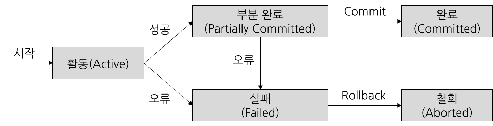

# 0. 왜 트랜잭션이 필요한가?

현실의 대부분의 비즈니스 작업은 **하나의 SQL로 끝나지 않는다.** 보통 **여러 개의 테이블 변경 작업**으로 이루어진다.

예: **계좌 이체**

```go
1. A 계좌에서 10,000원 차감 (-)
2. B 계좌에 10,000원 추가 (+)
```

문제 상황

- 1번만 성공하고 2번은 실패하면?
- A의 돈은 사라지고 B에게는 들어가지 않음

→ **데이터 정합성 깨짐**

---

따라서 **여러 작업을 하나의 단위(Transaction)로 묶어**

- 모두 성공하거나
- 중간에 실패하면 전부 취소하도록

보장할 필요가 있다.

---

# 1. 트랜잭션이란?

**트랜잭션(Transaction)**

> 데이터베이스에서 **여러 작업을 하나의 논리적 단위로 묶어 처리하는 것**
> 

예: 주문 처리

```go
1. 주문 생성
2. 주문 상품 저장
3. 재고 감소
```

이 작업들은 **반드시 함께 성공해야 한다.** 따라서 하나의 **트랜잭션**으로 묶어 처리한다.

---

# 2. 트랜잭션 핵심 동작 (All or Nothing)

트랜잭션은 **시작 → 작업 수행 → 종료**의 흐름으로 동작한다.

```
BEGIN

작업 1
작업 2
작업 3

성공 → COMMIT
실패 → ROLLBACK
```

**COMMIT**

- 트랜잭션의 모든 작업이 정상적으로 끝났을 때 실행
- 변경된 데이터가 **데이터베이스에 최종 반영됨**

**ROLLBACK**

- 작업 중 오류가 발생했을 때 실행
- 트랜잭션 시작 이전 상태로 **모든 변경 사항을 되돌림**

예시)

```sql
START TRANSACTION;

INSERT INTO orders (id, member_id, status)
VALUES (1, 100, 'CREATED');

INSERT INTO order_item (order_id, product_id, quantity)
VALUES (1, 200, 2);

UPDATE product
SET stock = stock - 2
WHERE id = 200;

COMMIT; (또는 ROLLBACK;)
```

---

# 3. ACID

트랜잭션은 데이터의 **신뢰성과 정합성**을 보장하기 위해 다음 네 가지 특성을 만족해야 한다. 이를 **ACID**

라고 한다.

## Atomicity (원자성): 전부 실행되거나 전부 취소

트랜잭션의 작업은 **모두 수행되거나, 모두 수행되지 않아야 한다.**

즉, 작업이 일부만 실행되는 상태는 허용되지 않는다. 두 작업 중 하나라도 실패하면 **전체 작업을 롤백**하여 트랜잭션 시작 이전 상태로 되돌린다.

> InnoDB
`autocommit`, `COMMIT`, `ROLLBACK (undo log)`

auto-commit 활성화

```sql
SET AUTOCOMMIT = 1;
update students set name = "민정" where id = 1; -- 이하 첫번째 쿼리
update students set name = "조앤" where id = 2; -- 이하 두번째 쿼리
```

auto-commit 활성화

```sql
SET AUTOCOMMIT = 0;
update students set name = "민정" where id = 1; -- 이하 첫번째 쿼리
update students set name = "조앤" where id = 2; -- 이하 두번째 쿼리
COMMIT;
```

## Consistency (일관성): 데이터 규칙 유지

트랜잭션이 완료되면 **데이터베이스는 항상 일관된 상태를 유지해야 한다.**

예:

- 계좌 잔액은 음수가 될 수 없다.
- 재고 수량은 0보다 작을 수 없다.

트랜잭션 수행 전과 수행 후에는 항상 **데이터의 규칙(제약 조건)이 유지**되어야 한다.

예:

- DB 제약조건(PK, FK, CHECK 등)
- 애플리케이션 비즈니스 규칙

## Isolation (격리성): 트랜잭션 간 간섭 방지

여러 트랜잭션이 동시에 실행될 때 

**서로의 작업이 간섭하지 않도록 격리되어야 한다.**

즉, 동시에 실행되더라도 **각 트랜잭션은 독립적으로 실행되는 것처럼 동작해야 한다.**

(이 격리 수준은 **Isolation Level**에서 자세히 다룬다.)

## Durability (지속성): 커밋된 데이터는 영구 저장

트랜잭션이 **COMMIT**되면 그 결과는 **영구적으로 저장되어야 한다.**

시스템 장애나 서버 재시작이 발생하더라도 **커밋된 데이터는 사라지지 않는다.**

이는 보통 **로그(redo log)** 등을 통해 보장된다.

> `redo log + recovery + doublewrite buffer`

---

# 4. 트랜잭션 상태



---

# 주의사항

### **트랜잭션은 필요한 최소 범위에서만 사용해야 한다.**

트랜잭션 범위가 길어질수록

- 락 유지 시간 증가
- 동시성 저하
- DB 커넥션 점유 시간 증가

따라서 **DB 작업에 필요한 코드만 트랜잭션에 포함하는 것이 좋다.**

## ❌ 잘못된 예

```java
@Transactional
public void writePost(PostRequest request) {
    validateUser(request.getUserId());     // 로그인 확인
    validateContent(request);              // 입력값 검증
    fileStorageService.upload(request.getFile()); // 파일 업로드

    postRepository.save(...);              // 게시글 저장
    attachmentRepository.save(...);        // 첨부파일 정보 저장

    mailService.send(...);                 // 메일 발송
    mailLogRepository.save(...);           // 메일 로그 저장
}
```

```
트랜잭션 시작

1. 로그인 여부 확인
2. 입력값 검증
3. 파일 업로드
4. 게시글 저장
5. 첨부파일 정보 저장
6. 게시글 조회
7. 이메일 발송
8. 이메일 로그 저장

트랜잭션 종료
```

문제

- 파일 업로드
- 이메일 전송
- 네트워크 작업

이런 작업은 **트랜잭션을 불필요하게 오래 유지**시킨다.

---

## ✅ 개선된 예

```java
public void writePost(PostRequest request) {
    validateUser(request.getUserId());
    validateContent(request);
    UploadedFile uploadedFile = fileStorageService.upload(request.getFile());

    savePostAndAttachment(request, uploadedFile);

    mailService.send(...);
    saveMailLog();
}

@Transactional
public void savePostAndAttachment(PostRequest request, UploadedFile uploadedFile) {
    postRepository.save(...);
    attachmentRepository.save(...);
}

@Transactional
public void saveMailLog() {
    mailLogRepository.save(...);
}
```

```
1. 로그인 확인
2. 입력값 검증
3. 파일 업로드

트랜잭션 시작
4. 게시글 저장
5. 첨부파일 정보 저장
트랜잭션 종료

6. 게시글 조회
7. 이메일 발송

트랜잭션 시작
8. 이메일 로그 저장
트랜잭션 종료
```

---

## 핵심 원칙

트랜잭션에는 **DB 변경 작업만 포함한다.**

다음 작업들은 **트랜잭션 밖에서 수행하는 것이 좋다.**

- 입력값 검증
- 파일 업로드
- 메일 전송
- 외부 API 호출
- 네트워크 통신

---

# 예시 (스프링 코드)

게시글 등록 처리

```java
@Service
@RequiredArgsConstructor
public class OrderService {

    private final OrderRepository orderRepository;
    private final OrderItemRepository orderItemRepository;
    private final ProductRepository productRepository;

    @Transactional
    public void placeOrder(Long memberId, Long productId, int quantity) {
        Order order = new Order(memberId, "CREATED");
        orderRepository.save(order); // 주문 생성

        OrderItem orderItem = new OrderItem(order.getId(), productId, quantity);
        orderItemRepository.save(orderItem); // 주문 상품 생성 (ex: 빠삐꼬 3개)

        Product product = productRepository.findById(productId) // 상품 검색(ex:빠삐꼬 검색)
                .orElseThrow(() -> new IllegalArgumentException("상품이 없습니다."));

        if (product.getStock() < quantity) {
            throw new IllegalStateException("재고가 부족합니다."); // ! -> 롤백
        }

        product.decreaseStock(quantity);
    } // ! -> 커밋
}
```
