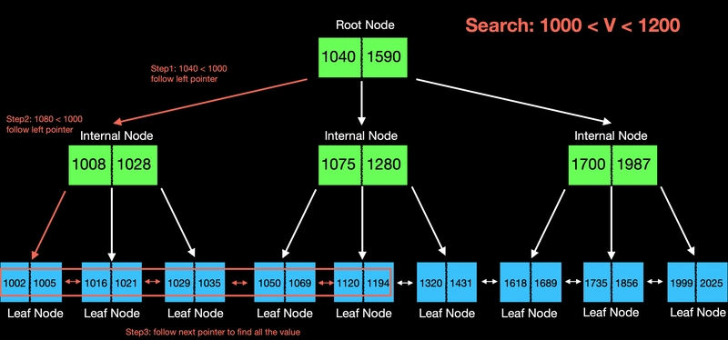
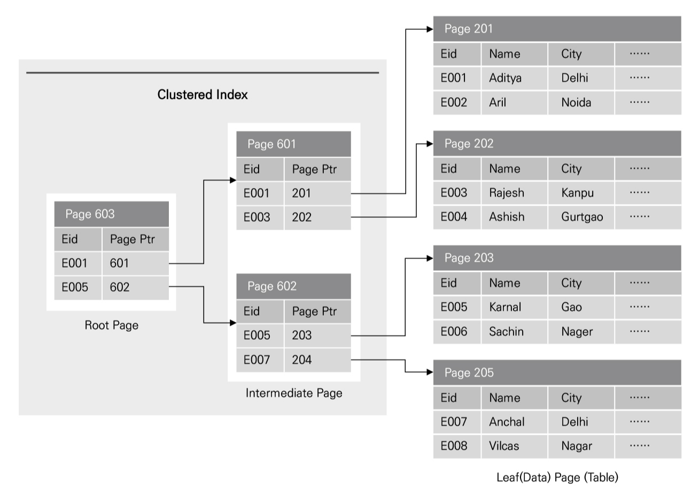
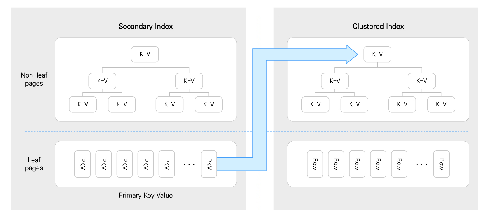

# 0. 인덱스가 왜 중요한가?

- DB 성능에서 가장 큰 병목은 CPU(나노초)가 아니라 **`디스크/스토리지 I/O(밀리초)`**이다.
- 따라서 성능 최적화의 핵심은 **`읽어야 하는 페이지 수를 줄이는 것!`**
    
    > 페이지(page): DB는 데이터를 레코드(행) 단위가 아니라 페이지 단위로 읽는다. (기본 16KB 단위)
    자주 쓰는 페이지는 버퍼풀(Buffer Pool)에 캐시된다.
    캐시 히트면 메모리에서 바로 읽어 빠르고, 캐시 미스면 디스크에서 페이지를 가져와 느리다.
    > 

---

# 1. 인덱스를 쓰는 이유

Full Table Scan은 조건과 상관없이 테이블의 많은 페이지를 읽는다.

인덱스는 필요한 위치 근처 페이지(블록)만 읽게 만든다.

결과적으로

- 단건 조회 → 빠른 위치 탐색
- 범위 조회 → 순차 스캔
- 정렬/그룹핑 → 추가 정렬 비용 감소

| 테이블 크기 | 읽는 페이지 |
| --- | --- |
| 10만 row | 3~4 page |
| 100만 row | 3~5 page |
| 1000만 row | 4~6 page |

➡ **트리 높이만큼만 탐색**

---

## 직관적인 성능 비교

예: 1000만 row 테이블

| 방식 | 읽는 페이지 |
| --- | --- |
| Full Table Scan | ~100000 page |
| Index Seek | ~4 page |

➡ **수만 배 차이 가능**

---

# 2. 인덱스란?

- 테이블과 별도로 존재하는 검색용 자료구조
- 일반적으로 (`키 값`, `row 위치 정보`)를 저장한다.

---

# 3. 인덱스 종류

## 3-1. 구조 기준 (자료구조 관점)

- **B-Tree**
    - 균형 트리 구조
    - 탐색 비용: **O(logN)** (정확히는 트리 높이만큼 페이지를 읽는 비용)
- **B+Tree (대부분의 DB)**
    - 실제 데이터 위치는 리프에만 존재
    - 리프 노드들이 연결 리스트 형태로 연결
        - 그래서 `BETWEEN, ORDER BY, LIKE ‘유%’` 같은 쿼리에 강함 (범위)



- **Hash Index**
    - 동등 비교 `(=)`에서 강함
    - 정렬/범위 검색에 약함
- **Bitmap Index (Oracle)**
    - 값 종류가 적은 컬럼 (카디널리티가 낮은)
    - 예) 성별, 색상, Y/N 값

## 3-2. 물리적 기준 (데이터 저장 방식)

- **Clustered Index**
    - **데이터 자체가 인덱스 순서로 저장됨**
    - Like 영어 사전 ⇒ **`단어 순서 = 내용 순서`**
    - 특징)
        - PK가 클러스터드 인덱스
        - 테이블당 1개만 가능 (정렬 기준이니)



- **Non-Clustered Index (보조 인덱스)**
    - **데이터와 인덱스가 분리된 구조** Like `책의 목차`
    - 구조: **`(Key, PK)`**
    - 조회 과정: `인덱스 탐색 -> PK 획득 -> 클러스터드 인덱스에서 실제 row 조회`
    - 보조 인덱스가 클러스터드 인덱스보다 느린 이유
        - 결과 row가 많은 경우 → `PK로 랜덤 페이지 접근이 반복` → `랜덤 I/O 증가`
        - 이를 완화하기 위해: `MRR, BKA` 같은 최적화 사용



# 4. 인덱스(B+Tree) 내부 작동 원리


## 4-1. 왜 B+Tree를 인덱스로 사용하는가?

1. 실제 데이터는 리프 노드에만 존재
    - 내부 노드는 탐색용 key만 저장: 한 페이지에 더 많은 키를 저장 가능
    - 트리 높이 감소 → 디스크 I/O 감소
2. 리프 노드끼리 연결
    - 리프 노드들이 Linked List 형태로 연결
    - **범위 검색 용이**
    - 예) `height BETWEEN 150 and 160` 의 경우
        1. 시작 Key 탐색 (= height가 150인 레코드)
        2. 옆 노드로 이동하며 체크 (리프 순차 검색)

---

# 5. 인덱스 스캔 방식

> DB 옵티마이저는 조건과 비용을 고려해 다양한 스캔 전략을 선택한다.
> 
- **Index Seek**
    - 특정 값(=)을 바로 찾음 (단건 조회에 강함)
    - 트리 높이만큼의 페이지 I/O만 발생
    - `WHERE id = 100;`
- **Index Range Scan**
    - 범위 조건을 처리 (BETWEEN, >, <, LIKE 'abc%')
    - 동작
        - 시작점 탐색 (`Index Seek`)
        - 리프 노드 순차 스캔
    
    ```jsx
    WHERE id BETWEEN 100 AND 200
    WHERE id > 100
    WHERE name LIKE '유%'
    ```
    
    
    
- **Index Full Scan**
    - 인덱스를 처음부터 끝까지 읽음
    - 정렬이 필요하거나 커버링일 때 선택될 수 있음
    - 인덱스가 이미 **정렬된 구조**
    - 추가 **SORT 비용이 필요 없음**
    
    ```jsx
    SELECT id
    FROM T
    ORDER BY id;
    ```
    
- **Full Table Scan**
    - 테이블 전체를 읽음
    - 테이블이 작거나, 결과 비율이 너무 큰 경우(대략 30~50% 이상) 유리할 수 있음

---

# 6. 인덱스가 안 타는 경우

- 함수 사용: `WHERE YEAR(date)=2024`
    - 컬럼을 가공하면 인덱스 정렬 구조를 그대로 활용하기 어려움
- `LIKE '%abc'`
    - 앞이 고정되지 않아 시작점을 못 잡음
    - 반대로 `LIKE 'abc%'`는 범위 스캔으로 타기 쉬움
- OR 조건
    - 경우에 따라 인덱스 병합보다 풀스캔이 싸다고 판단될 수 있음
- 타입 변환
    - 내부 변환이 발생하면 인덱스 사용이 깨질 수 있음
- 컬럼 가공
    - `WHERE col+1 = 10` 같은 형태
- 복합 인덱스 순서 불일치
    - (a,b) 인덱스인데 b만 조건으로 걸면 기대만큼 못 탐

---

# 7. 인덱스의 장점과 단점 (Trade-off)

## 장점

- **조회 성능 향상**: `Full Table Scan → 필요한 위치 탐색 (필요 페이지 수 감소)`
- **정렬 비용 감소:** 인덱스는 이미 정렬된 구조이기에 (sort 생략)
- **조인 성능 향상:** (조인 키 탐색 비용 감소)
- (주의) “100배” 같은 정량 수치는 환경 의존이 크니
    
    → 문서에는 “대규모에서 체감이 매우 크다” 정도로 쓰는 게 안전
    

## 단점

- INSERT/UPDATE/DELETE 비용 증가
    - 인덱스도 같이 갱신해야 함
    - 페이지 분할/리밸런싱이 생길 수 있음
- **`저장 공간 증가 (테이블 크기의 약 10~30%)`**
- 인덱스 관리 비용(통계/재빌드/설계 난이도)

# 8. 실무에서 인덱스 설계 전략

- 자주 쓰는 WHERE/JOIN 조건 중심으로 설계
- 복합 인덱스는 “자주 쓰는 조건 + 필터링 강한 컬럼”을 앞에
- 읽기 위주 시스템 위주로 쓰기 위주 시스템에서는 필수적인 것만

---

# 질문

- PK와 보조 인덱스 차이는?
- PK 값을 변경하면 어떻게 될까?
    - PK는 데이터 저장 위치(클러스터드 인덱스)이기 때문에 데이터 정렬 기준 자체가 변경 → 기존 row 삭제 → 새로운 위치에 재삽입
    - 사실상 DELETE + INSERT
- 언제나 인덱스 스캔이 유리할까?
    - 데이터 규모가 커질수록 인덱스 효과가 커짐
    - 카디널리티가 클수록 커짐
    - 가져오는 비율이 커지면 풀스캔이 유리할 수 있다.(30 ~ 50% 비율 정도로)
        - Index Scan → 랜덤 I/O 많음
        - Table Scna → 순차 I/O
- DB의 병목이 가장 크게 체감되는 부분은? 어느 부분에서 병목이 가장 크게 발생하나? (= 어디를 가장 최적화해야 하나?)
    - 디스크/스토리지 I/O
    - 특히나 랜덤 I/O
- Secondary Index (보조 인덱스) 리프에는 어느 값이 저장되어 있을까?
    - (보조키, PK값)
    - 실제 row를 얻으려면
        - 보조 인덱스 → PK 조회 → 클러스터드 인덱스 (이 과정을 `Index Lookup`)
- 보조 인덱스에는 PK값을 저장하고 있으니 그 PK값으로 다시 검색한다면 2 * O(logN)의 비용이 들까?
    - ㄴㄴ 빅오 관점에서는 그럴 수 있다.
    - 하지만 DB 성능에서는 I/O 패턴 (특히 랜덤 I/O)이다. (알고리즘, 코테의 경우에서는 다 메모리에서 작동하기에 빅오 관점으로 바라볼 수 있지만, 디스크라는 객체가 있음으로써 비용 추정이 아예 달라짐)
- 인덱스 설계 전략 중 카디널리티가 큰 컬럼에 인덱스를 적용하는 게 좋을까? 낮은 게 좋을까?
- 보조 인덱스에서 왜 랜덤 페이지 I/O가 발생할까? 클러스터드 인덱스에서는 발생하지 않는데?
