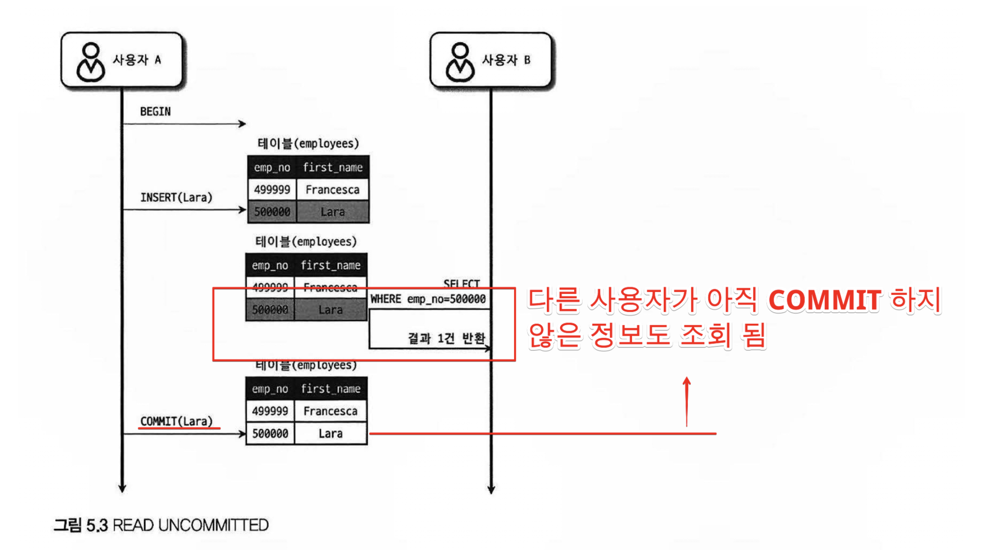
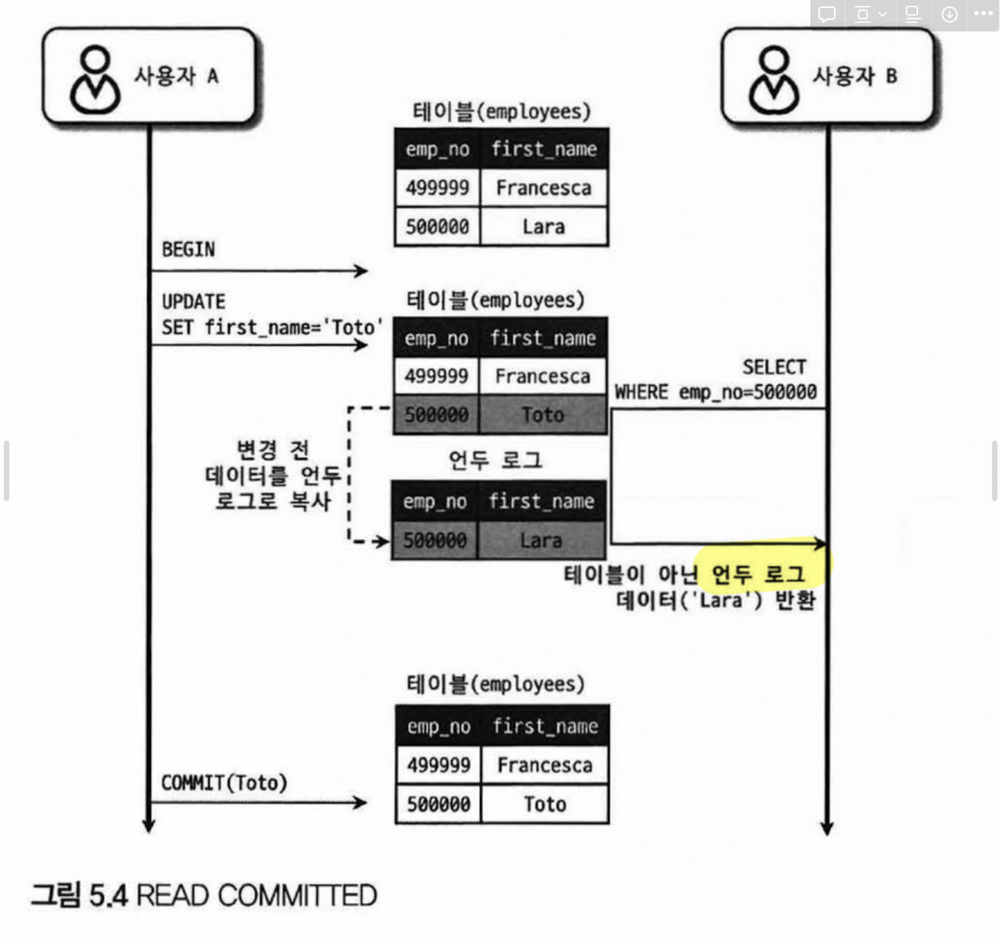
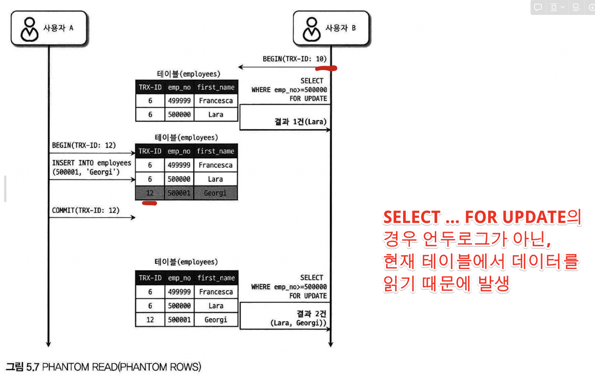
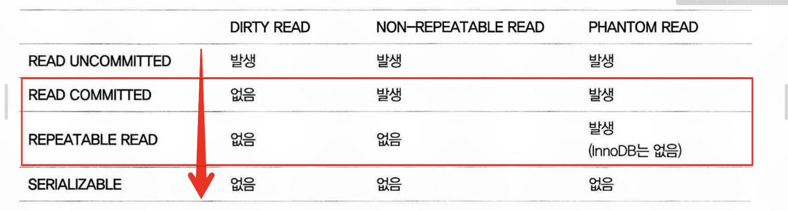

# 1. 동시 트랜잭션은 왜 문제가 될까?

- 데이터베이스는 여러 사용자의 요청을 빠르게 처리해야 한다.
- 그래서 여러 트랜잭션을 `동시`에 실행한다.
- 동시 실행은 `성능`과 `처리량` 측면에서 유리하다.

### 하지만 문제도 생긴다

- 동시에 실행되면 각 트랜잭션의 실행 순서가 서로 섞일 수 있다.
- 이 과정에서 한 트랜잭션의 **중간 변경 내용**이 다른 트랜잭션에 보이거나,
- 같은 조회를 다시 했는데 결과가 달라지는 등 **데이터 정합성 문제**가 발생할 수 있다.

---

# 2. 대표적인 동시성 이상 현상

## 2-1. Dirty Read

- 아직 **커밋되지 않은 데이터**를 다른 트랜잭션이 읽는 현상
- 이후 원래 트랜잭션이 **롤백**되면, 읽은 값은 실제로는 존재하지 않았어야 할 값이 된다

### 왜 문제일까?

- 예) 계좌 잔액이 확정되지 않았는데 다른 사용자가 그 값을 보고 결정을 내릴 수 있다.

## 2-2. Non-Repeatable Read

- 같은 트랜잭션 안에서 **같은 row를 두 번 읽었는데 값이 달라지는 현상**이다.
- 첫 번째 읽기 후 다른 트랜잭션이 그 row를 수정하고 커밋하면 발생할 수 있다.

### 왜 문제일까?

- 사용자 B 입장에서는 **같은 트랜잭션 안에서 같은 SELECT 결과가 달라진다**
- 일반적인 웹 조회에서는 크게 문제가 안 될 수도 있다
- 하지만 **금액, 재고, 잔액**처럼 정합성이 중요한 경우에는 큰 문제가 된다

### 한 줄 요약

- **같은 데이터를 다시 읽었는데 값이 바뀌는 문제**

## 2-3. Phantom Read

- 같은 조건으로 다시 조회했더니 기존 row의 값이 바뀐 것이 아니라, **조건에 맞는 row 집합 자체가 달라지는 현상**
- 예를 들어 범위 조건으로 조회한 뒤, 다른 트랜잭션이 그 범위에 들어오는 새 row를 INSERT하면 결과 개수가 달라질 수 있다.

### 왜 문제일까?

- 처음에는 10명이 조회됐는데, 같은 트랜잭션 안에서 다시 보니 11명이 될 수 있다
- 즉, **“조회 대상 집합” 자체가 흔들린다**

---

# 3. 그래서 격리 수준이 필요하

- 동시 실행은 성능을 높여주지만, 위와 같은 이상 현상을 만들 수 있다
- 따라서 DB는 **“어떤 이상 현상까지 허용하고, 어디부터 막을 것인가?”**를 정해야 한다
- 이 기준이 바로 **격리 레벨(Isolation Level)** 이다.

### 격리 레벨이란?

- 동시에 실행되는 트랜잭션이 **서로의 변경을 어느 정도까지 볼 수 있는지**를 결정하는 기준
- 격리 수준이 낮으면 동시성은 좋아질 수 있지만 이상 현상이 생길 가능성이 커진다
- 격리 수준이 높으면 정합성은 강해지지만, 더 많은 제약과 대기가 생길 수 있다

---

# 4. MySQL의 격리 수준

## `4-1. READ UNCOMMITTED`

- 아직 커밋되지 않은 값도 볼 수 있다
- 가장 느슨한 수준이다.
- `Dirty Read, Non-repeatable Read, Phantom Read` 모두 가능

## `2. READ COMMITTED`

- 커밋된 버전만 읽는다.
- 같은 트랜잭션 안에서도 조회 결과가 달라질 수 있다
- `Dirty Read`는 막지만, 읽을 때마다 최신 커밋 버전을 보므로 `Non-repeatable Read`와 `Phantom Read`는 가능하다

## `3. REPEATABLE READ (InnoDB 기준값)`

- 같은 트랜잭션 안의 `SELECT`는 같은 데이터를 읽는다.
- 첫 번째 읽기 시점의 snapshot을 계속 사용하여 일관된 결과를 본다.
- InnoDB는 `next-key locking`을 사용해 `Phantom Read`을 방지하려고 한다.

## `4. SERIALIZABLE`

- 가장 엄격한 수준이다.
- 직렬 실행에 가까운 결과를 보장하려는 수준이며, 가장 안전하지만 동시성 비용도 가장 크다.

---

# 5. MySQL은 격리 수준을 어떻게 구현할까? (동작 원리)

- InnoDB는 격리 수준을 구현할 때 **`MVCC` 기반 `consistent read`**와 **`lock` 기반 제어**를 함께 사용한다.

## 5-1. MVCC

- InnoDB는 기본적으로 **`consistent nonlocking read`**를 사용한다.
- 일반 `SELECT`는 `READ COMMITTED`와 `REPEATABLE READ`에서 락을 걸지 않는 `consistent read`로 처리된다.
- InnoDB는 **`multi-versioning`**을 통해 과거 버전을 재구성해 `snapshot`을 제공한다.

### 쉽게 말하면

- **읽기는 가능한 한 잠그지 않고, “내가 봐야 할 버전”을 보여준다**

## 5-2. Lock

- `SELECT ... FOR UPDATE`, `SELECT ... FOR SHARE`, `UPDATE`, `DELETE`처럼 실제 충돌을 막아야 하는 작업은 락을 사용한다. MySQL 문서는 locking read와 변경문이 일반적으로 **스캔한 인덱스 레코드들**에 락을 건다고 설명한다.

### 쉽게 말하면

- **“이 데이터는 지금 내가 쓰는 중이니 건드리지 마”라고 표시하는 것**

---

## 6. InnoDB의 레코드 잠금 구조

InnoDB의 `row-level lock`은 실제로는 **인덱스 레코드에 대한 잠금**이다. 또한 `REPEATABLE READ`에서 검색과 인덱스 스캔에 `next-key lock`을 사용해 `phantom row`를 방지한다.

### Record Lock

- 인덱스 레코드 자체에 거는 락

### Gap Lock

- 레코드 사이의 **공간(gap)** 에 거는 락
- 목적: 그 공간 안으로 새로운 row가 `INSERT`되는 것을 막기 위함

### Next-Key Lock

- **`Record Lock + Gap Lock`**
- InnoDB는 `phantom`을 막기 위해 `next-key locking`을 사용한다

### 한 줄 요약

- **InnoDB는 “행 자체”보다 “인덱스와 그 주변 범위”를 잠근다**

---

## 7. 인덱스와 잠금의 관계

- InnoDB의 잠금은 **인덱스를 기반으로 획득**된다
- locking read, `UPDATE`, `DELETE`는 일반적으로

  **스캔한 모든 인덱스 레코드**에 락을 건다

- 즉, DB는 “WHERE 조건식”을 기억하는 것이 아니라,

  **실제로 스캔한 인덱스 범위**를 기준으로 잠근다

### 그래서 왜 인덱스가 중요할까?

- 적절한 인덱스를 사용하면 필요한 범위만 스캔하고 잠글 수 있다
- 인덱스를 못 타면 넓은 범위를 스캔하면서 잠그게 된다
- 그래서 **테이블 전체가 잠긴 것처럼 체감**될 수 있다

### 한 줄 요약

- **인덱스가 좋을수록 잠금 범위도 작아진다**

---

## 8. InnoDB에서 Phantom Read가 잘 드러나지 않는 이유

이 부분은 **일반 SELECT** 와 **locking read / write** 를 나눠서 이해해야 한다. InnoDB는 일반 SELECT에서 consistent nonlocking read를 사용하고, REPEATABLE READ에서는 next-key locking으로 phantom을 방지한다.

### 8-1. 일반 `SELECT`

- REPEATABLE READ에서 일반 `SELECT`는 consistent read
- 같은 트랜잭션 안에서는 첫 snapshot을 계속 본다
- 그래서 여러 번 조회해도 결과 집합이 바뀌지 않은 것처럼 보인다

### 8-2. `FOR UPDATE` / `UPDATE` / `DELETE`

- 충돌 제어가 필요한 범위 작업에서는 InnoDB가 **next-key locking**을 사용한다
- 예: 범위 조건으로 `FOR UPDATE`를 수행하면

  해당 인덱스 범위의 record와 gap을 함께 잠가

  그 사이에 새로운 row가 `INSERT`되는 것을 막는다

### 정리

- 조회는 **snapshot read**로 일관성을 유지하고,
- 범위 잠금이 필요한 경우는 **next-key lock**으로 삽입을 막는다

### 한 줄 요약

- **“보여주는 방식”은 snapshot, “막는 방식”은 next-key lock**

---

# 예상 질문

- 격리 수준을 높이면 왜 느려질까
    - 격리 수준이 높아질수록 DB는 더 많은 충돌 가능성을 차단해야 한다.
    - 그러면 더 오랫동안 snapshot을 유지하거나, 더 넓은 범위에 락을 걸거나, locking read와 write 사이의 대기를 더 많이 감수해야 한다.
    - 즉, 더 강한 정합성을 얻기 위해 **동시에 자유롭게 지나갈 수 있는 공간**을 줄이는 셈이다.
    - 다만 “격리 수준이 높아지면 데드락이 자동으로 증가한다”라고 단정하기보다는, **락 대기와 충돌 비용이 커질 수 있다**고 보는 편이 정확하다. MySQL 문서는 deadlock이 기본적으로 write operations 때문에 발생한다고 설명한다.
- 데드락은 왜 발생하는가
    - 여러 트랜잭션이 서로가 가진 락을 기다리느라 아무도 더 이상 진행하지 못해서
    - 그래서 어떻게 해결하는가
        - InnoDB는 deadlock detection이 활성화되어 있으면 deadlock을 자동으로 감지하고, 이를 깨기 위해 한 트랜잭션을 롤백한다.
        - MySQL 문서는 deadlock이 “이상한 예외 상황”이 아니라, 경쟁이 있는 시스템에서 정상적으로 발생할 수 있는 현상으로 다뤄야 한다고 본다.
- 인덱스 설계 잘못했을 때 생기는 문제 (동시성/트랜잭션/락 관점에서)