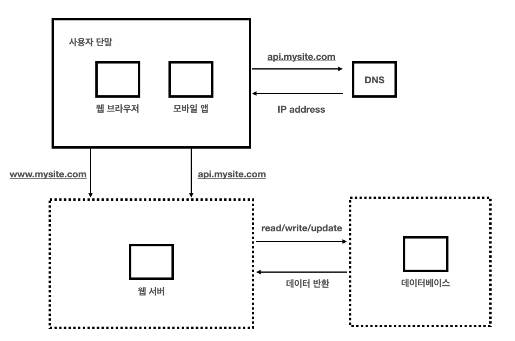
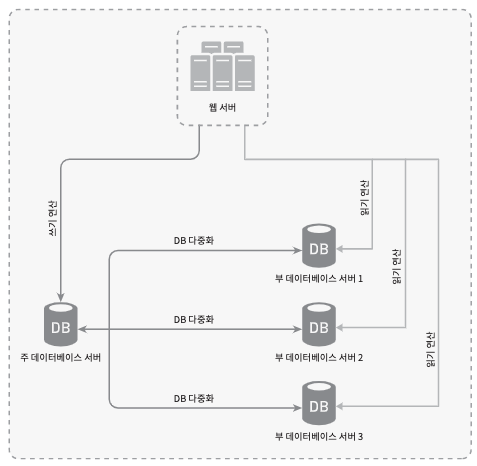
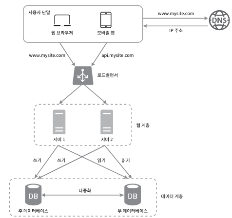
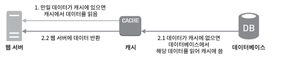
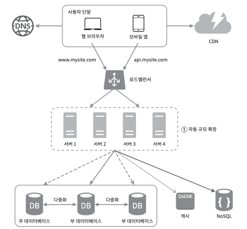
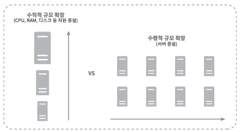
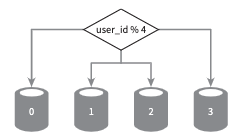
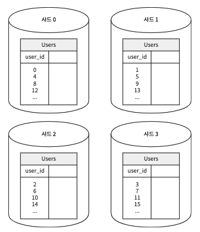
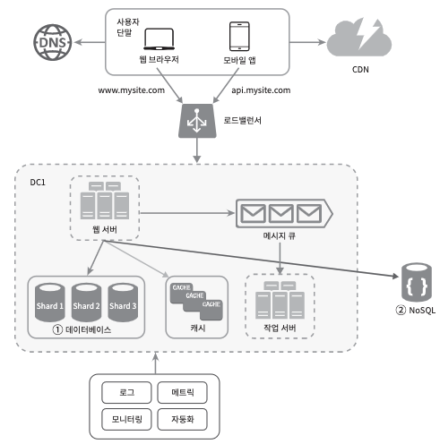
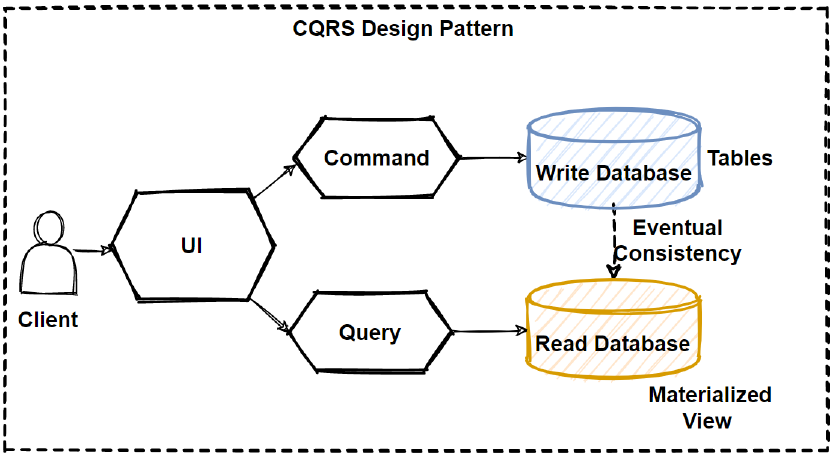

# 서버 1대에서 시작하는 대규모 시스템 설계

---

# 1. 처음에는 단순한 구조로 시작한다: 서버 1대 + DB 1대

- 가장 단순한 시작점
- 구현, 배포, 디버깅이 쉽다
- 초기 비용이 낮다
- 초기 트래픽에서는 충분히 실용적이다

## 한계
- DB가 단일 장애점(SPOF)이 된다
- 읽기/쓰기 요청이 모두 한 DB에 몰린다
- 트래픽이 늘면 가장 먼저 DB가 병목이 된다

---

# 2. 읽기 부하가 늘어나면 DB 다중화: Primary-Replica

- **Primary**: 쓰기 처리
- **Replica**: 읽기 처리
- 대부분의 서비스는 **쓰기보다 읽기가 훨씬 많다**
- 그래서 조회 요청을 Replica들로 분산해 DB 부담을 줄인다

### 왜 성능이 좋아질까?
- 읽기와 쓰기가 같은 DB 자원을 두고 경쟁하지 않게 된다
- 조회 트래픽을 여러 Replica가 나눠 처리한다
- Primary는 쓰기 처리에 더 집중할 수 있다

### 성능
- 읽기 요청을 여러 Replica로 분산
- 병렬 처리 가능한 조회 수 증가

### 안전성
- 데이터가 여러 서버에 복제됨
- 일부 서버 장애 시에도 데이터 보존 가능

### 가용성
- 특정 DB 장애 시 다른 Replica 활용 가능
- 장애 대응 여지가 커진다

---

## DB 다중화의 주의점

- 복제 지연(replication lag): Replica가 Primary보다 늦을 수 있다
- 방금 쓴 데이터가 Replica에는 아직 반영되지 않을 수 있다
- 장애 전환(failover)은 생각보다 복잡하다

---

# 3. 반복 조회가 많아지면 캐시

- 자주 조회되는 데이터를 매번 DB에서 읽는 것은 비효율적
- 애플리케이션 성능은 DB를 얼마나 자주 호출하느냐에 크게 좌우된다
- 캐시는 자주 쓰이는 데이터를 메모리에 저장해 응답을 빠르게 만든다

## 효과
- 응답 속도 향상
- DB 부하 감소

---

### 캐시의 어려움

- DB와 캐시 값이 달라질 수 있다
- 언제 캐시를 비울지 결정해야 한다
- 인기 키(Hot Key): 가 동시에 만료되면 DB에 부하가 몰릴 수 있다
- 캐시 서버 자체도 장애 지점이 될 수 있다

---

# 4. DB도 결국 확장이 필요하다: Scale Up vs Scale Out

## Scale Up
- 더 큰 CPU, RAM, 디스크를 가진 서버로 교체
- 단순하지만 물리적 한계와 비용 문제가 있다

## Scale Out
- 서버 수 자체를 늘려 부하를 분산
- 유연하지만 분산 시스템 복잡도가 생긴다

## 핵심
- 웹 서버는 Scale Out이 비교적 쉽지만
- DB는 상태를 가지기 때문에 훨씬 어렵다

---

# 5. 단일 DB의 한계를 넘는 방법, 샤딩

- 큰 DB를 여러 개의 작은 샤드로 나누는 방식
- 각 샤드는 같은 스키마를 가지지만 서로 다른 데이터 조각을 저장한다
- 대표적인 수평 확장 방식이다

## 샤딩의 핵심: 샤딩 키

- 데이터가 어느 샤드에 저장될지 결정하는 기준
- 가장 중요한 목표는 **고르게 분산하는 것**

### 잘못 고르면?
- 특정 샤드에만 요청이 몰린다
- 일부 샤드만 병목이 된다
- 전체가 아니라 부분적으로 무너진다

## 샤딩의 어려움

### 재샤딩
- 데이터가 너무 많아지면 샤드를 다시 나눠야 한다

### 핫스팟 키
- 특정 유명 사용자나 인기 데이터로 인해 일부 샤드에 요청 집중

### 조인 문제
- 여러 샤드에 걸친 조인이 어려워진다
- 비정규화가 필요해질 수 있다

---

# 7. 읽기와 쓰기의 요구가 완전히 달라지면 CQRS도 고려할 수 있다

- 쓰기는 정합성과 비즈니스 규칙이 중요
- 읽기는 빠른 조회와 다양한 조회 형태가 중요

## CQRS
- Command(쓰기)와 Query(읽기)의 책임을 분리
- 읽기 모델과 쓰기 모델을 따로 설계

## 장점
- 읽기/쓰기를 각각 최적화 가능
- 복잡한 도메인에서 구조를 명확하게 나눌 수 있음

## 단점
- 시스템 복잡도가 증가
- 동기화 문제가 생김
- 작은 서비스에는 과할 수 있음
