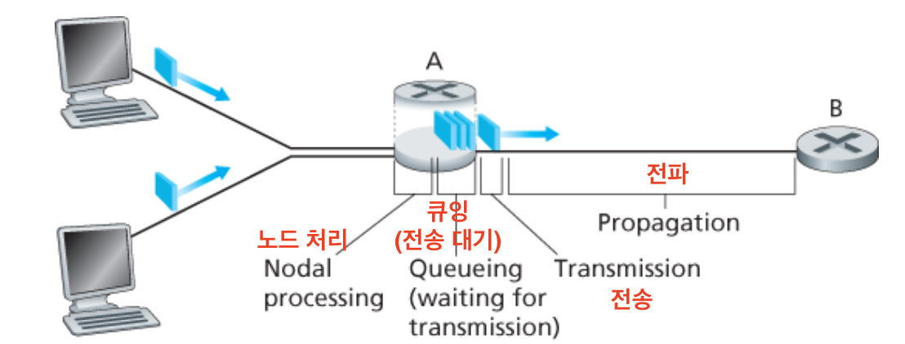
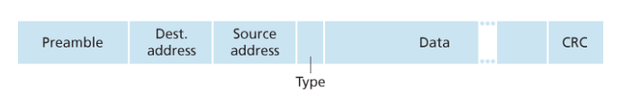
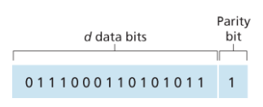
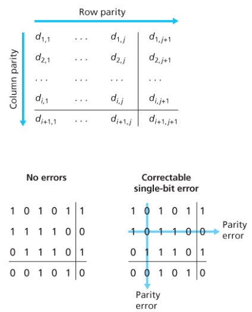
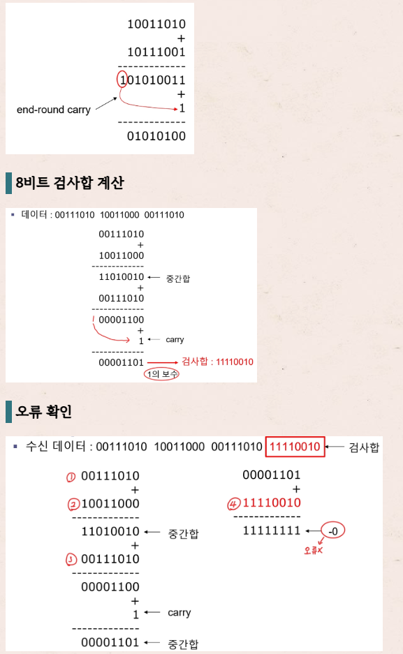
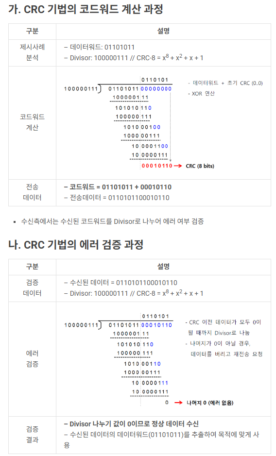
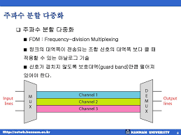

## 물리 계층(Physical Layer)

> 물리 계층은 0과 1(비트)을 실제로 전달 가능한 형태(전기/빛/전파 신호)로 바꿔서 전송하는 계층이다.  
> 데이터의 의미는 모르고, 신호를 어떻게 보내고 받는지만 관심 있다.

---

# 1) 비트(Bit) 개념

- 비트(bit)는 정보의 최소 단위로 `0` 또는 `1`이다.
- 물리 계층은 상위 계층에서 내려오는 데이터가 무엇이든 결국 비트열(0101...)로만 본다.
- 물리 계층의 역할:
  - 비트열을 신호로 변환해 전송(송신)
  - 들어온 신호를 비트열로 복원(수신)

### 비트는 어떻게 신호가 되나?
- 유선에서는 보통 전압 변화(전기 신호)로 
- 광케이블에서는 빛(광 신호)의 변화로
- 무선에서는 전파(라디오 신호)로 
> 핵심: 비트는 개념이고, 실제 이동하는 건 신호다.

---

# 2) 물리 계층 장비: 허브 vs 스위치

## 허브(Hub) — 물리 계층(1계층) 장비
- 한 포트로 들어온 신호를 그대로 모든 포트로 뿌리는 장비
- 목적지/주소 같은 건 모른다 → 전체에게 전달
- 특징:
  - 불필요한 트래픽 증가
  - 동시에 보내면 충돌 가능성 증가
  - 요즘은 거의 스위치로 대체됨

## 스위치(Switch) — 데이터 링크 계층(2계층) 장비
- 들어온 프레임의 MAC 주소를 보고 필요한 포트로만 전달
- 주소를 보고 골라 보낸다는 점이 허브와 핵심 차이

### 한 줄 비교
- **허브**: 들어오면 전부에게 방송
- **스위치**: 목적지 MAC 보고 해당 포트로만 전달

> 물리 계층 파트에서 기기로 자주 비교되는 건 허브고,  
> 스위치는 링크 계층 장비지만 허브와 대비로 같이 설명하면 이해가 빠르다.

---

# 3) 전송 매체(케이블) 개념: 꼬임쌍선 vs 광케이블

## 꼬임쌍선
- 우리가 흔히 “랜선”이라고 부르는 케이블의 대표 형태

### 특징
- ✅ 가격 저렴, 설치 쉬움, 일반 LAN에서 가장 흔함
- ❌ 거리/노이즈에 한계

---

## 광케이블
- 전기 신호 대신 빛(광 신호)로 데이터를 전송하는 케이블
- 빛이 내부에서 반사되며 이동하는 방식

### 특징
- ✅ 매우 빠름(대역폭 큼), 장거리 전송에 유리, 전자기 간섭에 강함
- ❌ 가격/장비 비용이 상대적으로 비싸고 시공이 더 까다로울 수 있음

---

# 4) 지연의 종류

---

## 데이터 링크 계층 정리

> 데이터 링크 계층(Data Link Layer)은 “한 번에 한 링크(같은 LAN 구간) 안에서” 데이터를 프레임(frame)으로 주고받게 해주는 계층이다.  
> 물리 계층이 비트(bit)를 보내는 계층이라면, 데이터 링크 계층은 그 비트들을 의미 있는 전송 단위(프레임)로 만들어 주소/접근 규칙/오류 처리까지 담당한다.

---

# 1. 기본 용어: 노드(Node)와 링크(Link)

## 1) 노드(Node)
- 링크 계층 프로토콜을 실행하는 장치
- 예시: 호스트(PC), 라우터, 스위치 등

## 2) 링크(Link)
- 통신 경로에서 서로 인접한 노드들을 연결하는 통신 채널
- 데이터그램(네트워크 계층 단위)을 종단 간으로 보내려면, 전체 경로를 한 번에 점프하는 게 아니라 경로를 구성하는 여러 개의 링크를 하나씩 건너가야 한다.

- 각 링크에서 송신 노드는 데이터그램을 링크 계층 프레임(link-layer frame)으로 캡슐화해서 전송한다.

---

# 2. 링크 계층이 제공하는 서비스

> 아래 4개가 데이터 링크 계층의 “주요 서비스”라고 보면 된다.

## 1) 프레임화(Framing)

- 데이터그램을 링크에서 보내기 전에 프레임으로 포장하는 과정

**왜 필요?**
- 물리 계층은 비트만 보내서 “경계(어디서부터 어디까지)”가 없다.
- 프레임화로 “이게 한 덩어리다”를 정의하고, 주소/검사를 붙인다.

---

## 2) 링크 접속(Link Access) = 매체 접속 제어(MAC)
- 링크(매체)를 **여러 노드가 공유**할 수 있으므로,
- 누가 언제 전송할지 “규칙”이 필요하다 → MAC 프로토콜

### 링크 종류에 따라 MAC 난이도 달라짐
- 점대점(Point-to-Point) 링크: 송신자 1명 + 수신자 1명  
  → 충돌 조정이 단순 (PPP/HDLC 같은 프로토콜이 대표)
- 브로드캐스트(Broadcast) 링크: 여러 노드가 하나의 채널 공유  
  → 동시에 보내면 충돌 발생 가능 → 조정이 어려움

---

## 3) 신뢰적 전달(Reliable Delivery)
- 확인응답(ACK) + 재전송(ARQ) 방식으로 링크 단위 신뢰성을 높이는 서비스
- TCP처럼 재전송을 하긴 하지만 차이가 있음:
  - TCP는 종단 간(end-to-end) 재전송
  - 링크 계층은 해당 링크에서 오류가 난 경우에만 로컬 재전송

### 언제 유용?
- 무선 링크처럼 오류율이 높은 환경에서 주로 유용
- 유선처럼 오류율이 낮으면 오히려 오버헤드가 커서 보통 안 넣는 경우도 많음

---

## 4) 오류 검출 & 정정(Error Detection & Correction)
- 신호 약화/잡음 때문에 비트가 뒤집힐 수 있음(0↔1)
- 그래서 대부분의 링크 계층은 프레임에 오류 검출 비트를 붙인다.

### 오류 검출 vs 오류 정정
- **오류 검출(Detection)**: “틀렸는지”만 알아냄  
- **오류 정정(Correction)**: “어디가 틀렸는지 찾아서 고침”까지 가능  
  (정정은 보통 더 복잡하고 비용이 큼)

> 참고: 링크 계층은 네트워크 어댑터(하드웨어) 수준에서 구현되는 부분이 많아서  
> 트랜스포트/네트워크 계층보다 복잡한 오류 기술(CRC 등)을 “하드웨어로” 처리하는 경우가 많다.  
> 즉, **링크 계층은 하드웨어 + 소프트웨어의 조합**이다.

---

# 3. 오류 검출/정정 기법 정리

## 1) 패리티 검사(Parity)

- 데이터 D에 **패리티 비트 1개**를 추가
- **짝수 패리티**: 전체 1의 개수가 짝수가 되도록 패리티 비트 선택

### 장단점
- ✅ 단순하고 오버헤드 작음
- ❌ 홀수 개 비트 오류만 검출 가능
  (짝수 개가 동시에 뒤집히면 짝수가 유지되어 놓칠 수 있음)

---

## 2) 2차원 패리티(2D Parity)

- 비트를 행/열로 배치한 뒤,
- 각 행/열에 패리티를 붙여서 검출 능력을 향상시키는 방식

---

## 3) 체크섬(Checksum)
- 데이터를 k비트 정수들의 합으로 보고 더한 뒤,
- 그 결과를 오류 검출 값으로 사용

### 인터넷 체크섬(Internet checksum)

- 합을 구한 뒤 1의 보수(비트 반전) 를 체크섬으로 사용
- 수신자는 받은 데이터의 합 + 체크섬을 다시 계산해 “모두 1”이 되는지 검사

### 왜 TCP/UDP는 체크섬을 쓰나?
- ✅ 소프트웨어로 빠르게 처리 가능, 오버헤드 작음
- ❌ CRC보다 오류 검출 성능은 약함  
- 링크 계층은 하드웨어 구현이 가능해서 보통 CRC를 사용하는 편

---

## 4) CRC (순환 중복 검사, Cyclic Redundancy Check)

- 가장 널리 쓰이는 오류 검출 기술
- 비트열을 “다항식(polynomial)”처럼 보고,
- 약속한 생성자 G로 나눠서 나머지(R)를 붙이는 방식

### CRC 핵심 아이디어
- 송신자는 D 뒤에 r비트 R을 붙여서 G로 나누어떨어지게 만든다.
- 수신자는 (D+R)을 G로 나눴을 때 나머지가 0인지 확인한다.
  - 0이면 정상(또는 검출 못한 오류)
  - 0이 아니면 오류

### 한 줄 요약
- CRC = 하드웨어로 빠르게 돌릴 수 있고, 체크섬보다 강력한 오류 검출 방식

---

# 4. 다중 접속 링크(Multiple Access)와 프로토콜

## 1) 두 종류의 링크
| 링크 종류 | 설명 | 예시 |
|---|---|---|
| 점대점 링크 (Point-to-Point) | 송신자 1, 수신자 1 | PPP, HDLC |
| 브로드캐스트 링크 (Broadcast) | 여러 노드가 하나의 채널 공유 | 공유 이더넷(과거), 무선 등 |

## 2) 다중 접속 문제(Multiple Access Problem)
- 브로드캐스트 링크에서 여러 노드가 동시에 전송하면 충돌(collision) 발생
- 충돌하면 수신자는 의미를 해석할 수 없고 프레임이 손실됨
- 충돌이 잦으면 대역폭 낭비가 커짐  
→ 그래서 다중 접속 프로토콜(MAC 프로토콜)이 필요

---

# 5. MAC 프로토콜 종류

## A) 채널 분할(Channel Partitioning)
> “채널을 미리 나눠서 충돌을 없애자”

### 1) TDM (시분할)

- 시간을 프레임/슬롯으로 나누고 노드에게 슬롯 할당

**장점**
- 충돌 없음, 공정함

**단점**
- 아무도 안 쓰는 슬롯도 생김(낭비)
- 노드는 자기 차례를 기다려야 함 (지연)

### 2) FDM (주파수분할)

- 주파수를 N개로 나누어 각 노드에 대역 할당
- TDM과 장단점 거의 동일

### 3) CDMA (코드분할)
- 각 노드에 “코드”를 할당하고 데이터에 코드를 섞어 동시에 보내는 방식
- 코드 설계가 좋으면 동시 전송에서도 분리가 가능

---

## B) 랜덤 접속(Random Access)
> “일단 보내고, 충돌하면 다시 보내자(규칙은 확률/백오프)”

### 1) 슬롯 알로하(Slotted ALOHA)

- 시간 슬롯에 맞춰 전송
- 충돌 시 확률 p로 다음 슬롯에서 재전송

**장점**
- 단순, 분산적
- 활성 노드가 1개면 채널을 R로 꽉 채워 사용 가능

**단점**
- 슬롯 동기화 필요
- 충돌/빈 슬롯으로 낭비 발생  
- 이론적 최대 효율이 약 37% 수준(노드 많을 때)

### 2) 순수 알로하(Pure ALOHA)

- 슬롯 없이 프레임이 생기면 즉시 전송
- 동기화는 필요 없지만 충돌 가능 구간이 더 커져 효율이 더 낮음  
  (최대 효율은 슬롯 알로하의 절반 수준)

### 3) CSMA (Carrier Sense Multiple Access)

- 남이 쓰는지 먼저 듣고(send 전에 listen) 보내자
- 그래도 전파 지연 때문에 동시에 시작하면 충돌 가능

**핵심 개념**
- 캐리어 감지(carrier sensing): 채널이 비었는지 확인하고 전송
- 전파 지연이 길수록 “비었다고 착각”할 가능성이 커져 성능에 영향

### 4) CSMA/CD (충돌 검출 포함)

- CSMA + Collision Detection
- 전송 중 충돌 감지하면 즉시 전송 중단 후 랜덤 시간 기다렸다 재전송

**이진 지수적 백오프(Binary Exponential Backoff)**
- 충돌 n번이면 K를 {0..2^n-1}에서 랜덤 선택
- K에 비례해 기다리고 재전송
- 충돌이 많을수록 기다림 범위가 커져 재충돌 확률을 낮춤

---

# 6. 스위치 LAN: 스위치는 무엇을 보고 전달하나?

## 1) 스위치는 링크 계층 장비(2계층)
- 스위치는 프레임을 교환한다.
- IP 주소(네트워크 계층 주소)를 보고 경로를 계산하지 않는다.
- 즉, OSPF 같은 라우팅 알고리즘으로 경로 계산을 하지 않는다.
- 대신 MAC 주소 기반으로 전달한다(2계층 스위칭).

---

# 7. 링크 계층 주소(MAC)와 네트워크 계층 주소(IP)가 둘 다 필요한 이유

## 1) 왜 IP만 쓰면 안 되나?
- 계층 독립성을 위해 각 계층은 자기 주소 체계를 가진다.
- 만약 어댑터가 MAC 대신 네트워크 계층 주소를 쓰면,
  - 장비 이동 시마다 주소 재구성이 번거롭고,
  - 계층 분리가 약해진다.

## 2) MAC 주소는 인터페이스(어댑터)에 붙는다
- 호스트/라우터 자체가 아니라 네트워크 인터페이스(NIC) 가 MAC 주소를 가진다.
- 따라서 한 장비에 인터페이스가 여러 개면 MAC도 여러 개다.

## 3) MAC 주소 특징(표기/구조)
- 보통 48비트(6바이트), 16진수로 표기
- IEEE가 주소 공간을 관리해 제조사에 블록을 할당(OUI)
- **계층적 구조가 아니라 평면 구조**(위치가 바뀌어도 유지되는 성격)
- 비유:
  - IP = 우편번호/주소(위치 기반)
  - MAC = 주민등록번호(장비 기반)

---

# 8. ARP 정리

## 1) ARP란?
- 같은 서브넷(LAN) 안에서 IP ↔ MAC 매핑을 해결하는 프로토콜

## 2) ARP 테이블(캐시)
- 호스트/라우터는 ARP 테이블을 갖고 있음
- IP ↔ MAC 매핑 + TTL 포함
- 보통 엔트리는 일정 시간이 지나면 삭제(예: 20분 같은 형태)

## 3) ARP 동작 흐름(정석)
1. 송신 호스트가 목적지 IP의 MAC이 필요함
2. ARP 요청 패킷 생성 → 브로드캐스트 프레임으로 전송  
   (목적지 MAC = FF:FF:FF:FF:FF:FF)
3. 모든 노드가 받고, 자기 IP가 맞는 노드만 응답
4. 응답은 유니캐스트로 전송
5. 송신 호스트는 ARP 테이블 갱신

**포인트**
- ARP는 링크 계층 정보(MAC)와 네트워크 계층 정보(IP)를 모두 다뤄서  
  **두 계층 경계에 있는 프로토콜**로 자주 설명된다.
- ARP 테이블은 플러그 앤 플레이(자동 구축)

---

# 9. 스위치 vs 라우터 (비교)

| 구분 | 스위치(Switch) | 라우터(Router) |
|---|---|---|
| 계층 | 2계층(데이터 링크) | 3계층(네트워크) |
| 전달 기준 | MAC 주소 | IP 주소 |
| 경로 계산 | 라우팅 알고리즘 사용 X | 라우팅 알고리즘 사용(예: OSPF) |
| 장점 | 플러그 앤 플레이, 전달률 높음, 설치/운영 쉬움 | 계층구조 기반, 루프/순환 방지에 유리, 대규모 네트워크에 적합 |
| 단점 | 브로드캐스트 트래픽 폭주 대응 약함, ARP 트래픽/테이블 증가 가능 | 플러그 앤 플레이 아님, 처리 비용이 더 큼 |

**실전 감각**
- 작은 네트워크: 스위치만으로도 충분한 경우가 많음(간단/고성능)
- 큰 네트워크(수천 호스트 등): 일반적으로 라우터도 포함(구조화/제어/보호)