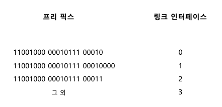
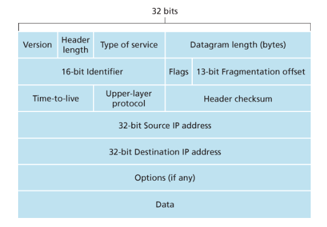
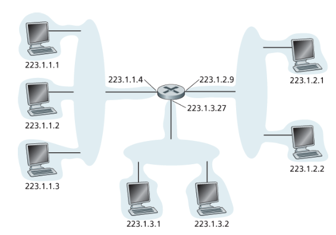
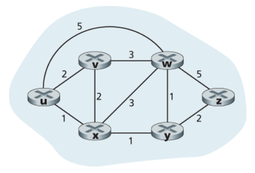
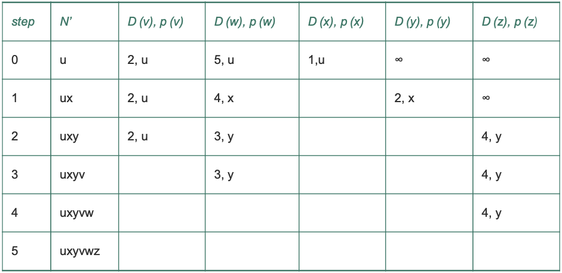
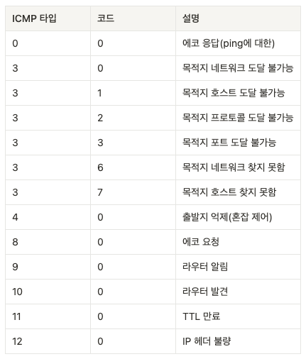

# 네트워크 계층
> **네트워크 계층의 근본 역할**: 송신 호스트에서 수신 호스트로 **패킷(데이터그램)** 을 전달한다.  
> 핵심 축: **포워딩(데이터 평면)** + **라우팅(제어 평면)**  
> 키워드: **IP(IPv4/IPv6), 서브넷/CIDR, NAT, ICMP, 라우팅 알고리즘(LS/DV), OSPF/BGP, 라우팅/포워딩 테이블, Longest Prefix Match**

---

## 1. 포워딩과 라우팅: 데이터 평면(Data Plane)과 제어 평면(Control Plane)

### 1.1 포워딩(Forwarding)
- 패킷이 라우터의 입력 링크로 들어오면, 라우터는 그 패킷을 적절한 출력 링크(인터페이스)로 옮겨야 한다.
- 특징
  - **데이터 평면(Data Plane)** 에서 실행
  - 매우 짧은 시간 단위(보통 나노초 수준)
  - 주로 하드웨어 기반으로 처리되어 빠르다.

### 1.2 라우팅(Routing)
- 송신자가 수신자에게 패킷을 전송할 때, 네트워크 계층은 패킷이 지나갈 경로(path)를 결정해야 한다.
- 이 경로를 계산하는 알고리즘을 라우팅 알고리즘(routing algorithm)이라고 한다.
- 특징
  - **제어 평면(Control Plane)** 에서 실행
  - 네트워크 전반의 정보를 바탕으로 경로를 계산 → 상대적으로 시간이 오래 걸림
  - 주로 소프트웨어(라우팅 프로토콜/OS)로 실행

---

## 2. 포워딩 테이블(Forwarding Table)과 라우팅 테이블(Routing Table)

### 2.1 포워딩 테이블(Forwarding Table)
- 라우터는 도착한 패킷의 목적지 IP(또는 목적지 프리픽스)를 사용해 포워딩 테이블을 색인(index)한다.
- 엔트리에는 보통 다음이 들어간다.
  - 목적지 주소 프리픽스(예: 223.1.1.0/24)
  - 출력 링크 인터페이스(또는 다음 홉 next hop)

> 핵심: (목적지 IP 프리픽스) → (출력 인터페이스 I / next hop)를 빠르게 결정해서 전달한다.

### 2.2 라우팅 테이블(Routing Table)
- “어떤 프리픽스는 어디(어떤 next hop / 인터페이스)로 보내야 하는가?”를 담는 표
- 라우팅 프로토콜(OSPF/BGP 등)이 경로를 계산/학습하면, 그 결과가 라우팅 테이블에 반영되고  
  실제 포워딩(데이터 평면)에서는 이 정보를 이용해 포워딩 테이블(FIB)을 구성해 빠르게 처리한다.

---

## 3. Longest Prefix Match

### 3.1 왜 필요한가?
- 목적지 IP는 여러 프리픽스와 동시에 매칭될 수 있다.
  - 예: `10.1.2.3`은 `10.0.0.0/8`에도 매칭되고 `10.1.2.0/24`에도 매칭됨
- 이때 라우터는 가장 구체적인 경로(가장 긴 프리픽스)를 선택해야 올바른 라우팅이 된다.

### 3.2 규칙
- 목적지 IP와 매칭되는 엔트리 중 프리픽스 길이가 가장 긴 것을 선택한다.
- 즉, `/24`가 `/8`보다 더 구체적이므로 `/24`가 우선.

### 3.3 예시
라우팅/포워딩 테이블에 다음이 있다고 하자.

- `10.0.0.0/8  → IF1`
- `10.1.0.0/16 → IF2`
- `10.1.2.0/24 → IF3`

목적지가 `10.1.2.3`이면  
- `/8`, `/16`, `/24` 모두 매칭되지만 가장 긴 프리픽스는 `/24`  
→ **IF3**로 포워딩한다.

> 결론: Longest Prefix Match = “가장 자세히 지정된(가장 긴) 네트워크 규칙을 우선 적용”

---

## 4. 인터넷 프로토콜(IP): IPv4/IPv6 개요 + IP의 역할

- 인터넷 네트워크 계층 패킷을 **데이터그램(datagram)** 이라고 부른다.

### 4.1 IP(Internet Protocol) 성격
- **비연결형(Connectionless)**: 연결을 미리 만들지 않고 데이터그램을 보냄
- **최선형(Best-effort)**: 전달/순서/재전송/중복 제거 보장 X  
  → 신뢰성/혼잡제어는 보통 TCP가 담당

### 4.2 IP가 해주는 핵심 기능
- **논리 주소 지정(Addressing)**: MAC이 아니라 **IP 주소**로 목적지 식별
- **라우팅 & 포워딩 기반 전달**
  - 라우팅: 경로 계산/학습
  - 포워딩: 테이블 기반 다음 홉 전달
- **(IPv4) 단편화(Fragmentation)**: MTU보다 큰 패킷을 쪼갤 수 있음

---

## 5. IPv4 데이터그램 포맷

> IPv4 데이터그램 = **헤더 + 데이터(페이로드)**  
> 옵션이 없으면 헤더는 보통 **20바이트**

### 5.1 주요 헤더 필드
- **버전(Version)** (4비트): IPv4/IPv6 구분
- **헤더 길이(Header Length)**: 옵션 때문에 가변, 페이로드 시작 위치 결정
- **서비스 타입(TOS/DSCP 등)**: 트래픽 유형 구분(우선순위/QoS 힌트)
- **데이터그램 길이(Total Length)** (16비트): 전체 길이(최대 65,535B)
- **식별자/플래그/단편화 오프셋**: 단편화 관련
- **TTL(Time To Live)**: 홉마다 감소, 0이면 폐기(루프 방지)
- **프로토콜(Protocol)**: 목적지에서 상위 프로토콜(TCP/UDP/ICMP)로 역다중화
- **헤더 체크섬(Header Checksum)**: 헤더 오류 검출, TTL 변경 때문에 매 라우터에서 재계산
- **출발지/목적지 IP 주소**
- **옵션(Options)**: 거의 안 씀(오버헤드/복잡성)
- **데이터(페이로드)**: 보통 TCP/UDP 세그먼트 포함

---

## 6. IPv4 주소체계: 인터페이스, 서브넷, 네트워크/호스트, CIDR

### 6.1 IP 주소는 “호스트”가 아니라 “인터페이스”에 붙는다
- 호스트: 보통 1개 링크 → 1개 인터페이스
- 라우터: 여러 링크 → 여러 인터페이스
- IP는 **각 인터페이스에 IP 주소**를 요구한다.

### 6.2 서브넷(Subnet)

- 같은 서브넷에 속한 인터페이스는 공통된 형태의 IP 주소를 가짐  
  예) `223.1.1.xxx`
- 중계 라우터 없이 한 네트워크로 직접 연결된 호스트/라우터 인터페이스 집합

#### 서브넷을 찾는 방법
1) 호스트/라우터에서 각 인터페이스를 떼어 고립된 네트워크를 만든다고 상상
2) 각 고립 네트워크 하나하나가 서브넷

> 포인트: 호스트-라우터뿐 아니라 라우터-라우터(점대점 링크)도 서브넷이 된다.

### 6.3 서브넷 마스크(Subnet Mask) & CIDR 프리픽스
- 서브넷 마스크: 네트워크 비트=1, 호스트 비트=0 인 32비트 값
- CIDR 프리픽스: `/n` 형태로 네트워크 비트 수 표기  
  예: `/24` ↔ `255.255.255.0`

#### 같은 네트워크인지 판단
- `IP AND 서브넷 마스크 = 네트워크 주소`
- AND 결과가 같으면 같은 서브넷

#### 호스트 수 계산
- 호스트 비트 `h`개 → 총 주소 `2^h`
- 사용 가능 호스트 수(일반 IPv4): `2^h - 2` (네트워크/브로드캐스트 제외)

### 6.4 네트워크 주소 / 호스트 주소 / 브로드캐스트(IPv4)
- **네트워크 주소**: 호스트 비트가 전부 0 (예: `192.168.1.0/24`)
- **브로드캐스트 주소**: 호스트 비트가 전부 1 (예: `192.168.1.255/24`)
- **호스트 주소 범위**: 네트워크 주소와 브로드캐스트 주소를 제외한 나머지  
  예: `192.168.1.1 ~ 192.168.1.254` (/24)

### 6.5 클래스 주소체계
- CIDR 이전: /8, /16, /24로 고정(A/B/C)
- /24는 작은 조직엔 OK지만 중간 조직에 부족, /16은 너무 큼 → 비효율

### 6.6 브로드캐스트 주소
- `255.255.255.255`로 보내면 **같은 서브넷의 모든 호스트**에 전달

---

## 7. 공인 IP / 사설 IP

### 7.1 공인 IP(Public IP)
- 인터넷 전체에서 유일, ISP로부터 할당
- 인터넷에서 직접 라우팅 가능(외부에서 접근 가능)

### 7.2 사설 IP(Private IP)
- 내부 네트워크(LAN)에서만 의미, 인터넷에서 직접 라우팅되지 않음
- 대표 사설 대역
  - `10.0.0.0/8`
  - `172.16.0.0/12` (172.16.0.0 ~ 172.31.255.255)
  - `192.168.0.0/16`

### 7.3 왜 사설 IP를 쓰나?
- IPv4 주소 부족 → 내부는 사설로, 외부로 나갈 때 NAT로 공인 변환하여 절약

---

## 8. NAT(Network Address Translation)

### 8.1 NAT가 나온 배경
- 네트워크가 커질수록 많은 공인 주소 필요
- ISP가 인접 대역을 이미 할당했거나 주소가 부족할 수 있음
- 해결: 내부는 사설, 외부는 공인 1개(또는 소수)로 대표

### 8.2 NAT 동작 핵심

- NAT 라우터
  - 내부 인터페이스: 사설 대역(예: `10.0.0.0/24`)
  - 외부 인터페이스: 공인 IP(예: `138.76.29.7`)
- 외부 인터넷에서 보면 NAT 라우터는 하나의 공인 IP를 가진 장비처럼 보임

### 8.3 NAT 변환 테이블
- NAT는 **(내부 IP, 내부 포트) ↔ (공인 IP, 공인 포트)** 매핑을 테이블에 저장
- 응답이 들어오면 테이블로 내부 호스트를 찾아 전달

> 포인트: **포트 번호는 호스트가 아니라 프로세스를 식별**한다.

### 8.4 NAT의 장단점 / 이슈
- 장점: IPv4 주소 절약, 내부망 정보 은닉
- 단점/이슈
  - End-to-End 원칙 약화(외부에서 내부로 직접 접근 어려움)
  - 내부 서버 운영 시 포트포워딩 필요
  - 일부 P2P/VoIP 등은 NAT 순회 기술(STUN/TURN/ICE 등) 필요 가능

---

## 9. IPv6

### 9.1 IPv6 도입 이유
- IPv4 주소 고갈 → 128비트 주소로 확장

### 9.2 IPv6의 주요 변화(핵심 3개)
1) **주소 기능 확장**: 32 → 128비트 + 애니캐스트(anycast) 도입
2) **간소화된 고정 40바이트 헤더**: 라우터 처리 속도 향상
3) **흐름 레이블(flow label)**: 특정 흐름에 QoS 등 특별 처리 지원 목적

### 9.3 IPv6 헤더 필드

- Version(6), Traffic Class, Flow Label, Payload Length
- Next Header(상위 프로토콜 구분), Hop Limit(TTL 역할)
- Source/Destination Address, Data

### 9.4 IPv4에는 있고 IPv6에는 없는 것
- 라우터 단편화 없음
  - 너무 크면 라우터가 폐기 + 너무 큼 ICMP 오류 송신
  - 단편화는 출발지/목적지만 수행
- 헤더 체크섬 없음
  - 링크/전송 계층 체크섬으로 충분하다고 판단
- 옵션(고정 헤더에서 제거)
  - 확장 헤더로 처리

### 9.5 IPv4 → IPv6 전환: 터널링

- IPv6 노드 간 통신이 IPv4 라우터 구간을 지나야 할 때
- IPv6 데이터그램을 IPv4 데이터그램 페이로드로 **캡슐화**해 통과
- 터널 입구: 캡슐화 / 터널 출구: 디캡슐화

---

## 10. 라우팅 알고리즘의 분류와 대표 방식

### 10.1 중앙 집중형 vs 분산형
- **중앙 집중형(링크 상태, LS)**  
  - 네트워크 전체 정보(토폴로지/링크 비용) 기반으로 최소 비용 경로 계산
- **분산형(거리 벡터, DV)**  
  - 각 노드는 이웃 링크 비용만 알고 시작
  - 이웃과 반복적 교환으로 비용 추정값 갱신

---

## 11. 링크 상태(LS) 라우팅 알고리즘

### 11.1 개념
- 각 노드가 “자신과 연결된 링크의 비용”을 담은 링크 상태 패킷을 네트워크 전체에 플러딩(flooding) = 전파
- 모든 라우터가 전체 토폴로지를 알게 되면, 각자 **다익스트라(Dijkstra)** 로 최단 경로 트리 계산

### 11.2 산출물
- 목적지별 최소 비용 경로 + 그 경로의 **다음 홉(next hop)**
- 이를 바탕으로 각 라우터의 **포워딩 테이블** 구성

### 11.3 계산 복잡도
- 전형적으로 최악의 경우 **O(n^2)**

### 11.4 진동(oscillation) 문제
- 혼잡/지연 기반 링크 비용이 변하면 경로가 자주 바뀌며 진동할 수 있음
- 완화 아이디어: 갱신 시각 랜덤화 등(자기 동기화 회피)

---

## 12. 거리 벡터(DV) 라우팅 알고리즘

### 12.1 특징(3단어)
- **분산적 distributed**
- **반복적 iterative**
- **비동기적 asynchronous**

### 12.2 벨만-포드(Bellman-Ford) 기반
- 목적지 y까지 최소 비용 = 모든 이웃 v에 대해  
  `c(x,v) + Dv(y)` 의 최소값
- 이웃의 거리 벡터를 받으면 갱신하고, 변화가 있으면 다시 전파
- 반복하면 실제 최소 비용으로 **수렴**

---

## 13. LS vs DV 비교

### 13.1 경로 계산
- **LS**: 전체 정보를 공유(플러딩) → 각 노드가 전체 지도 기반으로 계산
- **DV**: 이웃끼리만 교환 → 비용 추정 벡터를 점진적으로 갱신

### 13.2 메시지 복잡성
- **LS**: 링크 비용 변화 시 전체 플러딩 → 메시지량 큼
- **DV**: 변화가 최단경로에 영향 줄 때 점진적 전파

### 13.3 견고성
- **LS**: 한 노드가 오작동해도 각 노드는 독립 계산 → 상대적으로 분산 견고성
- **DV**: 한 노드의 잘못된 계산이 이웃→전체로 확산될 가능성

---

## 14. AS 내부 라우팅: OSPF (Intra-AS)

### 14.1 AS(Autonomous System) 도입 이유
- **확장성**: 라우터 수 증가 시 오버헤드 폭증
- **관리 자율성**: ISP/기관은 내부 정책/구성을 외부에 숨기고 싶음

-AS : 인터넷에서 하나의 관리 주체가 운영하는 네트워크 묶음 ex)통신사, 대형기업, 대학 등 자기 라우팅 정책을 스스로 결정할 수 있는 단위

### 14.2 OSPF 개요
- 대표적 링크 상태(LS) 기반 AS 내부 라우팅 프로토콜
- 링크 상태를 플러딩하고 각 라우터는 다익스트라 수행
- 링크 상태 갱신: 변화 시 즉시 + 주기적 갱신(예: 30분)

### 14.3 OSPF 개선사항(요약)
- 인증(단순/MD5)
- 동일 비용 다중 경로(ECMP)
- 멀티캐스트 확장(MOSPF)
- 영역(area)로 나누는 계층화(백본 영역 등)

---

## 15. AS 간 라우팅: BGP (Inter-AS)

### 15.1 왜 AS 간/AS 내부 프로토콜이 다른가?
- **정책(Policy)**: 통과 가능한 AS, 트래픽 수용 여부 등 정책이 지배
- **확장성**: 전 세계 규모의 프리픽스/경로 처리 필요
- **목표 차이**: 내부는 성능/최단경로 중심, 외부는 정책/합의/확장성 중심

### 15.2 BGP 핵심 개념
- AS 간 라우팅의 사실상 표준
- 목적지는 CIDR 프리픽스 단위로 표현

### 15.3 eBGP / iBGP
- **eBGP**: 서로 다른 AS 사이
- **iBGP**: 같은 AS 내부 라우터 사이(물리 링크와 항상 일치 X)

### 15.4 BGP 경로 속성(대표)
- **AS-PATH**: 통과 AS 리스트(루프 방지)
- **NEXT-HOP**: 다음으로 나가야 할 라우터 인터페이스 IP

### 15.5 뜨거운 감자 라우팅(Hot Potato)
- 여러 경로 중 **NEXT-HOP까지의 AS 내부 비용**이 최소인 경로 선택
- 핵심: “내 AS 밖 비용은 신경 덜 쓰고, 빨리 밖으로 내보내자”

### 15.6 BGP 경로 선택(개요)
- 실제 BGP는 복합 규칙 사용
  - Local Preference 우선
  - AS-PATH 길이
  - (그 다음) 뜨거운 감자 등

---

## 16. ICMP (Internet Control Message Protocol)

### 16.1 ICMP란?
- 호스트/라우터가 **네트워크 계층 오류/상태 정보**를 주고받는 프로토콜
- ICMP 메시지는 **IP 데이터그램의 페이로드**로 실려 전송됨
- IP 헤더의 상위 프로토콜 번호가 **1**이면 ICMP로 역다중화

### 16.2 ICMP 메시지 구성

- **Type / Code**
- 원인이 된 IP 데이터그램의 **헤더 + 첫 8바이트** 포함  
  → 송신자가 어떤 패킷이 문제였는지 식별 가능

### 16.3 ping
- 송신: Echo Request (**Type 8, Code 0**)
- 수신: Echo Reply (**Type 0, Code 0**)
- 운영체제가 보통 직접 지원

### 16.4 Traceroute
- TTL을 1,2,3,… 증가시키며 UDP 데이터그램 전송
- n번째 라우터에서 TTL 0 → 폐기 + **ICMP Time Exceeded (Type 11, Code 0)** 회신
- 목적지 도달 시 존재하지 않는 UDP 포트로 인해  
  **ICMP Port Unreachable (Type 3, Code 3)** 회신 → 종료

---