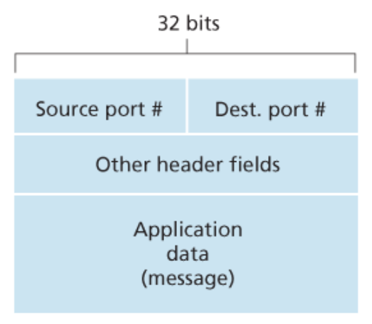
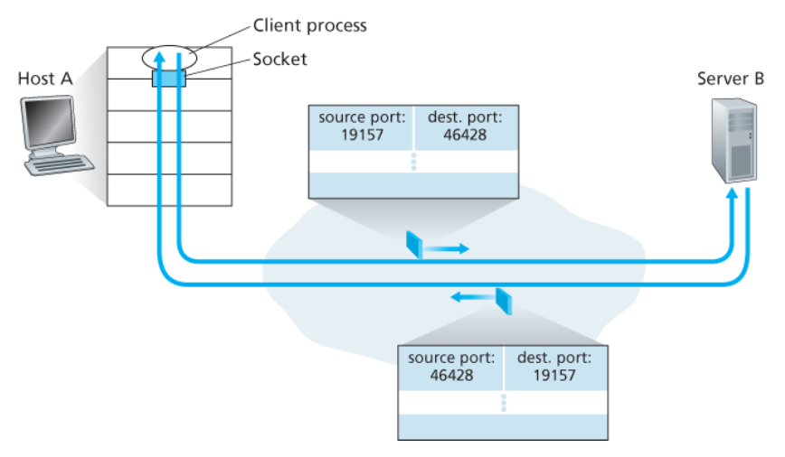
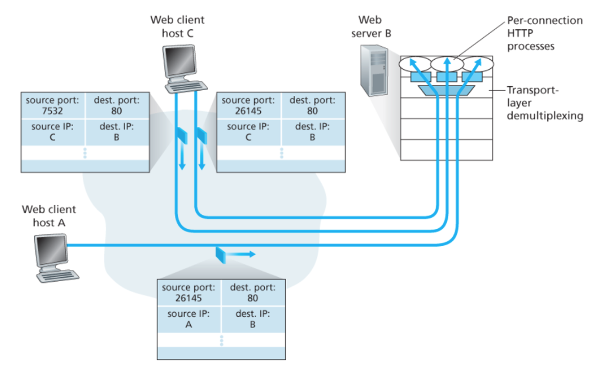

# 전송 계층 ① 기본 개념

## 1) 전송 계층의 역할 (Transport Layer Role)
- 전송 계층은 **서로 다른 호스트에서 동작하는 애플리케이션 프로세스 간**의 **논리적 통신(logical communication)** 을 제공한다.  
  → 애플리케이션 관점에서는 **“두 프로세스가 직접 연결된 것처럼”** 보이게 해준다.
- 전송 계층은 **라우터가 아니라 종단 시스템(End System)** 에서 구현된다.

### 송신 측 전송 계층 동작
- 애플리케이션 메시지를 **세그먼트(segment, L4 PDU)** 로 변환
- 메시지를 **분할**하고 각 조각에 **전송 계층 헤더**를 붙임
- 생성된 세그먼트를 **네트워크 계층(IP)** 으로 전달

### 네트워크 계층과의 관계
- 네트워크 계층은 세그먼트를 **데이터그램(datagram, L3 PDU)** 안에 캡슐화해 전달한다.
- 라우터는 **L3 필드만 보고 동작**하며, 데이터그램 내부의 세그먼트 필드는 검사하지 않는다.

### 전송 계층 vs 네트워크 계층
- 전송 계층: **프로세스 ↔ 프로세스** 논리적 통신
- 네트워크 계층(IP): **호스트 ↔ 호스트** 논리적 통신
- 전송 계층이 제공할 수 있는 서비스는 **하위(IP) 서비스 모델의 한계**를 받는다.
  - 예: IP가 지연/대역폭 보장을 못 하면 전송 계층도 그 보장을 “만들어낼 수는 없음”
  - 하지만 IP가 비신뢰적이어도 전송 계층이 **신뢰성을 “추가”**해서 제공할 수는 있음

---

## 2) 포트 번호 (Port Number)
- 전송 계층은 **“호스트 대 호스트” 전달**을 **“프로세스 대 프로세스” 전달**로 확장해야 한다.
- 이를 위해 프로세스의 출입구 역할을 하는 **소켓(socket)** 을 사용하며,
  각 소켓은 **포트 번호(port number)** 라는 **유일한 식별자**를 가진다.

### 세그먼트 헤더에 포함되는 포트 정보
- **출발지 포트 번호(source port)**
- **목적지 포트 번호(destination port)**
- 수신 측은 목적지 포트 번호를 보고 **올바른 소켓/프로세스**로 전달한다.

---

## 3) 소켓(Socket) 개념
- 소켓은 **프로세스와 네트워크 사이의 출입구(Interface / door)** 역할을 한다.
- 전송 계층은 수신한 세그먼트의 데이터를 **소켓으로 전달**하고,
  프로세스는 **소켓을 통해 데이터**를 받는다.

---

## 4) 멀티플렉싱 / 디멀티플렉싱(Transport-layer Multiplexing & Demultiplexing)

> 전송 계층의 핵심 역할 중 하나는  
> 네트워크 계층이 제공하는 **호스트 ↔ 호스트 전달(IP)** 을  
> **프로세스 ↔ 프로세스 전달**로 “확장”하는 것이다.

- 목적지 호스트의 전송 계층은 바로 아래 **네트워크 계층(IP)** 으로부터 **세그먼트**를 받는다.
- 전송 계층은 이 세그먼트를 **해당 애플리케이션 프로세스**에게 전달해야 한다.
- 이때 중간 매개체가 **소켓(socket)** 이고, 소켓은 프로세스의 네트워크 출입구 역할을 한다.
- 각 소켓은 **포트 번호(port number)** 라는 유일한 식별자를 가진다.

---

### 멀티플렉싱 (Multiplexing)
- **송신 측**에서 여러 소켓(여러 프로세스)로부터 데이터를 모아
  각 데이터에 전송 계층 헤더를 붙여 **세그먼트**를 만들고
  이를 **네트워크 계층(IP)** 으로 전달하는 작업
- 한마디로: **“여러 프로세스의 데이터를 한 줄로 모아 IP로 내려보냄”**

---

### 디멀티플렉싱 (Demultiplexing)
- 수신 측에서 세그먼트의 헤더 필드(특히 목적지 포트 번호)를 확인해
  올바른 소켓(= 올바른 프로세스)으로 데이터를 전달하는 작업
- 한마디로: 도착한 세그먼트를 누구(어느 프로세스)에게 줄지 분류

---

### “도착한 세그먼트는 어떻게 알맞은 소켓으로 가는가?”
- 각 세그먼트는 헤더에 **필드 집합**을 가지고 있고,
  전송 계층은 이 필드를 검사해 **수신 소켓**을 식별한 뒤 해당 소켓으로 전달한다.

---

### 요구사항 2가지
1. 소켓은 **유일한 식별자(= 포트 번호)** 를 가진다.
2. 세그먼트는 “어떤 소켓으로 가야 하는지” 알려주는 필드를 가진다.  
   - **출발지 포트 번호(source port)**
   - **목적지 포트 번호(destination port)**

---

### 디멀티플렉싱 동작 순서 (UDP 기본 동작과 동일)
1. 호스트의 각 소켓은 **포트 번호**를 할당받는다.
2. 세그먼트가 호스트에 도착하면 전송 계층은 세그먼트의 **목적지 포트 번호**를 확인한다.
3. 해당 포트 번호에 대응하는 **소켓**으로 세그먼트를 전달한다.
4. 세그먼트 데이터는 소켓을 통해 **해당 프로세스**로 전달된다.

---

## UDP: 비연결형 다중화/역다중화
- **UDP 소켓 식별 기준:**  
  **(목적지 IP 주소, 목적지 포트 번호)**

- 따라서 두 UDP 세그먼트가
  **목적지 IP와 목적지 포트가 같다면**
  → **같은 목적지 소켓(같은 프로세스)** 으로 전달된다.

### 그럼 출발지 포트 번호는 왜 필요할까?
- 출발지 포트 번호는 **“회신 주소”의 일부**로 사용된다.

- 예: A가 B에게 보낸 UDP 세그먼트의 출발지 포트가 `x`라면,  
  B가 A에게 응답할 때 그 응답 세그먼트의 **목적지 포트**는 `x`가 된다.

---

## TCP: 연결지향형 다중화/역다중화
- **TCP 소켓 식별 기준(4-tuple):**
  - 출발지 IP 주소
  - 출발지 포트 번호
  - 목적지 IP 주소
  - 목적지 포트 번호

- 따라서 **출발지 IP 또는 출발지 포트가 다르면**
  같은 서버(같은 목적지 IP/포트)로 가는 세그먼트라도
  → **서로 다른 소켓(서로 다른 연결)** 로 역다중화된다.
  - (단, 최초 연결 설정 요청을 처리하는 환영 소켓 단계는 예외)

### TCP 연결 설정(개념)
- 서버는 특정 포트(예: 12000)에서 연결 요청을 기다리는 **환영(welcome) 소켓**을 가진다.
- 클라이언트가 연결 요청 세그먼트를 보내면,
  서버는 세그먼트의 4-tuple을 확인하고
  해당 연결을 위한 **새로운 연결 소켓**을 만든다.
- 이후 도착하는 세그먼트가 4-tuple이 일치하면
  → 그 세그먼트는 해당 **연결 소켓**으로 전달된다.

---

## 웹 서버 예시: 같은 목적지 포트(80)인데도 연결을 구분하는 이유

- 여러 클라이언트가 같은 서버의 80번 포트로 접속해도,
  서버는 각 세그먼트를 **출발지 IP + 출발지 포트**로 구분할 수 있다.
- 예:
  - 호스트 C가 서버 B에 HTTP 세션 2개 시작 (출발지 포트 26145, 7532)
  - 호스트 A도 서버 B에 HTTP 세션 1개 시작 (출발지 포트가 우연히 26145여도 가능)
  - 그래도 A와 C는 **출발지 IP가 다르므로** 서버는 정확히 역다중화 가능

---

## (참고) Persistent vs Non-persistent HTTP
- **Persistent HTTP(지속 연결):** 한 TCP 연결을 유지하며 여러 HTTP 메시지를 교환
- **Non-persistent HTTP(비지속 연결):** 요청/응답마다 TCP 연결을 새로 만들고 종료

---

## 5) TCP vs UDP 개요

### UDP (User Datagram Protocol)
- **비연결형(connectionless)**, **비신뢰적(unreliable)**
- 제공 기능이 최소
  - 멀티플렉싱/디멀티플렉싱
  - 간단한 오류 검사(체크섬)
  - 그 외는 IP에 **추가 기능 거의 없음**

**장점**
- 연결 설정(핸드셰이크) 없음 → **지연이 적음**
- 연결 상태 유지 없음 → **서버가 더 많은 클라이언트 수용 가능**
- 헤더 오버헤드 작음 (**UDP 8B** vs **TCP 20B**)
- 애플리케이션이 전송 타이밍/속도를 **더 직접 제어 가능**

**단점**
- 혼잡 제어 없음 → 네트워크 혼잡 시 **손실률 폭증 가능**

**예시**
- DNS는 전형적으로 UDP 사용  
  (응답이 없으면 애플리케이션이 재시도/다른 서버 질의 등으로 처리)

---

### TCP (Transmission Control Protocol)
- **연결지향형(connection-oriented)**, **신뢰적(reliable data transfer)**
- 추가로 **혼잡 제어(congestion control)** 제공  
  → 혼잡한 링크에서 각 TCP 연결이 **대역폭을 공평하게 공유**하도록 조절

---

## 6) 신뢰성의 의미 (Reliability)

### 신뢰적 전달이란?
네트워크에서 **신뢰성(reliability)** 이란, 송신 프로세스가 보낸 데이터가 수신 프로세스에 도착할 때 다음을 보장(또는 최대한 보장)하는 성질을 말한다.

- **손실 없음**: 중간에 패킷/세그먼트가 유실되지 않게 하거나, 유실되면 재전송으로 복구
- **무결성(integrity)**: 데이터가 손상되지 않게 하거나, 손상되면 검출 후 폐기/재전송
- **순서 보장(in-order)**: 보낸 순서대로 애플리케이션에 전달
- **중복 제거(no duplicates)**: 같은 데이터가 중복 전달되지 않게 처리

> 핵심: 신뢰성은 단순히 “오류를 찾는 것(검출)”이 아니라,  
> 필요하면 “원래대로 되돌리는 것(복구)”까지 포함한다.

### IP / UDP / TCP 관점에서의 신뢰성
- **IP (Network Layer)**: best-effort
  - **전달/순서/무결성 보장 X** → 비신뢰적
  - 세그먼트 분실/순서 뒤바뀜/손상 가능

- **UDP (Transport Layer)**: 최소 기능
  - 기본적으로 **신뢰성 제공 X**
  - **오류 검출(체크섬)** 은 하지만, **복구(재전송/순서정렬 등)는 하지 않음**

- **TCP (Transport Layer)**: 신뢰적 전달 목표
  - 애플리케이션에 **신뢰적 전달 서비스** 제공(손실/순서/중복/무결성 문제를 전송 계층에서 처리)