# 신뢰적 데이터 전송과 TCP

## 1. 신뢰적 데이터 전송이란?

네트워크의 하위 채널은 완벽하지 않다.  
패킷이 전송되는 과정에서 **비트 오류**가 발생할 수 있고, **패킷 손실**이 일어날 수도 있다.  
또한 ACK가 사라지거나, 패킷 도착 순서가 바뀌는 경우도 존재한다.

이런 불완전한 채널 위에서도 상위 계층은  
**손상되지 않고, 손실되지 않으며, 순서대로 도착하는 데이터 전송 서비스**를 원한다.  

즉, 신뢰적 데이터 전송 프로토콜의 목표는  
**비신뢰적인 하위 채널 위에서 신뢰적인 채널처럼 동작하게 만드는 것**이다.

---

## 2. RDT의 기본 인터페이스

신뢰적 데이터 전송 프로토콜은 보통 다음과 같은 인터페이스를 가진다.

- `rdt_send(data)`  
  상위 계층이 송신 측에 데이터를 전달할 때 호출한다.

- `udt_send(packet)`  
  신뢰적 전송 프로토콜이 비신뢰적 하위 채널로 패킷을 보낼 때 사용한다.

- `rdt_rcv(packet)`  
  하위 채널에서 패킷이 도착했을 때 호출된다.

- `deliver_data(data)`  
  수신 측이 상위 계층으로 데이터를 넘길 때 호출한다.

즉, 위쪽에는 **신뢰적 서비스**, 아래쪽에는 **비신뢰적 채널**이 존재한다.

---

## 3. rdt1.0 - 완벽한 채널에서의 전송

rdt1.0은 하위 채널이 완벽하게 신뢰적이라고 가정한 가장 단순한 모델이다.

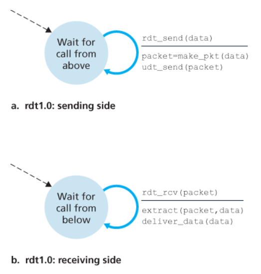

### 송신자
- 상위 계층으로부터 데이터를 받는다.
- 데이터를 포함한 패킷을 만든다.
- 패킷을 전송한다.

### 수신자
- 패킷을 받는다.
- 데이터를 추출한다.
- 상위 계층에 전달한다.

이 경우에는 오류도 없고 손실도 없기 때문에,
수신자가 송신자에게 ACK나 NAK 같은 피드백을 보낼 필요가 없다.

즉, **그냥 보내면 도착하는 상황**이다.

---

## 4. rdt2.0 - 비트 오류가 있는 채널

현실의 네트워크에서는 패킷이 도착하더라도 내용이 깨질 수 있다.  
이를 해결하기 위해 필요한 기능이 3가지다.

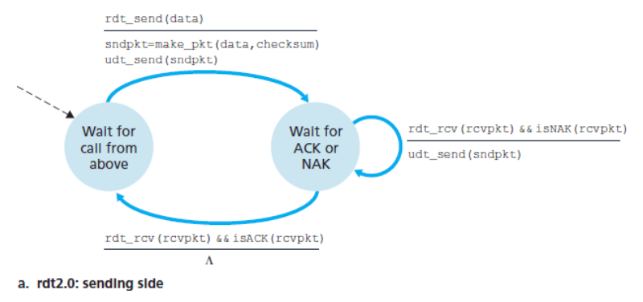

### 1) 오류 검출
수신자는 패킷이 손상되었는지 확인할 수 있어야 한다.  
대표적인 방법이 **체크섬(checksum)** 이다.

### 2) 수신자 피드백
송신자는 수신 상태를 직접 알 수 없기 때문에,
수신자가 결과를 알려줘야 한다.

- `ACK`: 정상 수신
- `NAK`: 오류 발생, 다시 보내 달라

### 3) 재전송
오류가 있는 패킷은 송신자가 다시 보내야 한다.

rdt2.0에서는 송신자가 패킷 하나를 보내고,  
그에 대한 ACK 또는 NAK를 기다린다.  
이처럼 **한 번에 하나만 보내고 응답을 기다리는 방식**을  
**전송 후 대기(stop-and-wait)** 라고 한다.

---

## 5. rdt2.0의 한계와 rdt2.1, rdt2.2

rdt2.0의 문제는 데이터 패킷만이 아니라  
**ACK나 NAK 자체도 손상될 수 있다**는 점이다.

송신자는 손상된 ACK/NAK를 받으면,
수신자가 마지막 패킷을 제대로 받았는지 알 수 없다.  
이때 단순히 다시 보내면 **중복 패킷** 문제가 생긴다.

이 문제를 해결하기 위해 도입된 개념이 **순서 번호(sequence number)** 이다.

### 순서 번호의 역할
- 이 패킷이 **새로운 패킷인지**
- 아니면 **이전에 보낸 패킷의 재전송인지**
구분할 수 있게 해준다.

### rdt2.1
- ACK, NAK를 모두 사용
- 패킷에 순서 번호를 붙여 중복 여부를 판단

### rdt2.2
- NAK 없이 ACK만 사용
- ACK 안에 **어떤 순서 번호에 대한 ACK인지** 포함
- 중복 ACK를 통해 NAK와 비슷한 효과를 냄

즉, rdt2.x의 핵심은  
**오류 검출 + 피드백 + 재전송 + 순서 번호**다.

---

## 6. rdt3.0 - 손실까지 있는 채널

이제는 패킷이 깨지는 것뿐 아니라  
**패킷이나 ACK가 아예 손실되는 경우**도 고려해야 한다.

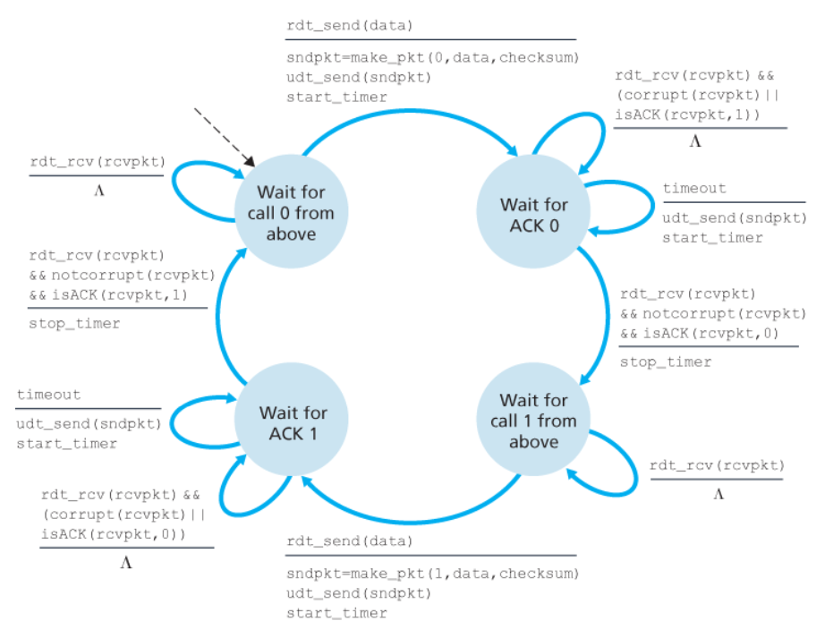

문제는 송신자가 응답을 못 받았을 때,
그 이유가 다음 중 무엇인지 알 수 없다는 점이다.

- 데이터 패킷 손실
- ACK 손실
- 단순 지연

이 문제를 해결하기 위해 **타이머(timer)** 를 도입한다.

### 동작 방식
1. 송신자가 패킷을 전송한다.
2. 타이머를 시작한다.
3. 일정 시간 안에 ACK가 오면 성공으로 처리한다.
4. 시간이 지나도 ACK가 안 오면 패킷을 재전송한다.

rdt3.0은 패킷 순서 번호를 0과 1로 번갈아 사용하기 때문에  
**alternating-bit protocol** 이라고도 부른다.

즉, rdt3.0의 핵심은  
**손실 대응을 위해 타이머 기반 재전송을 추가한 것**이다.

**무손실 동작**
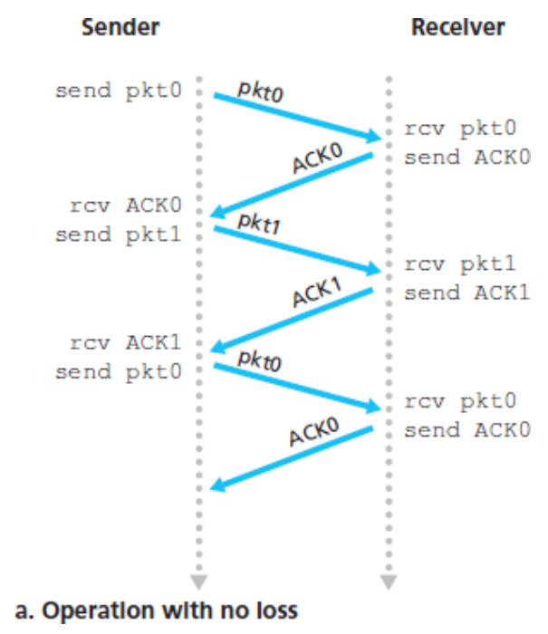

**패킷 손실**
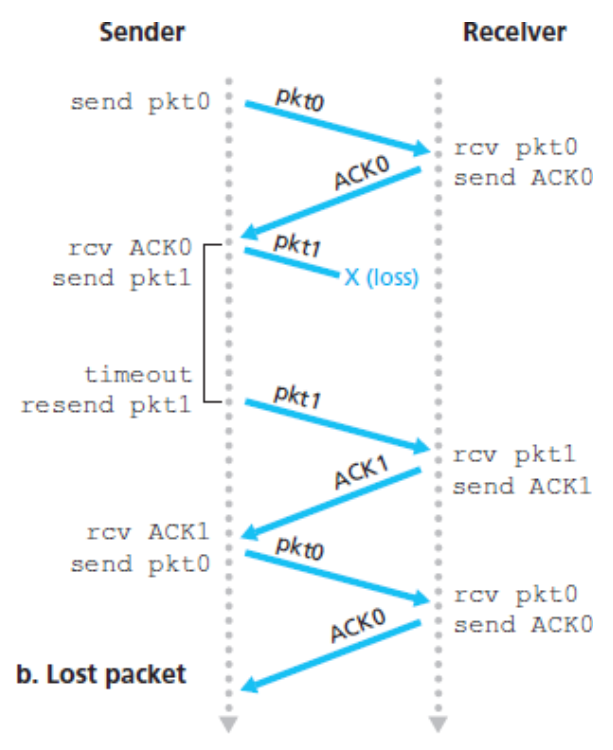

**ACK 손실**
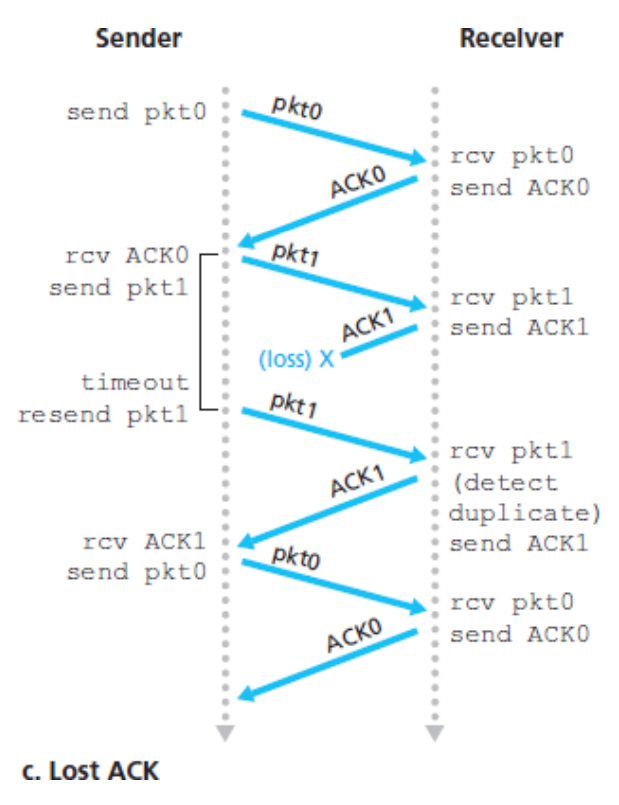

**타임아웃**
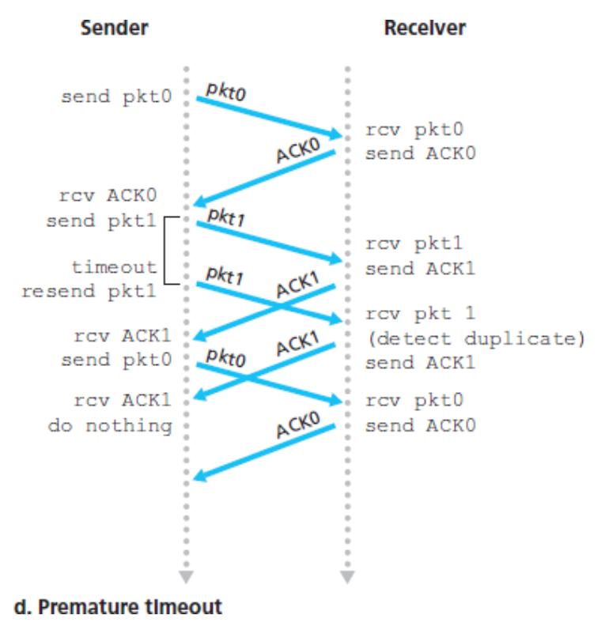

---

## 7. stop-and-wait의 한계와 파이프라이닝

rdt3.0은 기능적으로는 정확하지만 성능이 좋지 않다.  
이유는 stop-and-wait 방식이기 때문이다.

송신자는 패킷 하나를 보내고 ACK를 기다리는 동안  
아무 것도 하지 못한다.  
특히 RTT가 크고 링크가 빠른 환경에서는  
채널이 놀게 되는 시간이 많아져 이용률이 낮아진다.

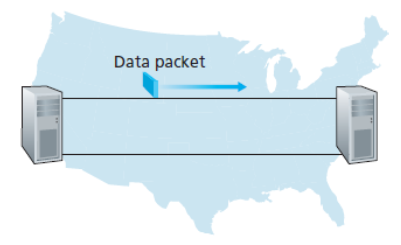

이 문제의 해결책은  
**ACK를 기다리기 전에 여러 패킷을 연속으로 보내는 것**,  
즉 **파이프라이닝(pipelining)** 이다.

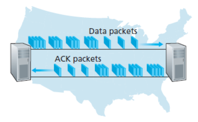

파이프라이닝을 사용하면
- 더 큰 순서 번호 공간이 필요하고
- 송신/수신 측 버퍼가 필요하며
- 손실 복구 방식도 더 정교해져야 한다.

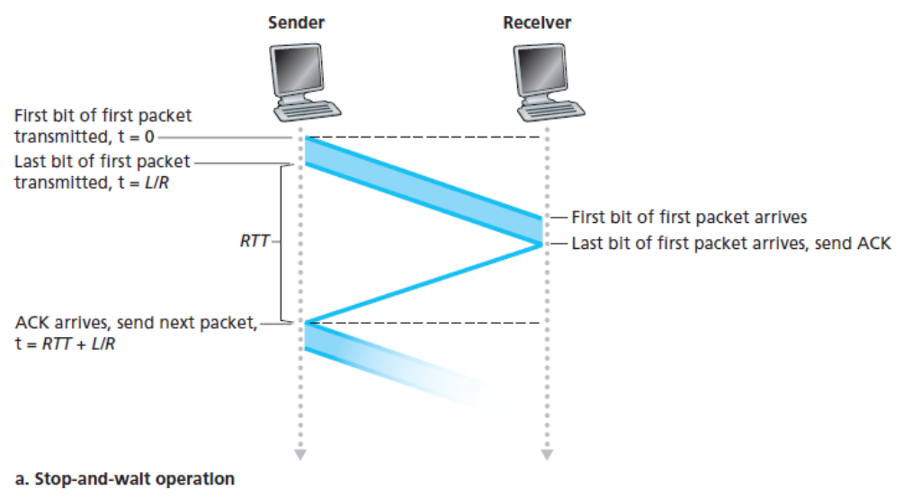

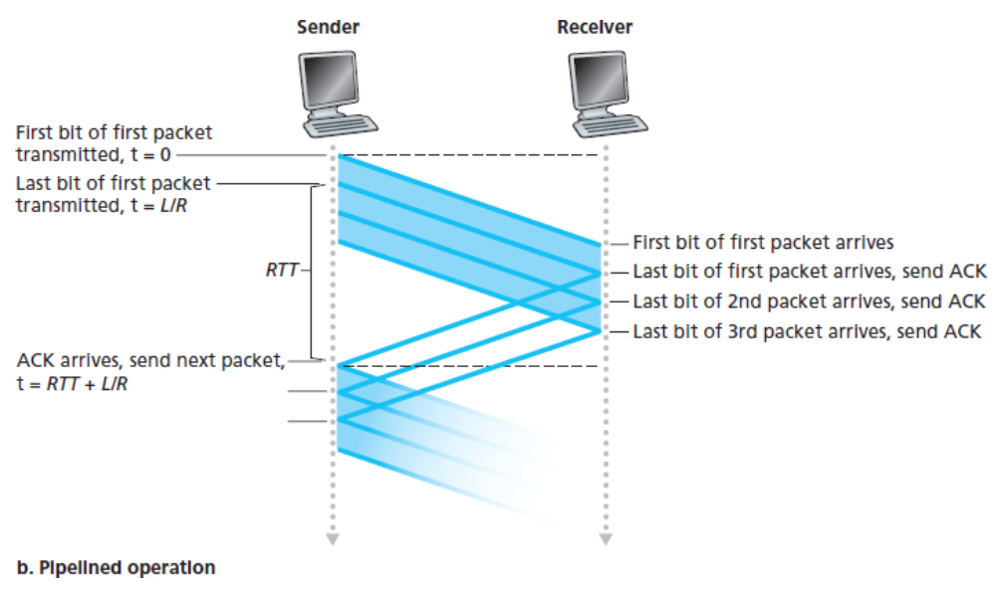

대표적인 방식이 **GBN** 과 **SR** 이다.

---

## 8. GBN(Go-Back-N)

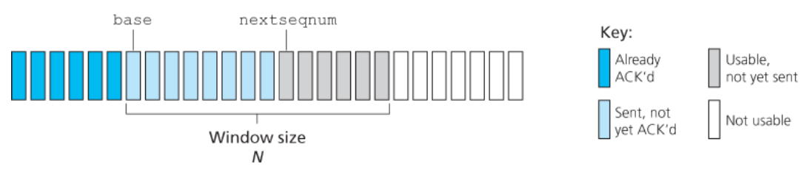

GBN에서는 송신자가 확인응답을 기다리지 않고  
여러 패킷을 연속으로 보낼 수 있다.  
다만, 아직 ACK를 받지 못한 패킷 수는  
윈도 크기 `N` 을 넘을 수 없다.

### 주요 변수
- `base`: 가장 오래된 미확인 패킷의 순서 번호
- `nextseqnum`: 다음에 전송할 패킷의 순서 번호

### 특징
- **누적 ACK** 사용
- 수신자는 **순서가 어긋난 패킷을 버린다**
- 타임아웃이 발생하면, 아직 ACK되지 않은 패킷들을 다시 보낸다

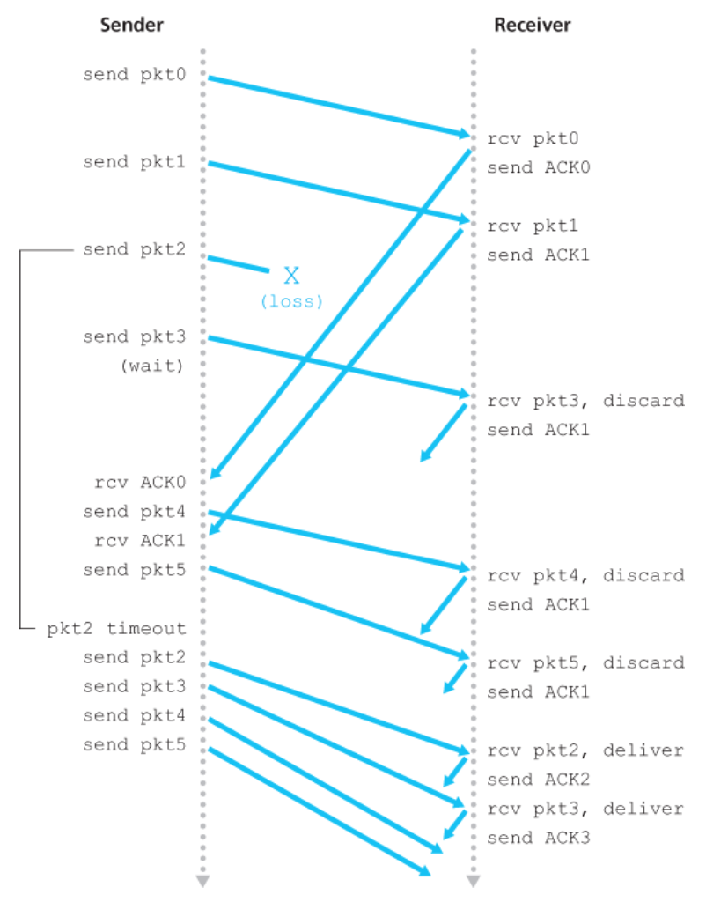

### 장점
- 구조가 단순하다
- 수신자 구현이 비교적 쉽다

### 단점
- 하나의 패킷만 손실돼도 그 뒤 패킷들까지 다시 보내야 해서
  불필요한 재전송이 많아질 수 있다

즉, GBN은 구현은 단순하지만  
오류가 발생했을 때 비효율적일 수 있다.

---

## 9. SR(Selective Repeat)

SR은 손실되거나 오류가 난 것으로 의심되는  
**특정 패킷만 선택적으로 재전송**한다.

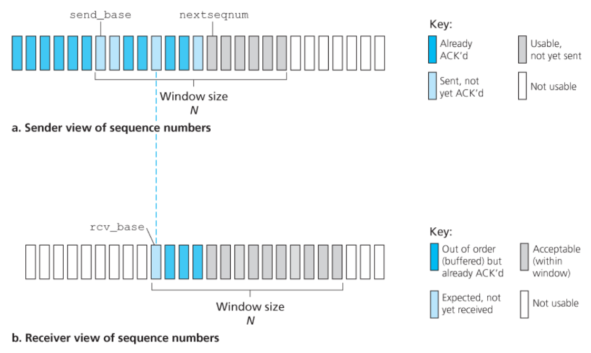

### 특징
- 수신자는 순서와 무관하게 정상 도착한 패킷에 ACK를 보낸다
- 순서가 어긋난 패킷도 버리지 않고 버퍼에 저장할 수 있다
- 빠진 패킷이 도착하면, 저장해 둔 패킷들과 함께 순서대로 상위 계층에 전달한다

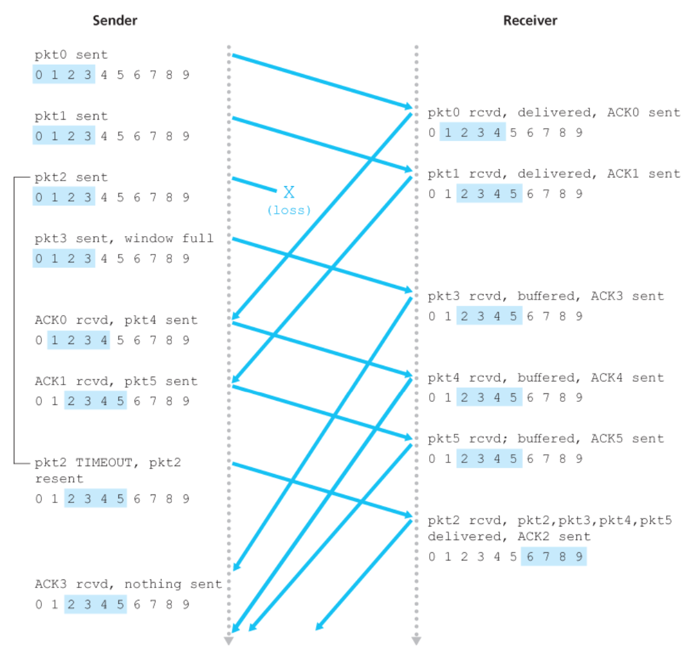

### 장점
- 불필요한 재전송이 적다
- GBN보다 효율적이다

### 단점
- 구현이 더 복잡하다
- 수신 버퍼 관리가 필요하다

또한 SR은 순서 번호 공간이 제한되어 있기 때문에  
**윈도 크기가 순서 번호 공간의 절반 이하**가 되도록 설정해야 한다.  
그래야 오래된 패킷과 새로운 패킷을 혼동하지 않는다.

---

## 10. TCP란?

TCP는 인터넷에서 사용하는 대표적인  
**연결지향형 신뢰적 전송 프로토콜**이다.

### 특징
- 연결지향형(connection-oriented)
- 신뢰적 데이터 전송 제공
- 전이중(full-duplex)
- 점대점(point-to-point)

즉, TCP는 IP의 비신뢰적인 서비스 위에서 동작하지만,  
애플리케이션에게는
- 손상 없는 데이터
- 중복 없는 데이터
- 순서가 보장된 데이터
를 제공한다.

---

## 11. TCP 연결 설정

TCP는 데이터를 보내기 전에 먼저 연결을 설정한다.  
이 과정을 **3-way handshake** 라고 한다.

### 과정
1. 클라이언트 → 서버 : `SYN`
2. 서버 → 클라이언트 : `SYN + ACK`
3. 클라이언트 → 서버 : `ACK`

이 과정을 통해
- 양쪽이 송수신 가능한지 확인하고
- 초기 순서 번호를 교환하고
- 연결 상태를 준비한다

즉, TCP는 **상태를 공유하는 논리적 연결**을 먼저 만든 뒤  
그 위에서 데이터를 주고받는다.

---

## 12. TCP 세그먼트 구조

TCP 세그먼트는 **헤더 + 데이터**로 이루어진다.

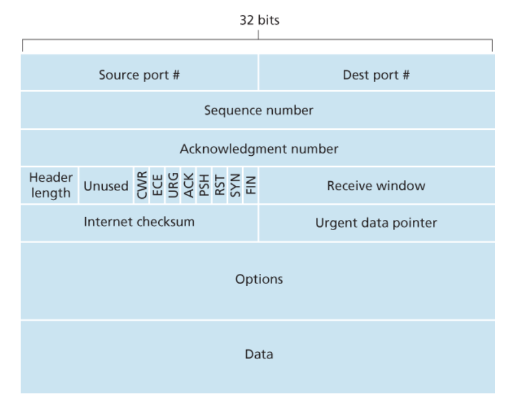

### 주요 헤더 필드
- 출발지 포트 번호 / 목적지 포트 번호
- 체크섬
- 순서 번호(sequence number)
- 확인응답 번호(acknowledgement number)
- 수신 윈도(receive window)
- 헤더 길이
- 옵션 필드
- 플래그 필드(SYN, ACK, FIN 등)

### MSS
TCP는 한 세그먼트에 담을 수 있는 데이터 양을  
**MSS(Maximum Segment Size)** 로 제한한다.

중요한 점은  
MSS가 **TCP 헤더를 포함한 전체 세그먼트 크기**가 아니라,  
**세그먼트에 담기는 애플리케이션 데이터의 최대 크기**라는 것이다.

---

## 13. TCP의 순서 번호와 확인응답 번호

TCP는 데이터를 **구조화된 메시지**가 아니라  
**순서대로 나열된 바이트 스트림**으로 본다.

### 순서 번호
세그먼트의 순서 번호는  
**그 세그먼트에 들어 있는 첫 번째 바이트의 번호**다.

### 확인응답 번호
확인응답 번호는  
**수신자가 다음에 받고 싶은 바이트 번호**다.

예를 들어,
- 0~535 바이트는 받았고
- 536~899 바이트는 못 받았고
- 900~1000 바이트는 먼저 받았더라도

ACK 번호는 **536**이다.  
왜냐하면 TCP는 **연속적으로 받은 마지막 바이트 다음 번호**를 ACK하기 때문이다.

즉, TCP는 **누적 ACK(cumulative ACK)** 를 사용한다.

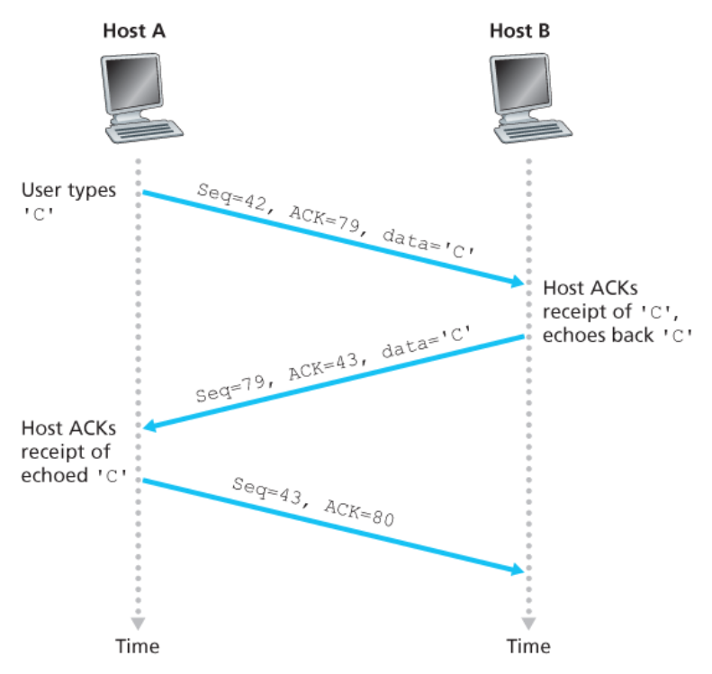

---

## 14. TCP의 신뢰적 전송 방식

TCP는 신뢰성을 위해 여러 메커니즘을 함께 사용한다.

### 1) 체크섬
세그먼트가 전송 중 손상되었는지 확인한다.

### 2) 순서 번호
세그먼트 순서를 맞추고, 중복 세그먼트를 구분한다.

### 3) ACK
수신 상태를 송신자에게 알린다.  
TCP는 기본적으로 **누적 ACK** 를 사용한다.

### 4) 재전송
세그먼트나 ACK가 손실되면 다시 보낸다.

### 5) 버퍼링
수신자는 순서가 어긋난 세그먼트를 임시로 저장할 수 있다.

따라서 TCP는 개념적으로 보면
- 누적 ACK 측면에서는 GBN과 비슷하고
- 일부 버퍼링과 선택적 처리 측면에서는 SR과 비슷하다

즉, TCP의 오류 복구 메커니즘은  
**GBN과 SR의 혼합형**으로 볼 수 있다.

---

## 15. RTT 추정과 타임아웃

TCP는 손실 세그먼트를 감지하기 위해 타이머를 사용한다.  
하지만 타임아웃 시간을 너무 짧게 잡으면 불필요한 재전송이 많아지고,  
너무 길게 잡으면 손실 복구가 늦어진다.

그래서 TCP는 RTT를 지속적으로 추정한다.

### 주요 개념
- `SampleRTT` : 실제 측정한 RTT
- `EstimatedRTT` : RTT 추정값
- `DevRTT` : RTT 변동폭

### 대표 식
- `EstimatedRTT = (1 - α) × EstimatedRTT + α × SampleRTT`
- `DevRTT = (1 - β) × DevRTT + β × |SampleRTT - EstimatedRTT|`
- `TimeoutInterval = EstimatedRTT + 4 × DevRTT`

즉, TCP는 최근 네트워크 상태를 반영하여  
**타임아웃 값을 동적으로 조정**한다.

**TCP 동작 예시**

**1)손실된 확인 응답에 기인한 재전송**

**2)세그먼트 100 재전송 안되는 경우**
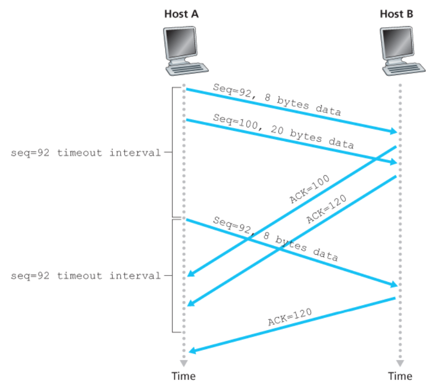

**3)누적 확인 응답이 첫 번째 세그먼트 재전송 방지**
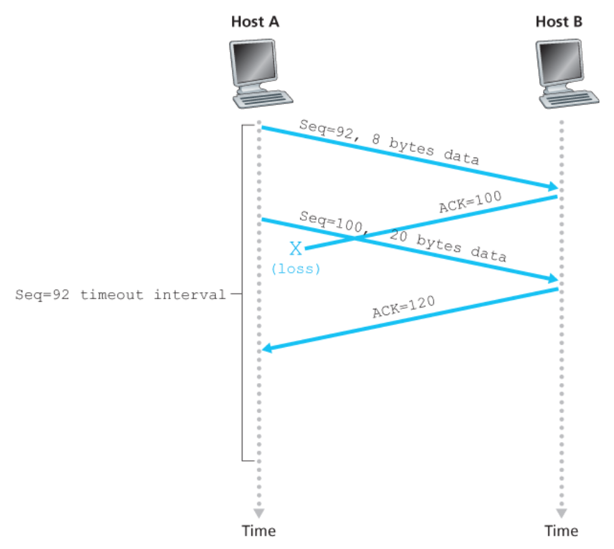

---

## 16. 빠른 재전송(Fast Retransmit)

타임아웃만 기다리면 손실 복구가 느릴 수 있다.  
그래서 TCP는 **중복 ACK** 를 이용해 손실을 더 빨리 감지한다.

수신자가 기다리던 순서보다 더 큰 순서 번호의 세그먼트를 받으면,  
빠진 세그먼트가 있다고 판단하고  
마지막으로 정상적으로 받은 바이트까지의 ACK를 반복해서 보낸다.  
이것이 **중복 ACK** 다.

송신자가 **같은 ACK를 3번 중복해서 받으면**,  
타임아웃이 일어나기 전이라도  
그 다음 세그먼트가 손실되었다고 보고 즉시 재전송한다.

즉, 빠른 재전송은  
**긴 타임아웃을 기다리지 않고 손실을 빠르게 복구하기 위한 메커니즘**이다.

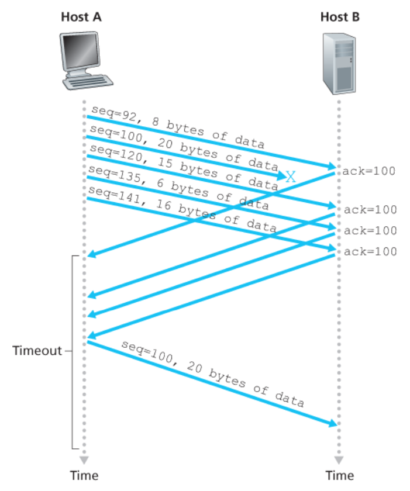

---

## 17. 흐름 제어

TCP는 송신자가 너무 빠르게 보내서  
수신자의 버퍼가 넘치는 것을 막아야 한다.  
이를 **흐름 제어(flow control)** 라고 한다.

### 핵심 개념
수신자는 자신의 남은 버퍼 공간을  
**수신 윈도(receive window, rwnd)** 로 광고한다.

송신자는 이 값을 참고해서  
미확인 데이터 양이 rwnd를 넘지 않도록 전송한다.

즉,
- 수신자는 “내가 지금 이만큼 더 받을 수 있다”고 알리고
- 송신자는 그 범위 안에서만 보낸다

이렇게 해서 수신 버퍼 오버플로를 방지한다.

---

## 18. 흐름 제어와 혼잡 제어

흐름 제어와 자주 함께 나오는 개념이 **혼잡 제어(congestion control)** 다.  
둘은 목적이 다르다.

### 흐름 제어
- 대상: **수신자**
- 목적: 수신자 버퍼가 넘치지 않게 하기

### 혼잡 제어
- 대상: **네트워크 전체**
- 목적: 네트워크 혼잡으로 인한 성능 저하를 막기

즉, 흐름 제어는 **수신자 보호**,  
혼잡 제어는 **네트워크 보호**라고 보면 된다.

---