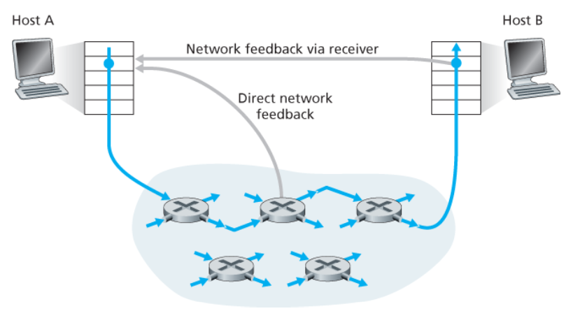

# 혼잡 제어와 TCP 혼잡 제어

## 1) 혼잡 제어란? (Congestion Control)

- **혼잡 제어(congestion control)** 란,  
  네트워크에 너무 많은 트래픽이 한꺼번에 유입되어 성능이 저하되는 상황을 방지하거나 완화하기 위해 **송신 속도를 조절하는 메커니즘**이다.

### 혼잡이 발생하면?
- 라우터 버퍼에 패킷이 쌓여 **지연(delay)** 이 증가한다.
- 버퍼가 가득 차면 패킷이 **손실(loss)** 된다.
- 손실된 패킷의 재전송으로 인해 혼잡이 더 심해질 수 있다.

> 즉, 혼잡 제어의 목적은  
> **네트워크가 감당할 수 있는 수준으로 전송률을 조절하여 전체 성능을 안정적으로 유지하는 것**이다.

---

## 2) 혼잡 제어에 대한 접근법

혼잡 제어 방식은 크게 **종단 간 혼잡 제어**와 **네트워크 지원 혼잡 제어**로 나뉜다.

### 2-1) 종단 간 혼잡 제어 (End-to-End Congestion Control)

- 네트워크 계층이 혼잡 제어를 위해 전송 계층에 **직접적인 피드백을 제공하지 않는 방식**
- 따라서 송신자는 네트워크 내부 상태를 직접 알 수 없고,  
  **관찰된 현상**을 바탕으로 혼잡을 추측해야 한다.

### 송신자가 참고하는 신호
- **패킷 손실**
- **RTT 증가**
- **ACK 도착 속도 변화**

### TCP와의 관계
- 전통적인 TCP 혼잡 제어가 이 방식을 사용한다.
- TCP는 다음을 혼잡의 신호로 본다.
  - **세그먼트 손실**
  - **증가하는 왕복 지연값**

- 그리고 그에 따라 **윈도 크기를 줄인다.**

### 2-2) 네트워크 지원 혼잡 제어 (Network-Assisted Congestion Control)

- 라우터가 혼잡 상태와 관련된 정보를 **송신자나 수신자에게 직접 알려주는 방식**이다.

### 예시
- 송신자에게 직접 알림을 보내는 방식
- 패킷 헤더의 특정 필드에 혼잡 상태를 표시하는 방식

### 혼잡 정보 전달 방식

#### 1. 직접 피드백
- 라우터가 송신자에게 직접 혼잡 상태를 알린다.
- 예: **choke packet**

#### 2. 간접 피드백

- 라우터가 패킷 안 특정 필드에 혼잡 상태를 표시한다.
- 수신자가 이를 확인한 뒤 송신자에게 알린다.
- 이 경우 송신자에게 정보가 돌아가기까지 **1 RTT**가 걸린다.

---

## 3) 전통적인 TCP의 혼잡 제어

- TCP는 **네트워크의 혼잡 정도에 따라 송신자가 전송률을 조절**하도록 하는 방식을 사용한다.

### 기본 동작
- TCP 송신자가 경로에 혼잡이 없다고 판단하면 → **전송률을 높인다**
- TCP 송신자가 경로에 혼잡이 있다고 판단하면 → **전송률을 줄인다**

> 즉, TCP는 네트워크 상태를 보며  
> **전송률을 계속 조정하는 적응형 방식**으로 동작한다.

---

## 4) TCP 송신자는 전송률을 어떻게 제한하는가?

- TCP는 송신 측에서 **혼잡 윈도(congestion window)** 라는 변수를 사용한다.

### 혼잡 윈도
- 표기: **`cwnd`**
- 역할: TCP 송신자가 네트워크로 보낼 수 있는 데이터 양을 제한

또한 수신 측의 버퍼 여유 공간을 나타내는 **수신 윈도(`rwnd`)** 도 함께 고려한다.

### 송신 측 제한식

LastByteSent - LastByteAcked ≤ min(cwnd, rwnd)

## 5) TCP 송신자는 혼잡을 어떻게 감지하는가?

- TCP는 네트워크 내부를 직접 볼 수 없기 때문에  
  **간접적인 신호**를 통해 혼잡을 판단한다.

### 5-1) 손실 이벤트가 발생한 경우

- 혼잡이 심해지면 경로 상의 라우터 버퍼가 오버플로되고 패킷이 버려질 수 있다.
- 전통적인 TCP는 이런 손실을 **혼잡의 신호**로 해석한다.

### 대표적인 손실 이벤트
- **타임아웃(timeout)**
- **3개의 중복 ACK 수신**

> 여기서 “3개의 중복 ACK”란,  
> **같은 ACK 번호를 가진 ACK를 연속으로 3번 더 받는 경우**를 뜻한다.

> 이러한 손실 이벤트는 TCP에게  
> **“경로 상에 혼잡이 발생했다”** 는 신호가 된다.

### ACK 도착 속도에 따른 의미
- ACK가 천천히 도착하면  
  → 혼잡 윈도 증가 속도도 느려진다.
- ACK가 빠르게 도착하면  
  → 혼잡 윈도는 더 빠르게 증가한다.

> 즉, ACK의 도착 속도 자체가  
> **현재 네트워크 상태를 간접적으로 반영하는 신호**가 된다.

---

## 6) TCP는 어떤 원리로 송신율을 조절하는가?

- TCP는 너무 빠르게 보내면 **혼잡 붕괴(congestion collapse)** 가 발생할 수 있고,
- 너무 느리게 보내면 **대역폭을 충분히 활용하지 못한다.**

그래서 TCP는 다음 **3가지 원칙**에 따라 송신 속도를 결정한다.

### 6-1) 세그먼트 손실이 발생하면 전송률을 줄인다

- 전통적인 TCP는 **손실된 세그먼트를 혼잡의 신호**로 해석한다.

### 손실을 재전송하게 만드는 대표적인 이벤트
- **타임아웃**
- **3개의 중복 ACK 수신**

### 6-2) ACK가 도착하면 전송률을 높일 수 있다

- ACK의 도착은 송신자의 세그먼트가 성공적으로 전달되었다는 뜻이다.
- 따라서 TCP는 이를  
  **네트워크가 아직 혼잡하지 않다는 묵시적 신호**로 받아들인다.

### 6-3) 대역폭을 계속 탐색한다

TCP는 다음과 같이 동작한다.

- ACK가 도착하는 동안 전송률을 증가시키고
- 손실 이벤트가 발생하면 전송률을 감소시킨다.

즉,

1. 혼잡이 발생하기 전까지 전송률을 높이고
2. 혼잡이 발생하면 전송률을 줄인 뒤
3. 다시 가용 대역폭이 더 있는지 탐색한다.

> 이처럼 TCP는  
> **증가 → 손실 감지 → 감소 → 재탐색**을 반복한다.

---

## 7) TCP 혼잡 제어 알고리즘의 세 가지 구성 요소

TCP 혼잡 제어 알고리즘은 크게 다음 세 가지 요소로 구성된다.

- **슬로 스타트 (Slow Start)**
- **혼잡 회피 (Congestion Avoidance)**
- **빠른 회복 (Fast Recovery)**

---

## 8) 슬로 스타트, 혼잡 회피, 빠른 회복이 왜 필요한가?

- TCP는 네트워크 안을 직접 볼 수 없다.
- 따라서 지금 네트워크가 얼마나 한가한지, 얼마나 막혀 있는지를 **정확히 알 수 없다.**

그래서 TCP는 다음과 같이 동작한다.

- 처음에는 일단 데이터를 보내 본다.
- ACK가 잘 오면 → **아직 괜찮다고 보고 더 보낸다.**
- 손실이 발생하면 → **너무 많이 보냈다고 보고 줄인다.**

문제는 여기서 두 가지를 정해야 한다는 점이다.

1. **얼마나 빨리 늘릴 것인가?**
2. **손실이 발생했을 때 얼마나 줄일 것인가?**

이 문제를 해결하기 위해 TCP는 다음 세 단계를 사용한다.

- **슬로 스타트(Slow Start)**  
  → 처음에는 작게 시작하지만 빠르게 증가
- **혼잡 회피(Congestion Avoidance)**  
  → 어느 정도 올라간 뒤에는 천천히 증가
- **빠른 회복(Fast Recovery)**  
  → 손실이 발생했을 때 너무 과하게 줄이지 않고 빠르게 회복

> 즉, 이 세 단계는  
> **TCP가 “속도를 어떻게 올리고, 언제 줄이고, 얼마나 회복할지”를 정하기 위한 규칙**이다.

---

## 9) 슬로 스타트 (Slow Start)

### 슬로 스타트는 무엇인가?

- TCP 연결이 시작될 때는 네트워크가 얼마나 여유로운지 전혀 모른다.
- 처음부터 너무 많이 보내면 혼잡을 일으킬 수 있고,
- 너무 조금씩만 늘리면 네트워크를 비효율적으로 사용하게 된다.

그래서 TCP는

- **작게 시작하지만**
- **빠르게 증가시키는 방식**

을 사용한다.  
이 단계가 **슬로 스타트**이다.

### 이름은 “슬로우”인데 왜 실제로는 빠른가?

이름 때문에 느리게 증가한다고 오해하기 쉽지만,  
실제로는 **매우 빠르게 증가하는 단계**다.

### 슬로 스타트의 동작

- TCP 연결이 시작될 때 `cwnd` 값은 일반적으로 **1 MSS**로 초기화된다고 본다.
- 따라서 초기 전송률은 대략 **`MSS / RTT`** 수준이다.
- 세그먼트가 ACK를 받을 때마다 `cwnd`를 **1 MSS씩 증가**시킨다.

### 왜 빠르게 증가한다고 하는가?

이 방식은 결과적으로 **RTT마다 거의 2배씩 증가**하는 효과를 만든다.

예를 들어:

- 처음: `cwnd = 1`
- 다음 RTT 후: `2`
- 다음 RTT 후: `4`
- 다음 RTT 후: `8`

즉, `cwnd`가 **지수적으로 증가**한다.

### 왜 이렇게 하냐?

- 처음에는 네트워크의 가용 대역폭을 모르기 때문이다.
- 따라서 **“어디까지는 괜찮은지”를 빠르게 탐색해야 한다.**

> 슬로 스타트는  
> **초기 대역폭을 빠르게 탐색하는 단계**라고 이해하면 된다.

### 슬로 스타트 종료 조건

슬로 스타트는 다음 세 경우 중 하나가 발생하면 끝난다.

#### 1. 타임아웃 손실 이벤트 발생
- `cwnd = 1 MSS`
- 새로운 슬로 스타트 시작

#### 2. `cwnd`가 `ssthresh`에 도달
- 슬로 스타트 종료
- **혼잡 회피 모드**로 전환

#### 3. 3개의 중복 ACK 검출
- 빠른 재전송 수행
- **빠른 회복 상태**로 진입

### `ssthresh`란?
- **slow start threshold**
- 일반적으로 **혼잡이 검출되었을 때의 `cwnd`의 절반**으로 설정한다.

---

## 10) 혼잡 회피 (Congestion Avoidance)

### 혼잡 회피는 무엇인가?

- 슬로 스타트로 빠르게 올리다 보면 언젠가는 혼잡이 생길 수 있다.
- 어느 정도 전송률이 올라간 뒤에는 더 이상 공격적으로 증가시키지 않고,
- **조심스럽게 천천히 증가시키는 단계**로 바뀐다.

이 단계가 **혼잡 회피**이다.

### 동작 방식

- 일반적으로 TCP는 혼잡 회피 상태에서  
  **RTT마다 1 MSS씩 `cwnd`를 증가**시킨다.

### 증가 방식의 차이

- 슬로 스타트: **지수 증가**
- 혼잡 회피: **선형 증가**

예를 들어 혼잡 회피에서는 다음과 같이 증가한다.

- `10`
- `11`
- `12`
- `13`

즉, 슬로 스타트처럼

- `1 → 2 → 4 → 8`

로 커지는 것이 아니라,

- `10 → 11 → 12 → 13`

처럼 **조금씩 증가**한다.

### 왜 이렇게 하냐?

- 이 단계에 들어왔다는 것은 이미 어느 정도 대역폭을 사용하고 있다는 뜻이다.
- 여기서 계속 2배씩 올리면 금방 혼잡이 발생할 수 있다.

> 혼잡 회피는  
> **“지금 꽤 차 있으니 조금씩만 올려 보자”** 라는 단계라고 보면 된다.

### 혼잡 회피 종료 조건

#### 1. 타임아웃 발생
- `cwnd = 1 MSS`
- `ssthresh = 손실 발생 시점의 cwnd / 2`
- 다시 슬로 스타트로 진입

#### 2. 3개의 중복 ACK 발생
- 이 경우 네트워크가 완전히 막힌 것은 아니고,  
  일부 세그먼트는 여전히 전달되고 있다고 볼 수 있다.

따라서 TCP는 다음과 같이 동작한다.

- `cwnd`를 절반으로 줄인다.
- `ssthresh`도 그 값으로 설정한다.
- 빠른 회복 상태로 진입한다.

---

## 11) 빠른 회복 (Fast Recovery)

### 빠른 회복은 언제 사용하는가?

- 빠른 회복은 **3개의 중복 ACK** 로 손실이 감지되었을 때 사용된다.

이것은 보통 다음 의미를 가진다.

- 어떤 패킷 하나가 중간에 빠졌는데
- 그 뒤의 패킷들은 어느 정도 정상적으로 도착하고 있다

즉, 네트워크가 완전히 막힌 것이 아니라  
**부분적인 손실** 정도로 볼 수 있다.

### 타임아웃과 무엇이 다른가?

이 차이가 매우 중요하다.

#### 타임아웃
- ACK가 너무 오래 오지 않음
- TCP는 **상황이 꽤 심각하다**고 판단

#### 3개의 중복 ACK
- 뒤 패킷들은 도착해서 ACK가 계속 오고 있음
- TCP는 **완전히 막힌 건 아니고, 패킷 하나 정도가 문제**라고 판단

따라서 3개의 중복 ACK 상황에서는  
전송 속도를 **처음부터 다시 시작할 필요는 없다**고 보는 것이다.

### 빠른 회복의 동작

- 손실이 감지되면 `cwnd`를 **절반 정도로 줄인다**
- 하지만 `cwnd`를 **1 MSS까지 떨어뜨리지는 않는다**
- 그 상태에서 빠르게 회복하여 다시 전송을 이어 간다

### 빠른 회복 상태의 세부 동작
- 손실된 세그먼트에 대한 **중복 ACK가 도착할 때마다** `cwnd`를 **1 MSS씩 증가**
- 손실된 세그먼트에 대한 **ACK가 도착하면** 혼잡 회피 상태로 진입

### 빠른 회복 중 타임아웃 발생 시
- `cwnd = 1 MSS`
- `ssthresh = 손실 시점의 cwnd / 2`
- 슬로 스타트로 전환

> 빠른 회복은  
> **“문제가 있긴 하지만 네트워크가 완전히 망한 건 아니니까, 너무 과하게 줄이지 말자”** 는 철학으로 이해하면 쉽다.

---

## 12) 세 단계를 한 번에 비유하면

도로 비유로 보면 쉽게 이해할 수 있다.

### 슬로 스타트
- 고속도로에 처음 진입했을 때는 차가 얼마나 많은지 모른다.
- 그래서 처음엔 조심해서 출발하지만,
- 길이 비어 있으면 **속도를 빠르게 올린다.**

### 혼잡 회피
- 어느 정도 속도가 붙고 나면,
- 이제는 도로 상황을 보면서  
  **속도를 조금씩만 올린다.**

### 빠른 회복
- 앞차 하나가 잠깐 브레이크를 밟았다고 해서  
  내 차를 완전히 멈출 필요는 없다.
- **조금 속도를 줄이고 다시 흐름에 맞춘다.**

> 즉,
> - **슬로 스타트** = 빠르게 탐색
> - **혼잡 회피** = 천천히 증가
> - **빠른 회복** = 과하게 줄이지 않고 복구

---

## 13) TCP Tahoe와 TCP Reno

- 둘 다 TCP의 혼잡 제어 방식이지만,
- **패킷 손실이 났을 때 어떻게 반응하느냐**가 다르다.

### 13-1) TCP Tahoe

### Tahoe의 생각
> “손실이 났다? 그럼 혼잡이 꽤 심한 거네.  
> 그냥 처음부터 다시 시작하자.”

그래서 손실이 나면:

- `cwnd = 1 MSS`
- 슬로 스타트로 다시 감

즉,

- **타임아웃이든**
- **3개의 중복 ACK든**

모두 **같이 크게 줄인다.**

### 13-2) TCP Reno

- Reno는 손실 상황을 좀 더 구분해서 반응한다.
- **빠른 회복(Fast Recovery)** 을 도입한 버전이다.

### Reno의 생각
> “타임아웃이면 심각한 거 맞다. 크게 줄이자.  
> 그런데 3개의 중복 ACK면 완전히 막힌 건 아니니까 덜 줄여도 되겠다.”

### Reno의 동작
- **타임아웃**이면  
  → `cwnd = 1 MSS`, 슬로 스타트 진입
- **3개의 중복 ACK**이면  
  → `cwnd`를 절반으로 줄이고 빠른 회복 후 혼잡 회피로 진입

> 즉, Reno는 Tahoe보다  
> **손실 상황에서 성능 저하를 덜 크게 만든다.**

---

## 14) Tahoe와 Reno의 차이

### TCP Tahoe
- `cwnd = 1 MSS`
- `ssthresh`까지는 **지수적으로 증가**
- 이후에는 **선형적으로 증가**
- 손실이 나면 **무조건 크게 줄이고 처음부터 다시 시작**

### TCP Reno
- `cwnd`를 **절반 수준으로 감소**
- 빠른 회복을 거친 뒤 **선형적으로 증가**
- 3개의 중복 ACK 상황에서는 **과하게 줄이지 않고 빠르게 회복**

### 예시로 비교

만약 손실 직전 `cwnd = 16`이었다고 하자.

#### Tahoe
- 손실 발생 → `cwnd = 1`
- 이후 다시 `1 → 2 → 4 → 8 → ...`

#### Reno
- 3개의 중복 ACK 발생 → `cwnd = 8`
- 빠른 회복 후 선형 증가

> 즉, Reno는 이미 확보했던 전송률을 완전히 버리지 않기 때문에  
> **Tahoe보다 더 효율적**이다.