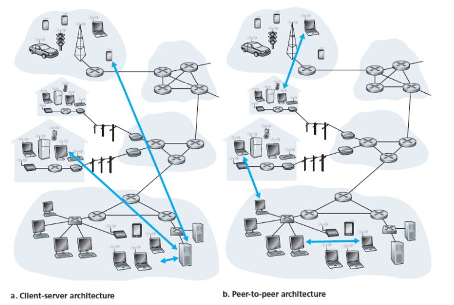
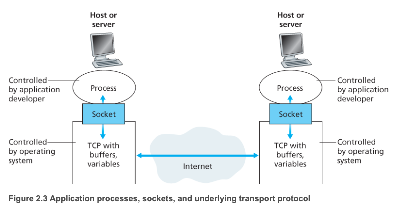
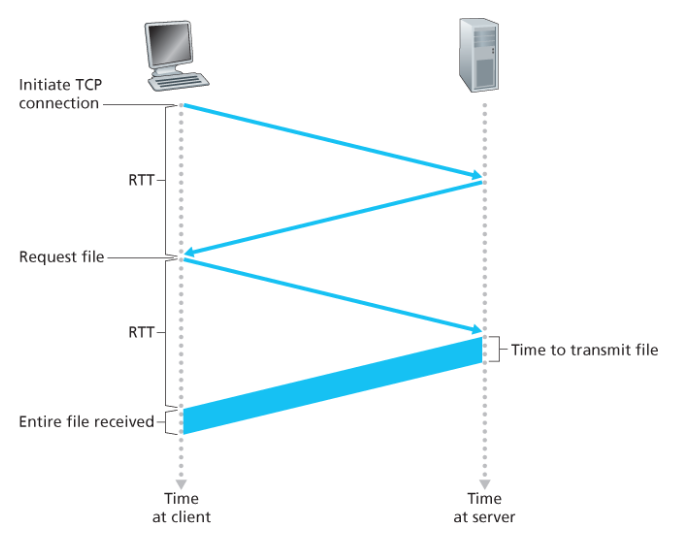
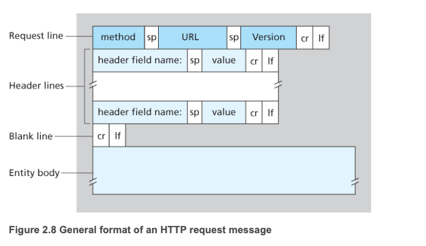
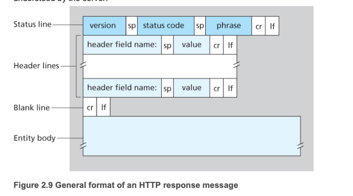
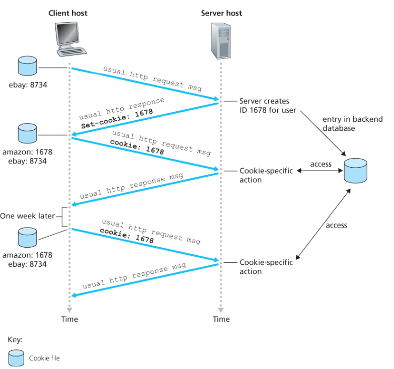
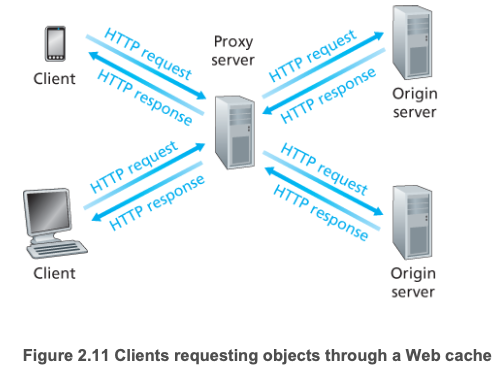
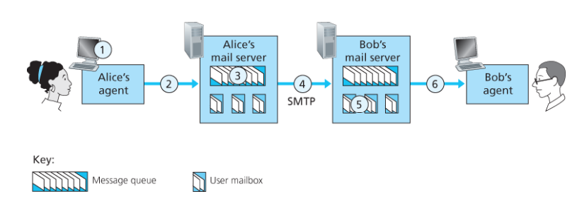
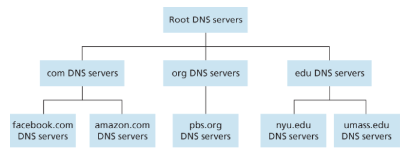
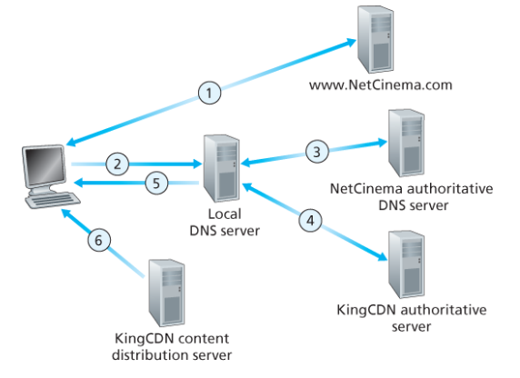

# 애플리케이션 계층 정리

---

## 1. 네트워크 애플리케이션의 원리

네트워크 애플리케이션 개발의 핵심은 **서로 다른 종단 시스템(end system)** 에서 실행되는 프로그램들이 **네트워크를 통해 통신**하도록 만드는 것이다.

예를 들어 웹에서는 다음 두 프로그램이 통신한다.

- **클라이언트**: 브라우저
- **서버**: 웹 서버

중요한 점은, 애플리케이션 개발자는 **라우터나 스위치 같은 네트워크 코어 장비의 소프트웨어를 작성하지 않는다**는 것이다.  
애플리케이션은 **종단 시스템**에서 동작한다.

---

## 2. 네트워크 애플리케이션 구조

### 2.1 클라이언트-서버 구조

#### 특징
- 항상 켜져 있는 서버가 존재
- 클라이언트가 서버에 요청을 보냄
- 클라이언트끼리는 직접 통신하지 않음
- 서버는 보통 고정 IP 주소를 가짐

#### 장점
- 관리가 쉬움
- 중앙 집중적으로 서비스 제공 가능

#### 단점
- 서버에 부하가 집중될 수 있음
- 많은 요청을 처리하기 위해 대규모 데이터센터가 필요할 수 있음

#### 예시
- 웹 서비스
- 이메일 서비스

---

### 2.2 P2P(Peer-to-Peer) 구조

#### 특징
- 항상 켜져 있는 중앙 서버 의존이 적음 또는 없음
- 피어(peer) 들이 서로 직접 통신
- 각 피어는 데이터를 요청하기도 하고 제공하기도 함

#### 장점
- **자가 확장성(self-scalability)** 이 있음
- 서버 인프라 비용이 적음

#### 단점
- 관리가 어렵고 안정성이 떨어질 수 있음
- 피어가 수시로 접속/종료될 수 있음

#### 예시
- 파일 공유 서비스

---

## 3. 프로세스 간 통신

실제로 통신하는 것은 프로그램 자체가 아니라, **실행 중인 프로그램인 프로세스(process)** 이다.

두 종단 시스템의 프로세스는 **메시지(message)** 를 주고받으며 통신한다.

- **송신 프로세스**: 메시지를 생성하여 보냄
- **수신 프로세스**: 메시지를 받고 응답함

---

### 3.1 클라이언트 프로세스와 서버 프로세스

두 프로세스 간 통신에서:

- **클라이언트**: 통신을 먼저 시작하는 쪽
- **서버**: 요청을 기다리는 쪽

즉, 보통

- **요청 보내는 쪽 = 클라이언트**
- **요청 받는 쪽 = 서버**

단, P2P 구조에서는 하나의 프로세스가 **클라이언트이면서 서버 역할도 할 수 있다.**

---

### 3.2 소켓(Socket)

프로세스는 **소켓(socket)** 을 통해 네트워크와 연결된다.

#### 소켓이란?
- 애플리케이션 계층과 트랜스포트 계층 사이의 인터페이스
- 비유하면 **프로세스의 문(door)** 같은 존재

#### 핵심
- 프로세스는 소켓을 통해 메시지를 보내고 받음
- 소켓은 애플리케이션과 네트워크 사이의 **API 역할**을 함

---

### 3.3 프로세스 주소 지정

다른 프로세스에게 메시지를 보내려면 수신 프로세스를 식별할 수 있어야 한다.

필요한 정보는 2가지다.

- **IP 주소**: 어느 호스트인지 식별
- **포트 번호(port number)**: 그 호스트 안의 어느 프로세스인지 식별

즉,

> 프로세스를 찾으려면 **IP 주소 + 포트 번호**가 필요하다.

---

## 4. 애플리케이션 계층 프로토콜

애플리케이션 계층 프로토콜은 **서로 다른 종단 시스템에서 실행되는 프로세스들이 메시지를 주고받는 방법**을 정의한다.

### 정의하는 내용
- 어떤 종류의 메시지를 교환할지
- 메시지 형식(syntax)
- 각 필드의 의미(semantics)
- 언제 어떻게 메시지를 보내고 응답할지에 대한 규칙

### 예시
- HTTP
- SMTP
- DNS

### 참고
- 표준 프로토콜은 보통 **RFC 문서**에 정의됨
- 어떤 프로토콜은 기업 내부에서만 쓰는 **독점 프로토콜**일 수도 있음

---

## 5. 웹과 HTTP

웹은 사용자가 원할 때 원하는 정보를 가져오는 **온디맨드(on-demand) 서비스**다.

웹의 핵심 애플리케이션 계층 프로토콜은 **HTTP** 이다.

---

### 5.1 웹 페이지와 객체(Object)

웹 페이지는 여러 **객체(object)** 로 구성된다.

#### 객체란?
하나의 URL로 지정할 수 있는 파일 하나

예:
- HTML 파일
- JPEG 이미지
- JavaScript 파일

#### 예시
웹 페이지가 다음으로 구성되어 있다면:

- HTML 파일 1개
- 이미지 5개

총 **6개의 객체**를 가진다.

---

## 5.2 HTTP와 TCP

HTTP는 **TCP를 전송 프로토콜**로 사용한다.

### 동작 과정
1. 클라이언트가 서버와 TCP 연결을 설정
2. HTTP 요청 메시지를 전송
3. 서버가 HTTP 응답 메시지를 전송

### TCP를 사용하는 이유
TCP는 다음을 보장한다.

- **신뢰적인 데이터 전송**
- **손실 복구**
- **올바른 순서 보장**

즉, HTTP는 데이터 전달의 신뢰성을 TCP에 맡기고,  
자신은 **메시지의 형식과 교환 규칙**에 집중한다.

---

## 5.3 HTTP의 특징: Stateless

HTTP는 **비상태(stateless) 프로토콜**이다.

### 의미
서버는 클라이언트의 이전 요청 상태를 기억하지 않는다.

예를 들어,  
같은 클라이언트가 몇 초 뒤 동일한 객체를 다시 요청해도  
서버는 “아까 보냈던 것”이라고 기억하지 않고 다시 전송한다.

### 장점
- 서버 설계가 단순해짐

### 단점
- 사용자 상태 관리가 어려움
- 이를 해결하기 위해 **쿠키(cookie)** 등을 사용함

---

# 6. 비지속 연결과 지속 연결

## 6.1 비지속 연결 (Non-persistent HTTP)

각 요청/응답마다 **새로운 TCP 연결**을 사용하는 방식

### 특징
- 객체 하나를 받을 때마다 TCP 연결 생성
- HTTP/1.0에서 사용

### 문제점
- 매 요청마다 연결 설정 필요
- 서버/클라이언트 모두 부담 증가
- 각 객체마다 **약 2 RTT + 전송 시간** 필요

### RTT란?
**Round Trip Time**  
패킷이 클라이언트에서 서버까지 갔다가 다시 돌아오는 시간

---

## 6.2 지속 연결 (Persistent HTTP)

한 번 맺은 TCP 연결을 **여러 요청/응답에 계속 사용하는 방식**

### 특징
- 같은 서버의 여러 객체를 하나의 TCP 연결로 전송 가능
- HTTP/1.1의 기본 방식
- **파이프라이닝(pipelining)** 가능

### 장점
- 연결 설정 비용 감소
- 응답 시간 단축
- 서버 부담 감소

---

# 7. HTTP 메시지 포맷

## 7.1 HTTP 요청 메시지

#### 구성
- 요청 라인(Request Line)
- 헤더 라인(Header Line)
- 개체 몸체(Entity Body)

## 주요 메서드
- **GET** : 리소스 요청
- **POST** : 데이터 포함 요청
- **HEAD** : 헤더만 요청
- **PUT** : 업로드
- **DELETE** : 삭제

## 주요 헤더
- **Host** : 요청 대상 호스트
- **Connection** : 연결 유지 여부
- **User-Agent** : 브라우저 정보
- **Accept-Language** : 원하는 언어

## Entity Body
- **GET 요청**에서는 보통 비어 있음
- **POST 요청**에서는 폼 데이터 등이 포함됨

## 7.2 HTTP 응답 메시지

### 구성
- 상태 라인(Status Line)
- 헤더 라인
- 개체 몸체

### 상태 코드 예시
- **200 OK** : 요청 성공
- **301 Moved Permanently** : 영구 이동
- **400 Bad Request** : 잘못된 요청
- **404 Not Found** : 문서 없음
- **505 HTTP Version Not Supported** : 지원하지 않는 HTTP 버전

### 주요 응답 헤더
- **Connection** : 연결 종료 여부
- **Date** : 응답 생성 시각
- **Server** : 서버 정보
- **Last-Modified** : 마지막 수정 시각
- **Content-Length** : 데이터 길이
- **Content-Type** : 데이터 타입

---

## 8. 쿠키(Cookie)

HTTP는 **비상태 프로토콜(stateless protocol)** 이기 때문에  
사용자 정보를 기억하려면 쿠키가 필요하다.

### 쿠키 동작 과정
1. 브라우저가 서버에 요청 보냄
2. 서버가 사용자 식별 번호 생성
3. 응답 헤더에 `Set-Cookie` 포함
4. 브라우저가 쿠키 파일에 저장
5. 이후 같은 서버에 요청할 때 `Cookie` 헤더에 식별 번호 포함
6. 서버는 이를 통해 사용자를 식별

### 쿠키의 역할
- 로그인 상태 유지
- 사용자별 맞춤 콘텐츠 제공
- 접속 기록 관리

---

## 9. 웹 캐싱(Web Caching)

웹 캐시(프록시 서버)는 원본 서버 대신 HTTP 요청을 처리하는 장치다.

### 목적
원본 서버까지 가지 않고, 캐시에 저장된 사본으로 빠르게 응답하기 위함

### 동작 방식
1. 브라우저가 캐시에 요청
2. 캐시에 객체가 있으면 바로 응답
3. 없으면 원본 서버에 요청
4. 받은 객체를 저장한 뒤 브라우저에 전달

즉, 캐시는
- 클라이언트 입장에서는 서버
- 원본 서버 입장에서는 클라이언트

역할을 동시에 한다.

### 장점
- 응답 시간 감소
- 네트워크 병목 완화
- 기관 외부로 나가는 트래픽 감소
- 전체 인터넷 트래픽 절감

---

## 10. SMTP (전자메일 전송 프로토콜)

SMTP는 인터넷 전자메일을 위한 대표적인 애플리케이션 계층 프로토콜이다.

### 특징
- 메일 서버 간 전송에 사용
- TCP 사용
- 포트 25 사용
- 송신 서버 → 수신 서버로 직접 전송

### SMTP의 3단계
1. 핸드셰이킹
2. 메시지 전송
3. 연결 종료

### 기본 흐름

1. 사용자가 메일 작성
2. 사용자 에이전트가 메일 서버에 전달
3. 송신 메일 서버의 SMTP 클라이언트가 수신 메일 서버와 TCP 연결
4. 메시지를 전송
5. 수신 메일 서버가 메일박스에 저장
6. 사용자가 나중에 읽음

### SMTP의 특징
- **Push 방식**
- 같은 수신 서버로 여러 메일을 보낼 때 하나의 TCP 연결을 계속 사용 가능
- 메시지 본문은 기본적으로 **7-bit ASCII 기반**

---

## 11. 메일 접속 프로토콜

SMTP는 메일을 전달(push) 하는 프로토콜이다.  
반면 사용자가 메일을 읽어오는 것은 pull 동작이므로 별도 프로토콜이 필요하다.

### 대표 방식
- **HTTP** : 웹메일, 모바일 앱
- **IMAP** : 메일 서버에서 메일 조회/관리

---

## 12. DNS

DNS는 인터넷의 디렉터리 서비스 역할을 한다.

사람은 `www.google.com` 같은 호스트 이름을 기억하기 쉽지만,  
실제 네트워크는 IP 주소를 사용한다.

따라서 DNS는  
**호스트 이름을 IP 주소로 변환하는 시스템**이다.

### 12.1 DNS의 역할
- 호스트 이름 → IP 주소 변환
- 호스트 별칭(alias) 관리
- 메일 서버 별칭 관리
- 부하 분산(load balancing)

### 12.2 DNS의 특징
- 분산 데이터베이스
- 계층 구조의 여러 DNS 서버로 구성
- 애플리케이션 계층 프로토콜
- UDP 포트 53 사용

### 12.3 DNS가 UDP를 사용하는 이유

#### 1) 빠르다
- TCP처럼 연결 설정이 필요 없음
- 질의/응답 크기가 작음

#### 2) 상태 유지가 필요 없다
- DNS 서버가 더 많은 클라이언트를 처리 가능

즉, DNS는 신뢰성보다 속도와 효율성이 중요하기 때문에 UDP를 주로 사용한다.

### 12.4 DNS 조회 과정
브라우저가 URL을 입력받으면:

1. URL에서 호스트 이름 추출
2. DNS 서버에 질의
3. IP 주소를 받음
4. 해당 IP 주소의 서버와 TCP 연결
5. HTTP 요청 전송

즉, **HTTP 통신 전에 DNS 조회가 선행된다.**

---

## 13. DNS를 중앙집중식으로 만들지 않는 이유

만약 DNS가 하나의 중앙 서버였다면:

- 단일 장애점(Single Point of Failure) 발생
- 모든 요청이 몰려 트래픽 과부하
- 사용자와 멀면 지연 증가
- 유지보수 어려움
- 확장성 부족

따라서 DNS는 분산 구조로 설계되었다.

---

## 14. DNS 서버의 계층 구조

### 14.1 루트 DNS 서버
- 최상위 계층
- TLD 서버 정보를 제공

### 14.2 TLD DNS 서버
- `.com`, `.org`, `.kr` 등 담당
- 책임 DNS 서버 정보를 제공

### 14.3 책임(Authoritative) DNS 서버
- 실제 호스트 이름과 IP 주소 매핑 정보 보유

### 14.4 로컬 DNS 서버
- ISP나 기관이 운영
- 사용자가 가장 먼저 질의하는 서버
- 가까이 있어서 지연이 적음

### 14.5 DNS 질의 방식

#### 반복적 질의
질의받은 서버가  
“내가 답은 모르지만 다음 서버는 여기야”  
식으로 알려줌

#### 재귀적 질의
질의받은 서버가 대신 끝까지 찾아서 결과를 돌려줌

일반적으로 로컬 DNS 서버가 많은 일을 대신 처리한다.

### 14.6 DNS 캐싱
DNS 서버는 응답 결과를 일정 시간 저장한다.

#### 장점
- 응답 속도 향상
- 네트워크 트래픽 감소
- 루트 서버 부담 감소

#### 주의
- 매핑 정보는 영구적이지 않으므로 **TTL(Time To Live)** 이후 삭제됨

### 14.7 DNS 취약점

#### DDoS 공격
- 루트 서버나 TLD 서버에 대량 요청을 보내 서비스 마비 유도

#### DNS 중독 공격
- 가짜 DNS 응답을 캐시에 저장하게 만들어
- 사용자를 공격자가 원하는 사이트로 유도

→ 이를 막기 위해 **DNSSEC** 같은 보안 기술 사용

---

## 15. 인터넷 비디오

비디오는 네트워크 관점에서 높은 비트 전송률이 필요한 콘텐츠다.

### 특징
- 영상은 초당 여러 장의 이미지로 구성
- 압축 가능
- 품질이 높을수록 비트레이트가 높아짐
- 고화질 스트리밍에는 높은 처리량 필요

즉,  
**스트리밍이 끊기지 않으려면 네트워크 평균 처리량이 비디오 전송률보다 커야 한다.**

---

## 16. HTTP 스트리밍과 DASH

### 16.1 HTTP 스트리밍
비디오를 일반 파일처럼 HTTP 서버에 저장하고,  
클라이언트가 HTTP GET으로 가져오는 방식

#### 동작
1. 서버에 요청
2. 바이트를 버퍼에 저장
3. 버퍼가 일정 수준 이상 차면 재생 시작

#### 문제점
- 사용자 네트워크 상황이 달라도 같은 품질의 비디오를 받게 됨

### 16.2 DASH

**Dynamic Adaptive Streaming over HTTP**

#### 핵심 아이디어
- 하나의 비디오를 여러 품질 버전으로 저장
- 클라이언트가 네트워크 상황에 따라 적절한 품질을 선택

#### 특징
- 비디오를 몇 초 단위의 조각(chunk)으로 나눔
- 각 품질 버전은 다른 URL 가짐
- 서버는 manifest 파일로 각 버전 정보를 제공
- 클라이언트가 상황에 따라 고화질/저화질 조각 요청

#### 장점
- 네트워크 상태가 좋아지면 고화질
- 나빠지면 저화질
- 끊김을 줄이고 사용자 경험 향상

---

## 17. CDN (콘텐츠 분배 네트워크)

CDN은 전 세계 여러 위치에 서버를 분산 배치하고  
콘텐츠 복사본을 저장하여 사용자에게 더 빠르게 전달하는 시스템이다.

### 필요한 이유
단일 데이터센터만 사용하면:

- 멀리 있는 사용자는 지연이 큼
- 중간 링크 병목 가능
- 인기 콘텐츠 전송 비용 증가
- 장애 시 전체 서비스 영향

### CDN의 개념
- 여러 지역에 서버 클러스터 배치
- 비디오/웹 콘텐츠 복사본 저장
- 사용자를 가장 적절한 서버로 연결

### CDN 배치 방식

#### Enter Deep
- 사용자와 매우 가까운 접속 네트워크 깊숙한 곳까지 서버 배치
- 지연 감소, 처리율 향상
- 대신 운영 비용과 관리 복잡성 증가

#### Bring Home
- 더 적은 수의 큰 클러스터를 핵심 지점에 배치
- 유지보수와 비용 측면에서 유리
- Enter Deep보다 성능은 다소 낮을 수 있음

### CDN 동작 방식

1. 사용자가 비디오 URL 요청
2. DNS가 요청을 가로채 가장 적절한 CDN 서버 선택
3. 클라이언트를 해당 CDN 서버로 연결
4. 클라이언트는 CDN 서버에서 콘텐츠 수신

이 과정을 **DNS redirection** 이라고 한다.

### 클러스터 선택 기준

#### Geographically Closest
- 지리적으로 가장 가까운 서버 선택

#### Real-time Measurements
- 실시간 지연, 손실률 등을 측정하여 현재 가장 좋은 서버 선택