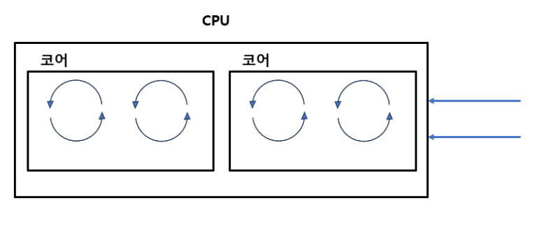

# OS 및 컴퓨터 구조 보충 학습 문서

## OS 및 컴퓨터 구조 보충 학습: 하드웨어와 소프트웨어의 연결

1. 하드웨어 계층: CPU -> 멀티 코어 -> 멀티 스레드
물리적 실체에서 논리적 실행 단위로 이어지는 하드웨어의 수직 계층 구조입니다.
- CPU (Central Processing Unit): 컴퓨터의 연산과 제어를 담당하는 핵심 장치입니다.
- 멀티 코어 (Multi-Core): 하나의 CPU 패키지 안에 독립적인 연산 회로(코어)를 여러 개 두는 방식입니다. "물리적인 일꾼"의 수입니다.
- 멀티 스레드(하드웨어) / SMT: 하나의 물리 코어가 명령어를 받아들이는 통로(레지스터 세트)를 여러 개 두어, OS가 여러 개의 CPU가 있는 것처럼 인식하게 하는 기술(예: 하이퍼스레딩)입니다.

1. 소프트웨어 계층: 프로세스 -> 멀티 스레드
프로그램이 실행될 때 OS가 관리하는 논리적 단위입니다.
- 프로세스 (Process): 실행 중인 프로그램의 단위로, OS로부터 독립된 메모리 자원을 할당받습니다.
- 멀티 스레드(소프트웨어): 하나의 프로세스 내에서 실행되는 여러 개의 작업 흐름입니다. 프로세스의 자원을 공유하며 병렬로 작업을 수행합니다.

1. 멀티 프로세스 vs 멀티 스레드
자원 공유 방식과 안정성에 따른 비교입니다.

- 예시) 실제 작업관리자

