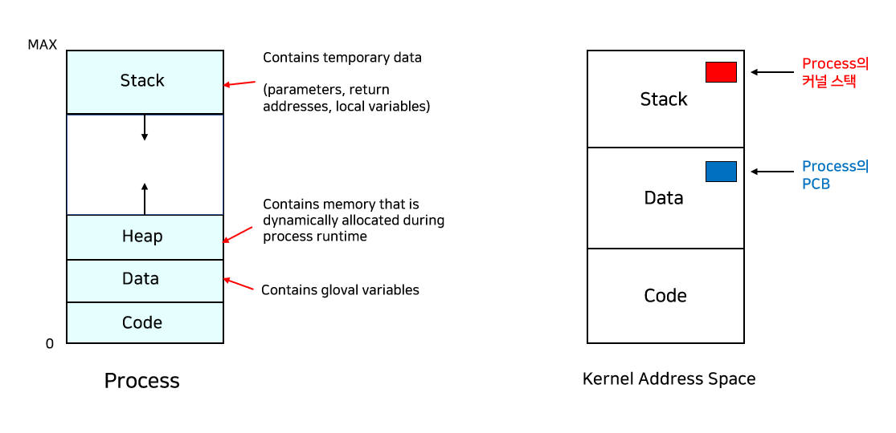

# [CS Study] 4주차

## [Week 4] CPU 스케줄링 학습 문서

### 00. Context Change

### ① PCB (Process Control Block) - "작업 일지"

OS 커널이 관리하는 메모리 영역(Kernel Space)에는 각 프로세스마다 하나씩 **PCB**라는 데이터 구조가 있습니다.

- **저장 내용**:
    - **PID**: 프로세스 번호
    - **PC (Program Counter)**: 다음 실행할 코드의 주소
    - **Register 값**: CPU 내부 레지스터에 들어있던 중간 계산값들
    - **상태**: 준비, 실행, 대기 중 어떤 상태인지
- **저장 방식**: CPU 레지스터에 있던 값들을 통째로 복사해서 해당 프로세스의 PCB 블록 내 정해진 칸에 써넣습니다.

### ② 커널 스택 (Kernel Stack) - "실행 흐름 저장"

각 프로세스(혹은 스레드)는 자신만의 **커널 스택** 공간을 RAM에 가지고 있습니다.

- 컨텍스트 스위칭이 발생하면, 현재 실행 중이던 함수의 복귀 주소나 일부 레지스터 값들이 이 스택에 **Push** 되어 저장됩니다.

### 01. 스케줄링의 목적과 성능 지표

운영체제가 여러 프로세스 사이에서 CPU 자원을 배분하는 이유는 시스템의 효율성을 극대화하기 위함입니다.

- **다중프로그래밍(Multi-programming):** CPU 활용도를 높이기 위해 메모리에 여러 프로그램을 올려두고 관리합니다.
- **스케줄링의 주요 목적:**
    - **응답 시간(Response Time):** 작업 제출 후 첫 결과가 나올 때까지의 시간 단축.
    - **작업 처리량(Throughput):** 단위 시간당 완료하는 작업 수 증대.
    - **자원 활용도:** CPU가 쉬지 않고 일하게 함.
- **시간 측정 기준:**
    - **대기 시간(Waiting Time):** 준비 큐에서 기다린 전체 시간.
    - **반환 시간(Turnaround Time):** 작업 제출부터 완료까지 걸린 총 시간.
    
    
    

---

### 02. 스케줄링의 단계와 기준

자원 할당의 빈도와 목적에 따라 세 단계로 구분합니다.

### 2.1 스케줄링 3단계 (Level)

1. **장기 스케줄링 (Long-term / Job Scheduling):** 어떤 프로세스를 메모리에 올릴지 결정하여 다중프로그래밍의 정도를 조절합니다.
2. **중기 스케줄링 (Mid-term / Memory Allocation):** 메모리에 여유가 없을 때 프로세스를 통째로 디스크로 쫓아내거나(Swap-out) 다시 불러와 메모리 할당을 결정합니다.
3. **단기 스케줄링 (Short-term / Process Scheduling):** 준비 큐의 프로세스 중 어떤 것에 CPU를 할당할지 결정합니다. 가장 빈번하게 발생합니다.

### 2.2 스케줄링 기준 (Criteria)

- **프로세스 특성:** CPU Burst(연산 위주)인지 I/O Burst(입출력 위주)인지 고려합니다.
- **긴급성(Urgency) 및 우선순위:** 정적(고정) 또는 동적(상황에 따라 변화) 우선순위를 적용합니다.

---

### 3. 스케줄링 정책 (Policy)

자원을 강제로 회수할 수 있는지에 따라 두 가지로 나뉩니다.

- **비선점(Non-preemptive):** 프로세스가 스스로 CPU를 반납할 때까지 사용권을 보장합니다. (Batch 시스템 적합)
- **선점(Preemptive):** 할당 시간이 종료되거나 우선순위가 높은 프로세스가 오면 CPU를 강제로 뺏을 수 있습니다. (Interactive 시스템 적합)

| **알고리즘** | **방식** | **주요 특징** | **장점** | **단점 및 한계** |
| --- | --- | --- | --- | --- |
| **FCFS** (First-Come, First-Service) | **비선점** | 도착 순서대로 처리 (Queue 구조) | 구현이 단순하고 오버헤드가 적음 | **콘보이 현상(Convoy Effect)** |
| **RR** (Round-Robin) | **선점** | 동일 시간(Time Quantum)씩 배분 | **응답 시간(Response Time)**이 짧아 대화형 시스템에 최적 | Time Quantum이 너무 크면 FCFS와 같고, 작으면 **문맥 교환 오버헤드** 증가 |
| **SPN** (Shortest Process Next) | **비선점** | 실행 시간이 가장 짧은 것 우선 | 평균 대기 시간을 최소화함 | **기아 현상(Starvation)** |
| **SRTN** (Shortest Remaining Time) | **선점** | 남은 시간이 더 짧은 프로세스 오면 교체 | SPN보다 평균 대기 시간이 더 짧음 | 새로운 프로세스가 올 때마다 남은 시간을 계산해야 하므로 오버헤드 발생 |
| **HRRN** (High Response Ratio Next) | **비선점** | **에이징(Aging)** 적용: (대기+실행)/실행 | SPN의 장점을 살리면서 **기아 현상 방지** | 실행 시간을 예측해야 하므로 구현 복잡도가 높음 |
| **MLQ** (Multi-Level Queue) | **혼합** | 성격이 다른 작업을 별도 큐에 배치 | 작업 특성별(전면/배경) 맞춤 스케줄링 가능 | 큐 간 이동이 불가능하여 유연성이 떨어지고 우선순위 낮은 큐는 소외됨 |
| **MFQ** (Multi-Level Feedback Queue) | **선점** | **큐 간 이동 허용**, 동적 우선순위 | **현대 OS의 표준**. 프로세스 특성을 스스로 파악하여 우선순위 조절 | 알고리즘 설계 및 구현이 매우 복잡함 |

[https://process-scheduling-solver.boonsuen.com/](https://process-scheduling-solver.boonsuen.com/)