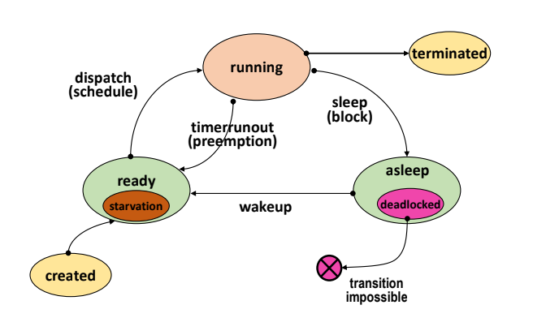

# [CS Study] 6주차 : 데드락(Deadlock)

## 1. 데드락 정의

- **데드락(Deadlock)**: 프로세스가 *발생 가능성이 없는 이벤트*를 기다리며 더 이상 진행하지 못하는 상태
- **데드락 상태의 구분**
    - 프로세스가 데드락에 빠져 있으면 해당 프로세스는 **deadlock 상태**
    - 시스템 내에 데드락 프로세스가 존재하면 시스템은 **deadlock 상태**
- **질문**: Deadlock vs Starvation 비교
    
    
    
- **자원의 분류(일반)**: Hardware resources vs Software resources
- **자원의 분류(다른 기준)**
    - **선점 가능 여부**: Preemptible / Non-preemptible(선점 시 이후 진행에 문제 발생, 예: disk drive)
    - **할당 단위**: Total allocation / Partitioned allocation(자원을 조각 내 할당, 예: memory)
    - **동시 사용 가능 여부**: Exclusive(동시에 1개 프로세스) / Shared(여러 프로세스 동시 사용, 예: program, shared data)
    - **재사용 가능 여부**: SR(Serially-reusable) / CR(Consumable, 사용 후 소멸, 예: signal, message)

## 2. 데드락 모델

- Deadlock 발생 필요 조건 (모두 성립 시)
    - Exclusive use of resources
    - Non-preemtible resources
    - Hold and wait(Partial allocation)
    - Circular wait

## 3. Deadlock Prevention

### 3.1. 4개의 조건 중 하나를 제거

- Exclusive → 모든 자원을 공유 허용
- Non-preemptible resources 조건 제거 : 프로세스가 할당 받을 수 없는 자원 요청 시
가지고 있던 자원 모두 반납
- Hold and wait → Total allocation
- Circular wait 조건 제거 : 자원들에게 순서 부여, 자원 순서 증가 방향으로만 자원 요청 가능

## 4. Deadlock Avoidance

- 시스템의 상태를 계속 감시, safe state 유지
- safe state : 모든 프로세스가 정상적 종료(Safe sequence) 가능한 상태
- 가정
    - 프로세스의 수, 자원의 종류와 수 고정
    - 프로세스가 요구하는 자원 및 최대 수량을 알고 있음
    - 프로세스는 자원을 사용 후 반드시 반납

### **4.1. Dijkstra’s “banker’s” algorithm**

- **목적**: 자원 요청이 들어올 때마다 *시스템이 계속 Safe state를 유지하는 경우에만* 자원을 할당해서 데드락을 **회피(avoidance)** 하는 알고리즘
- **Safe state / Safe sequence :** 어떤 순서(안전 순서)로 프로세스들을 종료시킬 수 있어서, 
그 순서대로라면 모든 프로세스가 필요한 자원을 얻고 종료할 수 있으면 **Safe state**
- Safe state

- No safe state

### **4.2. Habermann’s algorithm**

- 결론
    - High overhead
    - Low resource utilization
    - Not pratical

## 5. Deadlock Detection

- 사전 작업 X, 주기적으로 deadlock 발생 확인
- Resource Allocation Graph (RAG) 사용
    - Directed, bipartite Graph
    
    
    
    - **정점(Vertex) 종류**
        - **프로세스 노드** $P_i$ : 보통 **원(○)** 으로 표시
        - **자원 타입 노드** $R_j$ : 보통 **사각형(□)** 으로 표시
    - **간선(Edge) 종류**
        - **요청 간선(Request edge)**: $P_i \rightarrow R_j$
        - **할당 간선(Assignment edge)**: $R_j \rightarrow P_i$
        
        
        

### **5.1. Graph reduction**

- 주어진 RAG 에서 edge 를 하나 씩 지워가는 방법
- Unblocked process : 필요한 자원을 모두 할당 받을 수 있는 프로세스
- Unblocked process에 연결된 모든 edge 제거
→ 모두 제거 ? deadlock 없음 : deadlock 존재
- High overhead (검사 주기에 영향 받음, Node 수 많은 경우)

## 6. Deadlock Recovery

- Deadlock을 검출 후 해결하는 과정

### **6.1. Process termination**

### **6.2. Resource preemption**

### 6.3. Checkpoint-restart method